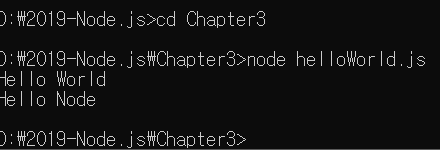

# 3.1 REPL 사용하기 

	1. 노드와 처음 상호작용을 해보고, 노드로 자바스크립트 파일을 실행하는 방법
	2. 노드가 기본적으로 제공하는 객체, 모듈 사용법
	3. 버퍼, 스트림, 동기와 비동기, 이벤트, 예외 처리에 대해서 배움

- 자바스크립트 : 스크립트 언어 => 미리 컴파일을 하지 않아도 즉석에서 코드를 실행할 수 있음.
- REPL(Read Eval Print Loop) : 입력한 코드를 읽고(Read), 해석하고(Eval), 결과물을 반환하고(Print), 종료할 때까지 반복한다고 함.
- 노드의 REPL을 해보면, 
  - 
- 간단한 문자열 출력
  - 
- 우리가 입력한 코드를 REPL이 읽고(Read), 해석(Eval)한 뒤 바로 결과물을  출력해 주었음(Print)
- 그리고 종료되기 전까지 우리의 입력을 기다림(Loop)
- REPL을 종료하려면 ctrl+c 두 번 누르거나, REPL 창에 .exit를 입력하면 된다.
- REPL : 한두 줄짜리 코드를 테스트해보는 용도로는 좋지만, 여러 줄의 코드를 실행하기 에는 불편

# 3.2 Js 파일 실행하기

- REPL에 직접 코드를 입력하는 대신 자바스크립트 파일을 만들어 실행해보자.
- 따로 폴더를 만들어 파일들을 모아두는 것이 편리
- 콘솔에서 'node 자바스크립트 파일 경로'로 실행함.
- 확장자(.js)는 생략 가능(REPL에서 입력하는 것 아니니 주의)
- 콘솔에서 입력해야 함.
- 콘솔 => REPL로 들어가는 명령어 : node
- 노드를 통해 파일을 실행하는 명령어 : node 자바스크립트 파일 경로
	


# 3.3 모듈로 만들기 

- 노드는 코드를 모듈로 만들 수 있다는 점에서 브라우저의 자바스크립트와는 다름
- 모듈 : 특정한 기능을 하는 함수나 변수들의 집합
- 자체로도 하나의 프로그램이면서 다른 프로그램의 부품으로도 사용가능 
- 모듈로 만들어두면 여러 프로그램에 해당 모듈을 재사용할 수 있음
- 자바스크립트에서 코드를 재사용하기 위해 함수로 만드는 것과 비슷.
- 보통 파일 하나가 모듈 하나가 됨.
- 파일별로 코드를 모듈화할 수 있어 관리하기 편리
- => 브라우저도 모듈을 지원합니다. (Chrome 60버전 이후)

```javascript
    const odd = '홀수입니다.';
    const even = '짝수입니다.';

    module.exports = {
        odd,
        even
    };
```

- var.js에 변수 두 개를 선언, module.exports에 변수들을 담은 객체를 대입 => 이 파일을 모듈로서 기능 
- 변수들을 모아둔 모듈이 되는 것 => 다른 파일에서 이 파일을 불러오면 module.exports에 대입된 값 사용 가능

```javascript
    const {odd , even} = require('./var');

    function checkOddOrEven(){
        if(num % 2){ // 홀수면
            return odd;
        }
        else{
            return even;
        }

    }

    module.exports = checkOddOrEven;
```

- require 함수 안에 불러올 모듈의 경로를 적어줌, 위 예제는 같은 폴더 안에 파일을 만들었지만,
- 다른 폴더에 있는 파일도 모듈로 사용할 수 있습니다. => require 함수의 인자로 제공하는 경로만 잘 지정해주면 됨.
- 파일 경로에서 js나 json 같은 확장자는 생략이 가능하다. 

- 예제 코드 : require 함수로 var.js에 있던 값들을 불러오고 있음 
- const {odd, even} => ES2015+ 문법 
- var.js의 module.exports에 담겨 있던 객체를 불러와 func.js에서 사용하는 모습

- var.js에서 변수를 불러온 뒤, 숫자의 홀짝을 판별하는 함수를 선언함. 그리고 다시 module.exports에 함수를 대입 
- => 다른 모듈(var.js)을 사용하는 파일을 다시 모듈(func.js)로 만들 수 있음 
- module.exports에는 객체만 대입해야 하는 것이 아니라 함수 or 변수를 대입해도 됨.

```javascript
    const { odd, even } = require('./var');
    const checkNumber = require('./func');

    function checkStringOddOrEven(str) {
        if (str.length % 2) // 홀수면
        {
            return odd;
        } else {
            return even;
        }
    }

    console.log(checkNumber(10));
    console.log(checkStringOddOrEven('hello'));
```

- index.js : var.js와 func.js를 모두 참조 => 모듈 하나가 여러 개의 모듈을 사용할 수 있는 것 
- var.js가 func.js와 index.js에 두 번 쓰이는 것 -> 모듈 하나가 여러 개의 모듈에 사용될 수 있음.
- 모듈로부터 값을 불러올 때 변수 이름을 다르게 지정할 수도 있음
- ex) func.js의 checkOddOrEven이 checkNumber라는 이름으로 사용되고 있음.

```shell
node index  // index.js의 실행 
```

- 이렇게 여러 파일에 걸쳐 재사용되는 함수나 변수들을 모듈로 만들어두면 편리
- But 모듈이 많아지고 모듈 간의 관계가 얽히게 되면 구조를 파악하기 어렵다는 단점도 존재
- 노드에서는 대부분이 파일이 다른 파일을 모듈로 사용하고 있음 => 모듈을 만들고 사용하는 방법을 꼭 알아두어야 함.

## ES2015 모듈 

- ES2015가 도입되면서 자바스크립트도 자체 모듈 시스템 문법이 생김 => 노드의 모듈 시스템과는 문법이 조금 다름 
```javascript
    // func.mjs => 본문의 func.js를 바꾸어 보면
    import { odd, even } from './var';
    
    function checkOddOrEven(num){
        if(num % 2)
        {
            return odd;
        }
        else{
            return even;
        }
    }

    export default checkOddOrEven;
```

- require와 module.exports가 import, export default로 바뀌었음. => 사소한 차이가 있음
- \+ 노드에서도 9버전부터 ES2015의 모듈 시스템 사용가능 
- => 하지만, 파일의 확장자를 mjs로 지정해야 하고, 실행 시 node --experimental-modules 파일명 처럼
    특별한 옵션을 붙여주어야 한다는 제한 존재

- 방금 썻던 require 함수, module 객체는 따로 선언하지 않았지만 사용할 수 있었어.
- 어떻게 가능한가? 바로 노드에서 기본적으로 제공하는 내장 객체!

# 3.4 노드 내장 객체 알아보기 

- 노드에선 기본적인 내장 객체와 내장 모듈을 제공 => 따로 설치하지 않아도 바로 사용 가능 
- 브라우저의 window객체와 비슷하다고 봐도 무방

# 3.4.1 global
- 브라우저의 window와 같은 전역 객체 => 전역 객체 => 모든 파일에서 접근 가능 
- 또한, window.open 메서드를 그냥 open으로 호출할 수 있는 것처럼 global도 생략 가능 
- require 함수에서도 global.require에서 global이 생략된 것 
- 노드 콘솔에 로그를 기록하는 console 객체도 원래는 global.console이 생략된 것 

- global 객체 내부에는 매우 많은 속성이 들어 있음 => global 객체 안을 REPL을 이용해서 보자.

- 주목! Node의 window, document 객체

    1. 노드에는 DOM이나 BOM이 없어 window와 document 객체를 사용할 수 없음
    => 노드에서 window 또는 document를 사용하면 에러가 발생 

- 노드 버전에 따라 콘솔 내용이 다를 수 있음 => global 객체 안에는 수십 가지의 속성이 담겨 있음

- 전역 객체라는 점을 이용해 간단한 데이터를 파일끼리 
공유할 때 사용하기도 함


- globalA 모듈의 함수 : global.message 값을 반환 
- globalB.js에선 global 객체에 속성명이 message인 값을 대입하고 globalA 모듈의 함수를 호출
- 콘솔 결과를 보면 globalB에서 넣은 global.message값을 globalA에서도 접근할 수 있음을 알 수 있음.


- `global 객체의 남용`
  - global 객체의 속성에 값을 대입해 파일 간 데이터를 공유할 수 있지만, 이를 남용하지는 말자.
  - 프로그램의 규모가 커질수록 어떤 파일에서 global 객체에 값을 대입했는지 찾기 힘듬 => 유지보수에 어려움
  - 다른 파일의 값을 사용하고 싶다?
  - 모듈 형식으로 만들어서 명시적으로 값을 불러와 사용하는 게 좋음.

# 3.4.2 console

- console도 global 객체 안에 들어있음. => 브라우저의 console과 거의 비슷
- console 객체 : 보통 디버깅을 위해 사용됨.
  
  1. 개발 중 변수에 값이 제대로 들어 있나 확인 위해
  2. 에러 발생 시 에러 내용을 콘솔에 표시하기 위해서도 사용
  3. 코드 실행 시간을 알아보려고 할 때도 사용 
- 대표적으로 console.log 메서드가 있음

## console.js 참고 

+ console.time(레이블): console.timeEnd(레이블)과 대응되어 같은 레이블을 가진 time과 timeEnd 사이의 시간을 측정
+ console.log(내용) : 평범한 로그를 콘솔에 표시함 => console.log(내용, 내용, ...)처럼 여러 내용을 동시에 표시 가능
+ console.error(에러 내용) : 에러를 콘솔에 표시함
+ console.dir(객체, 옵션) : 객체를 콘솔에 표시할 때 사용, 첫 번째 인자 - 표시할 객체 / 두 번째 인자 - 옵션을 넣음 
    - 옵션의 colors를 true로 하면 콘솔에 색이 추가되어 보기가 편해짐
    - depth : 객체 안에 객체를 몇 단계까지 보여줄지를 결정 (기본값 2)
+ console.trace(레이블) : 에러가 어디서 발생했는지 추적할 수 있게 해줌, 보통은 에러 발생 시 에러 위치를 알려주어 자주 사용하진 않음
    - 위치가 나오지 않는다면 사용할만 함.

- 단, console.time의 시간 or console.trace의 경로는 사용자의 컴퓨터 환경에 따라 다를 수 있음


-  편리한 디버깅을 위해서 console 객체에는 지금도 새로운 메서드들이 추가되고 있음. => 더 다양한 메서드가 있음

# 3.4.3 타이머

- 타이머 기능을 제공하는 함수 : setTimeout, setInterval, setImmediate는 노드에서 window 대신 global 객체 안에 들어 있음
- setTimeout, setInterval : 웹 브라우저에서도 자주 사용됨.

+ setTimeout(콜백 함수, 밀리초) : 주어진 밀리초(1000분의 1초) 이후에 콜백함수를 실행합니다.
+ setInterval(콜백 함수, 밀리초) : 주어진 밀리초마다 콜백 함수를 반복 실행합니다. 
+ setImmediate(콜백 함수) : 콜백 함수를 즉시 실행합니다.

+ clearTimout(아이디) : setTimeout을 취소합니다.
+ clearInterval(아이디) : setInterval을 취소합니다. 
+ clearImmediate(아이디) : setImmediate를 취소합니다. 

- setImmediate(콜백)과 setTimeout(콜백, 0)
- setImmediate(콜백), setTimeout(콜백, 0) : 여기에 담긴 콜백 함수는 이벤트 루프를 거친 뒤 즉시 실행됨.
- 차이점은?
- 특수한 경우, setImmediate는 setTimeout(콜백, 0)보다 먼저 실행됨.
- 파일 시스템 접근, 네트워킹 같은 I/O 작업의 콜백 함수 안에서 타이머를 호출하는 경우 
- 하지만, setImmediate가 항상 setTimeout(콜백, 0)보다 먼저 호출되는 것은 아니라는 사실!
- 헷갈리지 않도록 setTimeout(콜백,0)는 사용하지 않는 것 권장 


# 3.4.4 __filename, __dirname

- 노드에선 파일 사이에 모듈 관계가 있는 경우가 많아 현재 파일의 경로나 파일명을 알아야 하는 경우 존재
- 노드는 __filename, __dirname이라는 키워드로 경로에 대한 정보를 제공 
- 파일에 __filename, __dirname을 넣어두면 실행 시 현재 파일명과 파일 경로로 바뀜

```javascript
    console.log(__filename);
    console.log(__dirname);
```


- 경로는 다를 수 있고, 또한 윈도우가 아니면 \ 대신 /로 폴더 경로가 구분될 수 있음
- 이렇게 얻은 정보를 사용해서 경로 처리를 사용할 수 있음
- But, 경로가 문자열로 반환되기도 하고, \나 / 같은 경로 구분자 문제도 있어
- 보통 이를 해결해 주는 path 모듈과 함께 사용!

# 3.4.5 module, exports

- 지금까지 모듈 생성시 module.exports만 사용했었지만, module 객체 말고 exports 객체로도 모듈을 만들 수 있음


- module.export로 한 번에 대입하는 대신, 각각의 변수를 exports 객체에 하나씩 삽입함 
- 왜 동일하게 동작하는가? 
- module.exports와 exports가 같은 객체를 참조
- 실제로 console.log(module.exports === exports)를 하면 true가 나옴 
- 따라서 exports 객체에 add 함수를 넣으면 module.exports에도 add 함수가 들어감

- `exports와 module.exports의 관계는 책을 참고하자`

- exports 객체 사용 시
  - exports 객체 사용 시에는 module.exports와의 참조 관계가 깨지지 않도록 주의해야 함
  - module.exports에는 어떤 값이든 대입해도 되지만, 
exports에는 반드시 객체처럼 속성명과 속성값을 대입해야 함
  - exports에 다른 값을 대입하면 객체의 참조 관계가 끊겨 더 이상 모듈로 기능하지 않음.
  - exports를 사용할 때는 객체만 사용할 수 있어 func.js와 같이 module.exports에 함수를 대입한 경우에는 exports로 바꿀 수 없음
  - exports와 module.exports에는 참조 관계가 있어 한 모듈에 exports 객체와 module.exports를 동시에 사용하지 않는 게 좋음

# 3.4.6 process

- process 객체 : 현재 실행되고 있는 노드 프로세스에 대한 정보를 담고 있음
- process 객체 안에는 다양한 속성이 있는데, REPL에 하나씩 따라서 입력해보자.
- 결괏값은 사용자의 컴퓨터마다 차이가 있을 수 있어 


- 이 정보들의 사용 빈도는 높지 않음.
- 일반적으로 운영체제나 실행 환경 별로 다른 동작을 하고 싶을 때 사용함
```javascript   
    process.version // 설치된 노드의 버전
    process.arch // 프로세서 아키텍처 정보(arm, ia32 등의 값)
    process.platform // 운영체제 플랫폼(linux, darwin, freebsd) 등의 값
    process.pid // 현재 프로세스의 아이디, 프로세스를 여러 개 가질 때 구분할 수 있음
    process.uptime() // 프로세스가 시작된 후 흐른 시간, 단위는 초
    process.execPath // 노드의 경로
    process.cwd() // 현재 프로세스가 실행되는 위치
    process.cpuUsage() // 현재 cpu 사용량
```

# 3.4.6.1 process.env

- REPL에 process.env를 입력하면 많은 정보 출력
- process.env : 서비스의 중요한 키를 저장하는 공간
- 서버나 데이터베이스의 비밀번호와 각종 API 키를 코드에 직접 입력하는 것은 위험
- 서비스가 해킹되 코드 유출 시 비밀번호가 코드에 남아 있어 추가 피해 발생 가능

```javascript
    const secretId = process.env.SECRET_ID;
    const secretCode = process.env.SECRET_CODE;
```
- 이처럼 중요한 비밀번호는 process.env의 속성으로 대체
- 이제 process.env에 직접 SECRET_ID와 SECRET_CODE를 넣어주면 됨.
- 넣는 방법은 운영체제마다 차이가 존재
- but 한 번에 모든 운영체제에 동일하게 넣을 수 잇는 방법이 존재! => 나중에 배우자

# 3.4.6.2 process.nextTick(콜백)

- 이벤트 루프가 다른 콜백함수들 보다 nextTick의 콜백함수를 우선으로 처리하게 만듬

```javascript
    // nextTick.js
    setImmediate(()=>{
        console.log('immediate');
    });
    process.nextTick(()=>{
        console.log('nextTick');
    });
    setTimeout(()=>{
        console.log('timeout');
    },0);
    Promise.resolve().then(()=>{
        console.log('promise');
    });
```

- process.nextTick : setImmediate나 setTimeout보다 먼저 실행됨. 
- 코드 맨 맽에 Promise를 넣은 것은 resolve된 Promise도 nextTick처럼 다른 콜백들보다 우선시 됨.
- 그래서 process.nextTick과 Promise : microtask라고 따로 구분지어 부름

- `태스크와 마이크로테스트는 책을 참고`

- 마이크로태스크의 재귀 호출
  - process.nextTick으로 받은 콜백 함수나 resolve된 Promise는 다른 이벤트 루프에서 대기하는 콜백 함수보다도 먼저 실행됨.
  - 그래서 비동기 처리 할 때 setImmediate보다 process.nextTick을 더 선호하는 개발자도 있음
  - 하지만, 이런 Microtask를 재귀 호출하게 되면 이벤트 루프는 다른 콜백 함수보다 Microtask를 우선하여 처리하므로 콜백 함수들이 실행되지 않을 수도 있음

# 3.4.6.3 process.exit(콜백)

- 실행 중인 노드 프로세스를 종료
- 서버에 이 함수를 사용하면 서버가 멈춤 => 서버에는 거의 사용하지 않음 
- But, 서버 외의 독립적인 프로그램에선 수동으로 노드를 멈추게 하기 위해 사용함.

```javascript
    let i = 1;
    setInterval(()=>{
        if(i === 5){
            console.log('종료!');
            process.exit();
        }

        console.log(i);
        i += 1;
    }, 1000);
```
- process.exit 메서드는 인자로 코드 번호를 줄 수 있음
- 인자를 주지 않거나 0이면 정상 종료를 뜻하고, 1을 주면 비정상 종료를 뜻함
- 만약 에러가 발생해 종료하는 경우 1을 넣어주면 됨.
  


- 타이머, 콘솔, 프로세스, 모듈은 기본적인 기능 But 앞으로도 계속 사용됨.
- 또한, 노드는 여러 가지 강력한 기능을 기본 모듈로 제공 

# 3.5 노드 내장 모듈 사용하기 

- 노드 : 웹 브라우저에서 사용되는 자바스크립트보다 더 많은 기능을 제공 
- 운영체제 정보에도 접근 가능, 클라이언트가 요청한 주소에 대한 정보도 가져올 수 있음.
- => 바로 노드에서 제공하는 모듈을 사용하면 됨.

+ 노드의 모듈들은 노드 버전마다 차이가 존재!

# 3.5.1 os

- 웹 브라우저에 사용되는 자바스크립트 : 운영체제의 정보를 가져올 수 없음
- 노드는 OS 모듈에 정보가 담겨 있어 정보를 가져올 수 있음


- process 객체와 겹치는 부분도 있음
- os : 사용자 컴퓨터의 운영체제 정보를 가져옴

    + os.arch() : process.arch와 동일
    + os.platform() : process.platform과 동일
    + os.type() : 운영체제의 종류를 보여줌
    + os.uptime() : 운영체제 부팅 이후 흐른 시간(초)을 보여줌, process.uptime()은 노드의 실행 시간
    + os.hostname() : 컴퓨터의 이름을 보여줌
    + os.release() : 운영체제의 버전을 보여줌
    + os.homedir() : 홈 디렉터리 경로를 보여줌
    + os.tmpdir() : 임시 파일 저장 경로를 보여줌
    + os.cpus() : 컴퓨터의 코어 정보를 보여줌
    + os.freemem() : 사용 가능한 메모리(RAM)을 보여줌
    + os.totalmem() : 전체 메모리 용량을 보여줌

* ! 코어 개수 확인하기

    * os.cpus().length를 하면 코어의 개수가 숫자로 나옴.
    * 하지만 노드는 싱글 스레드라 코어가 몇 개이든 대부분의 경우 코어를 하나밖에 사용하지 않음
    * But, Cluster 모듈을 사용하는 경우 코어 개수에 맞춰서 프로세스를 늘릴 수 있음
    * => 이 때 cpus() 메서드를 사용할 것

- os.constants라는 객체도 존재 
- => 각종 에러와 신호에 대한 정보가 담김
- 에러 발생 시, EADDRINUSE나 ECONNRESET 같은 에러 코드를 함께 보여줌 => 이러한 코드들이 들어있음
- 너무 많아서 발생할 때마다 검색 ㄱㄱ

- os 모듈 : 주로 컴퓨터 내부 자원에 빈번하게 접근하는 경우 사용됨.
- 즉, 일반적인 웹 서비스를 제작할 때는 사용빈도가 높지 않음
- But, 운영체제별로 다른 서비스를 제공하고 싶을 때 os 모듈이 유용할 것

# 3.5.2 path

- 폴더와 파일의 경로를 쉽게 조작하도록 도와주는 모듈
- 왜? 운영체제 별로 경로 구분자가 다르기 때문
- 크게 windows타입과 posix 타입으로 구분
- POSIX : 유닉스 기반의 운영체제들, macOS와 리눅스가 속함

+ Windows : C\... 처럼 \로 구분
+ POSIX : /home/zerocho처럼 /로 구분

- 또한, 파일 경로에서 파일명이나 확장자만 따로 떼어주는 기능도 구현해두어 직접 구현할 필요없이 편리하게 사용할 수 있음

- __filename, __dirname : 각각 현재 파일과 현재 폴더의 경로를 표시함!
  


+ path.sep : 경로의 구분자 (Windows는 \, POSIX는 /)
+ path.delimiter : 환경 변수의 구분자, process.env.PATH를 입력하면 여러 개의 경로가 이 구분자로 구분되어 있음. Windows는 세미콜론(;)이고 POSIX는 콜론(:)임
+ path.dirname(경로) : 파일이 위치한 폴더 경로를 보여줌
+ path.extname(경로) : 파일의 확장자를 보여줌
+ path.basename(경로, 확장자) : 파일의 이름(확장자 포함)을 보여줌, 파일의 이름만 표시하고 싶다면 basename의 두 번째 인자로 파일의 확장자를 넣어주면 됨.
+ path.parse(경로) : 파일 경로를 root, dir, base, ext, name으로 분리
+ path.format(객체) : path.parse()한 객체를 파일 경로로 합칩니다. 
+ path.normalize(경로) : \나 /을 실수로 여러 번 사용 or 혼용 시 정상적인 경로로 변환해 줌
+ path.isAbsolute(경로) : 파일의 경로가 절대경로인지 상대 경로인지 true나 false로 알려줌
+ path.relative(기준경로, 비교경로) : 경로를 두 개 넣으면 첫 번째 경로에서 두 번째 경로로 가는 방법을 알려줌
+ path.join(경로, ...) : 여러 인자를 넣으면 하나의 경로로 합쳐줌, 상대경로인 ..(부모 디렉터리)과 .(현 위치)도 알아서 처리해줌
+ path.resolve(경로, ...) : path.join()과 비슷하지만 차이가 존재

* join과 resolve의 차이

    * path.join과 path.resolve 메서드는 비슷해 보이지만 동작 방식의 차이가 존재 
    * path.resolve는 /를 만나면 절대 경로로 인식해서 앞의 경로를 무시하고,
    * path.join은 상대경로로 처리 
    ```javascript
        path.join('/a','/b','c'); // 결과: /a/b/c/ 
        path.resolve('/a','/b','c'); // 결과: /b/c
    ```
* `어떤 때 \\을 사용하고 어떤 때 \를 사용?`

    * 기본적으로 경로는 \ 하나를 사용해서 표시, 하지만 자바스크립트 문자열에선 \가 특수문자이므로
    \를 두 개 붙여 경로를 표시해야 함
    * ex) \n : 자바스크립트 문자열에서 줄바꿈 => 따라서 C:\node와 같은 경로에서 의도하지 않은 오류가 발생가능
    * => C:\\node처럼 표시해야 함
    * path 모듈은 위와 같은 경우에 발생하는 문제를 알아서 처리해줌 => Windows에서 path 모듈이 꼭 필요한 이유

* `상대경로와 절대경로`

    * 절대 경로 : 루트 폴더(Windows의 C:\나 POSIX의 /)나 노드 프로세스가 실행되는 위치가 기준이 됨.
    * 상대 경로 : 현재 파일이 기준이 됨. 현재 파일과 같은 경로면 점 하나(.)를, 현재 파일보다 한 단계 상위 경로면 점 두 개(..)를 사용해 표현
    * C:\users\zerocho\path.js에서 C:\로 가고 싶다면 절대 경로에선 그냥 C:\ 입력 ㄱㄱ
    * 하지만 상대 경로에선 ..\..을 해야 두 디렉터리 위로 올라가 C:\이 됨.

- 만약 Windows에서 POSIX 스타일 path를 사용해야 한다? 반대인 경우도 존재할 수 있음
  - Windows에선, path.posix.sep이나 path.posix.join() 같이 사용하면 되고
  - POSIX에선 path.win32.sep이나 path.win32.join() 같이 사용하면 됨.

- path 모듈은 노드 프로그래밍하면서 매우 자주 쓰게 될 모듈

# 3.5.3 url

- 인터넷 주소를 쉽게 조작하도록 도와주는 모듈
- 노드 버전 7에서 추가된 WHATWG(웹 표준을 정하는 단체의 이름) 방식
- 노드에서 사용하던 방식의 url이 있음

- `WHATWG와 노드의 주소 체계는 책을 참고`

- 가운데 주소를 기준으로 위쪽은 기존 노드의 url 구분 방법, 아래쪽은 WHATWG의 url 구분 방법


- 기존 노드 방식에선 두 메서드 주로 사용

* url.parse(주소) : 주소를 분해함, WHATWG 방식과 비교하면 username과 password 대신 auth 속성이 있고, searchParams 대신 query가 있음
* url.format(객체) : WHATWG 방식의 url과 기존 노드의 url 모두 사용할 수 있습니다. 분해되었던 url 객체를 다시 원래 상태로 조립.

- WHATWG와 노드의 url은 취향에 따라 사용하면 되지만, 노드의 url 형식을 꼭 사용해야 하는 경우가 존재

* 주소가 host 부분 없이 pathname 부분만 오는 경우(/book/bookList.aspx), WHATWG 방식은 이 주소를 처리할 수 없음

- WHATWG 방식 : search 부분을 searchParams라는 특수한 객체로 반환하므로 유용
- search 부분은 보통 주소를 통해 데이터를 전달할 때 사용됨.
- search : 물음표(?)로 시작하고, 그 뒤에 키=값 형식으로 데이터를 전달함 => 여러 키가 있을 경우에는 &로 구분

- ex) http://www.gilbut.co.kr/?page=3&limit=10&category=nodejs&category=javascript와 같은 주소에서는 
  - ?page=3&limit=10&category=nodejs&category=javascript 부분이 search


- URL 생성자를 통해 myURL이라는 주소 객체를 만듬 => myURL 안에는 searchParams 객체가 있음
  - 이 객체는 search 부분을 조작하는 다양한 메서드를 지원

* getAll(키) : 키에 해당하는 모든 값들을 가져옴. category 키엔 두 가지 값, nodejs와 javascript의 값이 들어있음
* get(키) : 키에 해당하는 첫 번째 값만 가져옴 
* has(키) : 해당 키가 있는지 없는지를 검사함
* keys() : searchParams의 모든 키를 반복기(iterator) 객체로 가져옴
* values() : searchParams의 모든 값을 반복기 객체로 가져옴
* append(키, 값) : 해당 키를 추가함, 같은 키의 값이 있다면 유지하고 하나 더 추가
* set(키, 값) : append와 비슷하지만 같은 키의 값들을 모두 지우고 새로 추가
* delete(키) : 해당 키를 제거함
* toString() : 조작한 searchParams 객체를 다시 문자열로 만듬. 이 문자열을 search에 대입하면 주소 객체에 반영됨.

- query 같은 문자열보다 searchParams가 유용한 이유는 query의 경우 다음 절에 나오는 querystring 모듈을 한 번 더 사용해야 함.

# 3.5.4 querystring

- WHATWG 방식의 url 대신 기존 노드의 url을 사용할 떄 search 부분을 사용하기 쉽게 객체로 만드는 모듈


- 처음으로 모듈 두 개를 함께 사용함. 실제 프로젝트에서도 이렇게 모듈 여러 개를 파일 하나에 불러올 수 있음

* querystring.parse(쿼리) : url의 query 부분을 자바스크립트 객체로 분해해줌
* querystring.stringify(객체) : 분해된 query 객체를 문자열로 다시 조립해줌
- 간단하게 객체로 분해되고 문자열로 조립되므로 편리함.

# 3.5.5 crypto

- 다양한 방식의 암호화를 도와주는 모듈, 몇 가지 메서드는 익혀두면 실제 서비스에도 적용할 수 있어 정말 유용
- 고객의 비밀번호는 반드시 암호화해야함. 비밀번호를 암호화하지 않으면 비밀번호를 저장해둔 데이터베이스가 해킹당하는 순간
- 고객들의 비밀번호도 고스란히 해커 손에 넘어가고 만다.
- 물론 데이터 베이스가 해킹당하지 않도록 노력해야하지만, 안전 장치를 이중으로 만들어 놓는 것이 좋음

# 3.5.5.1 단방향 암호화

- 비밀번호는 보통 단방향 암호화 알고리즘을 사용해서 암호화(복호화-암호화된 문자열을 원래 문자열로 되돌려 놓는 것)
- 복호화할 수 없는 암호화 방식을 의미, 한 번 암호화되면 원래 문자열을 찾을 수 없음 
- 그럼 복호화할 수 없는 암호화가 왜 필요한가? => 생각해보자, 고객의 비밀번호는 복호화할 필요가 없어
  1. 먼저 고객의 비밀번호를 암호화해서 데이터베이스에 저장
  2. 로그인할 때마다 입력받은 비밀번호를 같은 암호화 알고리즘으로 암호화한 후,
  3. 데이터베이스의 비밀번호와 비교하면 됨.
  4. => 원래 비밀번호는 어디에도 저장되지 않고 암호화된 문자열로만 비교하는 것

- 단방향 암호화 알고리즘 : 주로 해시 기법을 사용
- 해시 기법?
- 어떠한 문자열을 고정된 길이의 다른 문자열로 바꾸어버리는 방식
- ex) abcdefgh라는 문자열 => qvew로 바꾸어버리고, ijklm라는 문자열 => zvsf로 바꿔버림
  - 입력 문자열의 길이는 다르지만, 출력 문자열의 길이는 네 자리로 고정되어 있음


- 비밀번호라는 문자열을 해시를 사용해 바꾸어보았음

* createHash(알고리즘) : 사용할 해시 알고리즘을 넣어줌 md5, sha1, sha256, sha512 등이 가능하지만, md5와 sha1은 이미 취약점이 발견
    현재는 sha512 정도로 충분하지만, 나중에 sha512로도 취약해지면 더 강화된 알고리즘으로 바꾸어야 함.
* update(문자열) : 변환할 문자열을 넣어줌
* digest(인코딩) : 인코딩할 알고리즘을 넣어줌, base64, hex,latin1이 주로 사용됨. 그 중 base64가 결과 문자열이 가장 짧아 애용 
    => 결과물로 변환된 문자열을 반환함.

- `Hash Function도 책을 참고하자`

- 가끔 nopqrst라는 문자열이 qvew로 변환되어 abcdefgh를 넣었을 때와 똑같은 출력 문자열로 바뀐다? => 충돌이 발생했다.
- 해킹용 컴퓨터의 역할 : 어떤 문자열이 같은 출력 문자열을 반환하는지 찾아내는 것
- 여러 입력문자열이 같은 출력 문자열로 변환될 수 있어 비밀번호를 abcdefgh로 설정했어도 nopqrst로 뚫리는 사태가 발생함

- 해킹용 컴퓨터의 성능이 발달함 => 기존 해시 알고리즘들이 위협받고 있음 But, 해시 알고리즘도 더 강력하게 진화하고 있음
- 언젠가 sha512도 취약점이 발견되면 => sha3으로 이전하자.

- 현재는 주로 pbkdf2나 bcrypt, scrypt라는 알고리즘으로 비밀번호를 암호화하고 있음.
- 이 중에 노드에서 지원하는 pbkdf2에 대해 알아보자 
  - pbkdf2 : 기존 문자열에 salt라고 불리는 문자열을 붙인 후 해시 알고리즘을 반복해서 적용하는 것

```javascript
    const crypto = require('crypto');

    crypto.randomBytes(64, (err,buf) => {
        const salt = buf.toString('base64');
        console.log('salt:' ,salt);
        crypto.pbkdf2('비밀번호', salt, 100000,64,'sha512', (err, key) =>{
            console.log('password:',key.toString('base64'));
        });
    });
```

- `pbkdf2 알고리즘의 원리는 책을 참고하자`

- 먼저 randomBytes() 메서드로 64바이트 길이의 문자열을 만들어줌. => 이것이 salt가 됨.
- pbkdf2() 메서드에는 순서대로 비밀번호, salt, 반복 횟수, 출력 바이트, 해시 알고리즘을 인자로 넣어줌
- ex) 예시에선 10만 번 반복해서 적용한다고 함. (즉, sha512로 변환된 결괏값을 다시 sha512로 변환하는 과정을 10만 번 반복하는 것)
- 예시에선 1초 정도만 걸리고 컴퓨터의 성능에 좌우되므로 조금 느리다 싶으면 반복 횟수를 낮추고, 너무 빠르다 싶으면 1초 정도가 될 때까지 반복 횟수 UP


- pbkdf2는 간단하지만, bcrypt나 scrypt보다 취약하므로 나중에 더 나은 보안이 필요하면 scrypt방식을 사용하면 됨.

# 3.5.5.2 양방향 암호화

- 암호화된 문자열을 복호화할 수 있음, 여기서는 키(열쇠)라는 것이 사용됨. 암호를 복호화하려면 암호화할 때 사용한 키와 같은 키를 사용해야 함

```javascript
    const crypto = require('crypto');

    const cipher = crypto.createCipher('aes-256-cbc', '열쇠');
    let result = cipher.update('암호화할 문장', 'utf8','base64');
    result += cipher.final('base64');
    console.log('암호화:',result);

    const decipher = crypto.createDecipher('aes-256-cbc', '열쇠');
    let result2 = decipher.update(result, 'base64', 'utf8');
    result2 += decipher.final('utf8');
    console.log('복호화:', result2);
    // 원래 문장으로 제대로 복호화 되었음
```
 

* crypto.createCipher(알고리즘, 키) : 암호화 알고리즘과 키를 넣어줌. 암호화 알고리즘은 aes-256-cbc를 사용함. 
    * 다른 알고리즘을 사용해도 되며, 사용 가능한 알고리즘 목록은 crypto.getCiphers()를 하면 볼 수 있음
* cipher.update(문자열, 인코딩, 출력 인코딩) : 암호화할 대상과 대상의 인코딩, 출력 결과물의 인코딩을 넣어줌
    * 보통 문자열은 utf8 인코딩을, 암호는 base64를 많이 사용함
* cipher.final(출력 인코딩) : 출력 결과물의 인코딩을 넣어주면 암호화가 완려됨.
* crypto.createDecipher(알고리즘, 키) : 복호화할 때 사용함. 암호화할 때 사용했던 알고리즘과 키를 그대로 넣어주어야 함
* decipher.update(문자열, 인코딩, 출력 인코딩) : 암호화된 문장, 그 문장의 인코딩, 복호화할 인코딩을 넣어줌
    * createCipher의 update()에서 utf8, base64 순으로 넣었다면 createDecipher의 update()에선 base64, utf8 순으로 넣어주면 됨.
* decipher.final(출력 인코딩) : 복호화 결과물의 인코딩을 넣어줌.

- 이 이외에도 crypto 모듈은 양방향 비대칭형 암호화, HMAC 등의 다양한 암호화를 제공하고 있음 
- 암호화가 필요하면 모듈이 어떤 메서드들을 지원하는지 확인해 보면 좋음 
- 노드 공식 문서에서 확인 가능

# 3.5.6 util

- util : 각종 편의 기능을 모아둔 모듈 & 계속해서 API가 추가되고 있고 가끔 deprecated되어 사라지는 경우도 존재

* `deprecated?`

    * 중요도가 떨어져 더 이상 사용되지 않고 앞으로는 사라지게 될 것이라는 뜻
    * 새로운 기능이 나와서 기존 기능보다 더 좋을 때, 기존 기능을 deprecated 처리하곤 함.
    * 이전 사용자를 위해 기능을 제거하진 않지만, 곧 없앨 예정이라 더 이상 사용하지 말라는 의미

```javascript
    const util = require('util');
    const crypto = require('crypto');

    const dontUseMe = util.deprecate((x,y)=>{
        console.log(x+y);
    }, 'dontUseMe 함수는 deprecated 되었으니 더 이상 사용하지 마세요!');
    dontUseMe(1,2);

    const randomBytesPromise = util.promisify(crypto.randomBytes);
    randomBytesPromise(64)
    .then((buf)=>{
        console.log(buf.toString('base64'));
    })
    .catch((error)=>{
        console.log(error);
    });
```


* util.deprecate : 함수가 deprecated 처리되었음을 알려줌, 첫 번째 인자로 넣은 함수를 사용했을 때 경고 메시지가 출력됨.
    * 두 번째 인자로 경고 메시지 내용을 넣으면 됨, 함수가 조만간 사라지거나 변경될 때 알려줄 수 있어 유용함!
* util.promisify : 콜백 패턴을 프로미스 패턴으로 바꾸어줍니다. 바꿀 함수를 인자로 제공하면 됨. 
    * 이렇게 바꾸어 되면 async/await 패턴까지 사용할 수 있어 좋음
    * randomBytes와 비교해 보자, 프로미스를 콜백으로 바꾸는 util.callbackify도 있지만 자주 사용되지는 않음.

- 실제로는 훨씬 더 많은 내장 모듈이 있으며, 계속해서 추가되고 있음.

# 3.6 파일 시스템 접근하기

- fs 모듈 : 파일 시스템에 접근하는 모듈 
- 즉, 파일을 생성하거나 삭제하고, 읽거나 쓸 수 있음, 폴더도 만들었다 지웠다 할 수 있음
- 웹 브라우저에서 자바스크립트를 사용할 때는 파일 다운로드와 파일 시스템 접근이 금지되어 있어.

```javascript
const fs= require('fs');

fs.readFile('./readme.txt', (err, data)=>{
    if(err){
        throw err;
    }
    console.log(data);
    console.log(data.toString());
});
```

- fs 모듈 불러온 뒤 읽을 파일의 경로를 지정합니다, 콜백 함수도 readFile 메서드의 인자로 같이 넣어준다는 점.
- 이 콜백 함수의 매개변수로 에러 또는 데이터를 받는다.
- 파일을 읽다가 무슨 문제가 생겼다면 에러가 발생할 것이고, 정상적으로 읽었다면?


- console.log(data) => Buffer라는 것이 출력 
- data에 toString()을 붙여서 로그를 찍었더니 제대로 문자열이 출력됨.
- readFile의 결과물은 버퍼라는 형식으로 제공됨. => 버퍼는 메모리의 데이터라고 생각하자
- 버퍼는 사람이 읽을 수 있는 형식이 아니므로 toString을 사용해 문자열로 변환하였음

```javascript
const fs = require('fs');

fs.writeFile('./write,e.txt', '글이 입력됩니다.', (err) => {

    if (err) {
        throw err;
    }
    fs.readFile('./writeme.txt', (err, data) => {

        if (err) {
            throw err;
        }
        console.log(data.toString());
    });

});
```
- writeFile() 메서드 : 생성될 파일의 경로와 내용을 입력함. => 도중에 에러가 발생하지 않았다면 같은 폴더 내 writeme.txt가 생성되었을 것
- readFile() 메서드로 파일을 읽어볼 수 있음.


- 파일이 잘 만들어졌고, 동시에 파일 읽기도 성공했음. => 자바스크립트로도 파일 시스템에 간단하게 접근할 수 있음.


# 3.6.1 동기 메서드와 비동기 메서드

- setTimeoout 같은 타이머와 process.nextTick 외에도, 노드는 대부분의 메서드를 비동기 방식으로 처리
- But, 몇몇 메서드는 동기 방식으로도 사용할 수 있음 => 특히, fs 모듈

```javascript
// 파일 하나를 여러번 읽어보는 예제
    const fs = require('fs');

    console.log('시작');
    fs.readFile('./readme2.txt',(err,data)=>{
        if(err){
            throw err;
        }
        console.log('1번', data.toString());
    });
    fs.readFile('./readme2.txt',(err, data)=>{
        if(err){
            throw err;
        }
        console.log('2번', data.toString());
    });
    fs.readFile('./readme2.txt', (err, data)=>{
        if(err){
            throw err;
        }
        console.log('3번', data.toString());
    });
    console.log('끝');
```


- 시작과 끝을 제외하고는 결과가 달라질 수 있음 => 반복 실행할 때마다 결과가 달라짐

* 비동기 메서드들은 백그라운드에 해당 파일을 읽으라고만 요청하고 다음 작업으로 넘어감
    * 따라서 파일 읽기 요청만 세 번 보내고 console.log('끝')을 찍음
    * 나중에 읽기가 완료되면 백그라운드가 다시 메인 스레드에 알림을 줌
    * 메인 스레드는 그제서야 등록된 콜백 함수를 실행함.

- 이 방식은 상당히 좋음 why? 수백 개의 I/O 요청이 들어와도 메인 스레드는 백그라운드에 요청 처리를 위임
- 그 후로도 얼마든지 요청을 더 받을 수 있음.
- 나중에 백그라운드가 각각의 요청 처리가 완료되었다고 알리면 그 때 콜백 함수를 처리하면 됨.

- `동기 vs 비동기는 책을 참고`

* `동기와 비동기, 블로킹과 논블로킹?`
  
    * 노드에선 동기, 비동기, 블로킹, 논블로킹이라는 네 용어가 혼용 => 용어가 다른 만큼 의미도 차이가 존재
    * 동기, 비동기 : 함수가 바로 return 되는지의 여부
    * 블로킹과 논블로킹 : 백그라운드 작업 완료 여부
    * 노드에선 동기-블로킹 방식과 비동기-논블로킹 방식이 대부분
    * 동기-블로킹 방식
        * 백그라운드 작업 완료 여부를 계속 확인하며, 호출한 함수가 바로 return되지 않고 백그라운드 작업이 끝나야 return 됨
    * 비동기-논블로킹 방식 
        * 호출한 함수가 바로 return되어 다음 작업으로 넘어가고, 백그라운드 작업 완료 여부는 신경 쓰지 않고 나중에 백그라운드가 알림을 줄 때 처리함.

```javascript
    const fs = require('fs');

    console.log('시작');
    let data = fs.readFileSync('./readme2.txt');
    console.log('1번', data.toString());
    data = fs.readFileSync('./readme2.txt');
    console.log('2번', data.toString());
    data = fs.readFileSync('./readme2.txt');
    console.log('3번', data.toString());
    console.log('끝');
```

- 코드의 모양이 많이 바뀌었습니다. readFile() 대신 readFileSync()라는 메서드를 사용함.
- 그런데, 콜백 함수를 넣는 대신 직접 return 값을 받아옴. 


- 코드는 훨씬 더 이해하기 쉽지만 치명적인 단점 존재 
- readFileSync 메서드를 사용 => 요청이 수백 개 이상 들어왔을 때 성능에 문제가 생김
- Sync 메서드를 사용할 때는 이전 작업이 완료되어야 다음 작업을 진행할 수 있음
- 즉, 백그라운드가 작업하는 동안 메인 스레드는 아무것도 못하고 대기하고 있어야 하는 것 
- 메인 스레드가 일을 하지 않고 노는 시간이 생기기 때문에 비효율적 => 비동기 메서드는 백그라운드가 작업을 하는 와중에도 다음 작업 처리 가능
 
- 동기 메서드들 : 이름 뒤에 Sync가 붙어 있어 구분하기 쉽다. => writeFileSync도 있음
- 하지만 동기 메서드를 사용해야 하는 경우는 극히 드뭄, 비동기 메서드가 훨씬 더 효율적임 => 동기 메서드를 왠만하면 사용하지 않을 것

```javascript
    const fs = require('fs');

    console.log('시작');
    fs.readFile('./readme2.txt', (err, data)=>{
        if(err)
        {
            throw err;
        }
        console.log('1번', data.toString());
        fs.readFile('./readme2.txt', (err, data)=>{
            if(err)
            {
                throw err;
            }
            console.log('2번',data.toString());
            fs.readFile('./readme2.txt',(err, data)=>{
                if(err){
                    throw err;
                }
                console.log('3번', data.toString());
            });
        });
    });
    console.log('끝');
```


- 이전 readFile() 콜백에 다음 readFile()을 넣어주면 됨. 
- 소위 말하는 콜백 지옥이 펼쳐지지만 적어도 순서가 어긋나는 일은 없음
- 콜백 지옥은 Promise나 async/await로 어느 정도 해결할 수 있음

- 그럼 왜? readFile()과 readFileSync()에서 받아온 data를 data.toString()으로 변환하는 이유을 알아보자
- => toString 메서드를 사용하는 이유는 data가 버퍼이기 때문 

# 3.6.2 버퍼와 스트림 이해하기 

- 파일을 읽거나 쓰는 방식 : 버퍼를 이용하는 방식, 스트림을 이용하는 방식 존재
- 버퍼링 : 영상을 재생할 수 있을 때까지 데이터를 모으는 동작 
- 스트리밍 : 방송인의 컴퓨터에서 시청자의 컴퓨터로 영상 데이터를 조금씩 전송하는 동작
- 스트리밍하는 과정에서 버퍼링을 할 수도 있음
  - 전송이 너무 느리면 화면을 내보내기까지 최소한의 데이터를 모아야 하고 영상 데이터가 재생 속도보다 빨리 전송되어도 미리 전송받은 데이터를 저장할 공간이 필요하기 때문.

- `버퍼와 스트림은 책을 참고`

- 노드의 버퍼와 스트림도 비슷한 개념
- readFile 메서드를 사용할 때 읽었던 파일이 버퍼 형식으로 출력되었음
- 노드 : 파일을 읽을 때 메모리에 파일 크기만큼 공간을 마련해둠 => 파일 데이터를 메모리에 저장한 뒤 사용자가 조작할 수 있도록 해줌 / 메모리에 저장된 데이터 => 버퍼

```javascript
    const buffer = Buffer.from('저를 버퍼로 바꿔보세요');
    console.log('from():', buffer);
    console.log('length:', buffer.length);
    console.log('toString():',buffer.toString());

    const array = [Buffer.from('띄엄 '), Buffer.from('띄엄 '), Buffer.from('띄엄 ')];
    const buffer2 = Buffer.concat(array);
    console.log('concat():', buffer2.toString());

    const buffer3 = Buffer.alloc(5);
    console.log('alloc:',buffer3);
```

* Buffer 객체는 여러가지 메서드를 제공
    * from(문자열) : 문자열을 버퍼로 바꿀 수 있음. length 속성은 버퍼의 크기를 알려줌 => 바이트 단위
    * toString(버퍼) : 버퍼를 다시 문자열로 바꿀 수 있음, 이때 base64나 hex를 인자로 넣으면 해당 인코딩
    * concat(배열) : 배열 안에 든 버퍼들을 하나로 합친다. 
    * alloc(바이트) : 빈 버퍼를 생성함. 바이트를 인자로 지정해주면 해당 크기의 버퍼가 생성됨.

- readFile() 방식의 버퍼가 편리하기는 하지만 문제점도 존재!
- if 용량이 100MB인 파일이 있으면 읽을 때 메모리에 100MB의 버퍼를 만들어야 함. 이 작업을 동시에 열 개만 해도 1GB에 달하는 메모리가 사용됨.
- 특히 서버 같이 몇 명이 이용할지 모르는 환경에서는 메모리 문제가 발생 가능 

- 또한, 모든 내용을 버퍼에 다 쓴 후에야 다음 동작으로 넘어감 => 파일 읽기, 압축, 파일 쓰기 등의 조작을 연달아 할 때
- 매번 전체 용량을 버퍼로 처리해야 다음 단계로 넘어갈 수 있음

- => 버퍼의 크기를 작게 만들어서 여러 버에 나눠서 보내는 방식이 등장 
- ex) 버퍼 1MB를 만든 후 100MB 파일을 백 번에 걸쳐 보내는 것
 => 메모리 1MB로 100MB 파일을 전송할 수 있음 (이를 편리하게 만든 것 = 스트림)

```javascript
const fs = require('fs');

const readStream = fs.createReadStream('./readme3.txt', { highWaterMark: 16 });
const data = [];

readStream.on('data', (chunk) => {
    data.push(chunk);
    console.log('data : ', chunk, chunk.length);
});

readStream.on('end', () => {
    console.log('end : ', Buffer.concat(data).toString());
});

readStream.on('error', (err) => {
    console.log('error :', err);
});
```


1. createReadStream()으로 읽기 스트림을 만들어줌
2. 첫 번째 인자로 읽을 파일 경로를 넣음, 두 번째 인자는 옵션 객체인데, highWaterMark라는 옵션이 버퍼의 크기(바이트 단위)를 정할 수 있는 옵션
    - 기본 값은 64KB이지만 여러 번 나눠서 보내는 모습을 보여주기 위해 16KB로 낮춤
3. readStream : 이벤트 리스너를 붙여서 사용, 보통 data, end, error 이벤트를 사용함. ex) readStream.on('data') 같이 이벤트 리스너를 붙임
4. 파일을 읽는 도중 에러가 발생하면 error 이벤트가 호출되고, 파일 읽기가 시작되면 data 이벤트가 발생함
    - 16B씩 읽도록 설정했으므로 파일의 크기가 16B보다 크다면 여러 번 발생할 수도 있음
5. 파일을 다 읽으면 end 이벤트가 발생함

- 예제 : 미리 data 배열을 만들어 놓고 들어오는 chunk들을 하나씩 push한 뒤 마지막에 Buffer.concat()으로 합쳐 다시 문자열을 만듬
- 파일의 크기가 99B라 무려 7번에 걸쳐 데이터를 전송했었어, But 기본값으론 64KB씩 전송해 대부분의 txt파일들은 한 번에 전송함.

```javascript
    const fs = require('fs');

    const writeStream = fs.createWriteStream('./wrtiteme2.txt');
    writeStream.on('finish', ()=>{
        console.log('파일 쓰기 완료');
    });

    writeStream.write('이 글을 씁니다.\n');
    writeStream.write('한 번 더 씁니다.');
    writeStream.end();
```


1. createWriteStream()으로 쓰기 스트림을 만들어 줌 ( 첫 번째 인자 : 출력 파일명, 두 번째 인자 : 옵션(여기선 안 씀))
2. finish 이벤트 리스너도 붙여줌, 파일 쓰기가 종료되면 콜백 함수가 호출됨.
3. writeStream에서 제공하는 write() 메서드로 넣을 데이터를 씁니다. 여러번 호출 가능
    - 데이터를 다 썼다면 end() 메서드로 종료를 알려줌 => 이 때 finish 이벤트가 발생 
4. createReadStream으로 파일을 읽고 그 스트림을 전달받아 createWriteStream으로 파일을 쓸 수도 있음
    - 파일 복사와 비슷, 스트림끼리 연결하는 것을 '파이핑한다'고 표현


```javascript
const fs = require('fs');

const readStream = fs.createReadStream('readme4.txt');
const writeStream = fs.createWriteStream('writeme4.txt');
readStream.pipe(writeStream);
```

- readme4.txt와 똑같은 내용의 writeme3.txt가 생성되었을 것 
- 미리 읽기 스트림과 쓰기 스트림을 만들어둔 후 두 개의 스트림 사이를 pipe 메서드로 연결해주면 저절로 데이터가 writeStream으로 넘어감.
- on(data)나 writeStream.write()를 하지 않아도 알아서 전달되므로 편리 
- pipe : 스트림 사이에 연결할 수 있음

```javascript
    const zlib = require('zlib');
    const fs = require('fs');

    const readStream = fs.createReadStream('./readme4.txt');
    const zlibStream = zlib.createGzip();
    const writeStream = fs.createWriteStream('./readme4.txt.gz');
    readStream.pipe(zlibStream).pipe(writeStream);
```

- 노드에선 파일을 압축하는 zlib이라는 모듈 제공
- zlib의 createGzip()이라는 메서드가 스트림을 지원하므로 readStream과 writeStream 중간에서 파이핑을 할 수 있음
- 버퍼 데이터가 전달되다가 gzip 압축을 거친 후 파일로 쓰여짐


- readme4.txt.gz 파일이 생성됨 => 전체 파일을 모두 버퍼에 저장하는 readFile() 메서드와 부분으로 나눠 읽는 createReadStream 메서드에 대해 알아봄

# 3.6.3 기타 fs 메서드 

- fs : 파일 시스템을 조작하는 다양한 메서드를 제공 => 파일 생성, 삭제, 폴더 생성, 삭제 가능 

```javascript
    const fs = require('fs');

    fs.access('./folder',fs.constants.F_OK | fs.constants.R_OK | fs.constants.W_OK, (err)=>{

        if(err){
            if(err.code === 'ENOENT'){
                console.log('폴더 없음');
            
            fs.mkdir('./folder',(err) =>{
                if(err){
                    throw err;
                }
                console.log('폴더 만들기 성공');
                fs.open('./folder/file.js','w',(err,fd)=>{
                    if(err){
                        throw err;
                    }
                    console.log('빈 파일 만들기 성공', fd);
                    fs.rename('./folder/file.js','./folder/newfile.js',(err)=>{
                        if(err){
                            throw err;
                        }
                        console.log('이름 바꾸기 성공');
                    });
                });
            });
            }
            else{
                throw err;
            }
        }
        else{
            console.log('이미 폴더 있음');
        }
    });
```


* 모두 비동기 메서드 => 한 메서드의 콜백에서 다른 메서드를 호출

    * fs.access(경로, 옵션, 콜백) : 폴더나 파일에 접근할 수 있는지를 체크, 두 번째 인자로 상수들을 넣었음 
        * F_OK : 파일 존재 여부, R_OK : 읽기 권한 여부, W_OK : 쓰기 권한 여부 체크
        * 파일/폴더나 권한이 없다면 에러가 발생, 파일/폴더가 없을때의 에러 코드 : ENOENT
    * fs.mkdir(경로, 콜백) : 폴더를 만드는 메서드, 이미 폴더가 있다면 에러가 발생하므로 먼저 access() 메서드를 호출해서 확인하는 것이 중요
    * fs.open(경로, 옵션, 콜백) : 파일의 아이디(fd 변수)를 가져오는 메서드임. 파일이 없다면 파일을 생성한 뒤 그 아이디를 가져옴
        * 가져온 아이디를 사용해 fs.read()나 fs.write()로 읽거나 쓸 수 있음
        * 쓰려면 w, 읽으면 r, 기존 파일에 추가하려면 a. (예제에선 w로 설정했으므로 파일이 없을 때 새로 만들 수 있었어, r이었다면 에러가 발생하였음)
    * fs.rename(기존 경로, 새 경로, 콜백) : 파일의 이름을 바꾸는 메서드, 기존 파일 위치와 새로운 파일 위치를 적어주면 됨.
        * 반드시 같은 폴더를 지정할 필요는 없으므로 잘라내기 같은 기능을 할 수도 있음.

```javascript
    const fs = require('fs');

    fs.readdir('./folder', (err, dir)=>{
        if(err){
            throw err;
        }
        console.log('폴더 내용 확인', dir);
        fs.unlink('./folder/newFile.js', (err)=>{
            if(err)
            {
                throw err;
            }
            console.log('파일 생성');
            fs.rmdir('./folder',(err)=>{
                if(err)
                {
                    throw err;
                }
                console.log('폴더 삭제 성공');
            });
        });
    });
```


* fs.readdir(경로, 콜백) : 폴더 안의 내용물을 확인할 수 있음, 배열 안에 내부 파일과 폴더명이 나옴
* fs.unlink(경로, 콜백) : 파일을 지울 수 있음. 파일이 없다면 에러가 발생하므로 먼저 파일이 있는지를 꼭 확인해야 함
* fs.rmdir(경로, 콜백) : 폴더를 지울 수 있음. 폴더 안에 파일이 있다면 에러가 발생하므로 먼저 내부 파일을 지우고 호출해야 함

- 노드 8.5 버전에서 파일 복사 방법도 새로 추가됨.

```javascript
    const fs = require('fs');
    
    fs.copyFile('readme4.txt', 'writeme4.txt', (error)=>{
        if(error){
            return console.error(error);
        }
        console.log('복사 완료');
    });
```


- 동일한 내용의 writeme4.txt가 생성됨 
- 첫 번째 인자 : 복사할 파일, 두 번째 인자 : 복사될 경로, 세 번째 인자 : 복사 후 실행될 콜백 함수를 넣음

* `fs 프로미스`
    * 노드 10 버전에 fs 모듈을 프로미스 형식으로 사용하는 방법이 추가되었음
    * fs 모듈로부터 promises 객체를 불러와 사용합니다.
    ```javascript
        const fsPromises = require('fs').promises;
    ```
    * 하지만 아직 실험적인 기능 


# 3.7 이벤트 이해하기

- 스트림을 배울 때 on('data', 콜백) 또는 on('end', 콜백)을 사용했었음 
- => data라는 이벤트와 end라는 이벤트가 발생할 때 콜백 함수를 호출하도록 이벤트를 등록한 것 
- createReadStream() : 내부적으로 알아서 data, end 이벤트를 호출하지만, 우리가 직접 이벤트를 만들 수도 있음

```javascript 
    const EventEmitter = require('events');

    const myEvent = new EventEmitter();
    myEvent.addListener('event1',()=>{
        console.log('이벤트 1');
    });
    myEvent.on('event2', ()=>{
        console.log('이벤트 2');
    });
    myEvent.on('event2',()=>{
        console.log('이벤트 2 추가');
    });

    myEvent.emit('event1');
    myEvent.emit('event2');

    myEvent.once('event3',()=>{
        console.log('이벤트 3');
    });
    myEvent.emit('event3');
    myEvent.emit('event3');

    myEvent.on('event4',()=>{
        console.log('이벤트 4');
    });

    myEvent.removeAllListeners('event4');
    myEvent.emit('event4');

    const listener = () => {
        console.log('이벤트 5');
    };

    myEvent.on('event5', listener);
    myEvent.removeListener('event5',listener);
    myEvent.emit('event5');

    console.log(myEvent.listenerCount('event2'));
```


- event 모듈을 사용하면 됨. myEvent라는 객체를 만들자 => 객체는 이벤트 관리를 위한 메서드를 가지고 있음

* on(이벤트명, 콜백) : 이벤트 이름과 이벤트 발생 시 콜백을 연결해 줌 => 이렇게 연결하는 동작 : 이벤트 리스닝
    * event2처럼 이벤트 하나에 이벤트 여러 개를 달아줄 수 있음
* addListener(이벤트명, 콜백) : on과 기능이 같음
* emit(이벤트명) : 이벤트를 호출하는 메서드, 이벤트 이름을 인자로 넣어주면 미리 등록해뒀던 이벤트 콜백이 실행됨.
* once(이벤트명, 콜백) : 한 번만 실행되는 이벤트, myEvent.emit('event3')을 두 번 연속 호출했지만 콜백이 한 번만 실행됨.
* removeAllListeners(이벤트명) : 이벤트에 연결된 모든 이벤트 리스너를 제거. 
    * event4가 호출되기 전에 리스너를 제거했으므로 event4의 콜백은 호출되지 않음.
* removeListener(이벤트명, 리스너) : 이벤트에 연결된 리스너를 하나씩 제거,역시 event5의 콜백도 호출되지 않음
* off(이벤트명, 콜백) : 노드 10 버전에서 추가된 메서드, removeListener와 기능이같음
* listenerCount(이벤트명) : 현재 리스너가 몇 개 연결되어 있는지 확인

- 스트림에서 보았던 on('data')와 on('end')도 어느 정도 감이 오나?
- 겉으로 이 이벤트를 호출하는 코드는 없지만, 내부적으로 chunk를 전달할 때마다 data 이벤트를 emit하고 있음
- => 완료되었을 경우엔 end 이벤트를 emit 한 것 

# 3.8 예외 처리하기

- 노드 : 예외처리가 정말 중요 => 예외 : 처리하지 못한 에러
- 예외들 : 실행 중인 노드 프로세스를 멈추게 만듬

- 멀티 스레드 프로그램 - 스레드 하나가 멈추면 그 일을 다른 스레드가 대신하지만, 
- But, 노드 : 스레드가 하나뿐 => 그 하나를 소중히 보호해야 함.
- 하나뿐인 스레드가 에러로 인해 멈춘다? => 전체 서버가 멈춘다는 뜻과 같음
- 아무리 신중을 기해 만들었다고 해도 항상 예기치 못한 에러는 발생하는 법
  - => 그래서 에러를 처리하는 방법을 익혀두어야 하며, 에러 로그는 기록되도 작업은 계속 진행될 수 있도록

```javascript
setInterval(() => {
    console.log('시작');
    try {
        throw new Error('서버를 고장내주마~!');
    } catch (err) {
        console.log(err);
    }
}, 1000);
```
- 에러가 발생할 것 같은 부분을 try catch문으로 감싸주면 됨.
- setInterval을 사용한 것은 프로세스가 멈추는지 여부를 체크하기 위해서 
- 프로세스가 에러로 인해 멈추면 setInterval도 멈출 것 
- setInterval 내부에 throw new Error()로 에러를 강제로 발생시킴.


- 에러는 발생하지만 try-catch로 잡을 수 있고 setInterval도 직접 멈추기 전까지 계속 실행됨 
- => 에러가 발생할 것 같은 부분을 미리 try-catch로 감싸면 됨.

- 그러면 노드 자체에선?

```javascript
    const fs = require('fs');
    
    setInterval(()=>{
        fs.unlink('./abcdefg.js',(err)=>{
            if(err){
                console.error(err);
            }
        });
    }, 1000);
```
- fs.unlink()로 없는 파일을 지우고 있음, 에러가 발생하지만 다행히 노드 내장 모듈의 에러는 실행 중인 프로세스를 멈추지 않음
- 에러 로그를 기록해두고 나중에 원인을 찾아 수정하면 된다.

- 이전 예제 => throw를 했지만, 이건 노드 프로세스가 멈춰버림
- 따라서 throw를 하는 경우에 반드시 try-catch문으로 throw한 에러를 잡아주어야 한다.


- 예측이 불가능한 에러는?

```javascript
    process.on('uncaughtException', (err)=>{
        console.error('예기치 못한 에러', err);
    });
    
    setInterval(()=>{
         throw new Error('서버를 고장내주마!');
    }, 1000);

    setTimeout(()=>{
        console.log('실행됩니다.');
    }, 2000);
```

- process 객체에 uncaughtException 이벤트 리스너를 달아주었음. 처리하지 못한 에러가 발생했을 때 
- 이벤트 리스너가 실행되고 프로세스가 유지됨.
- 이 부분이 없다면 위의 예제에선 setTimeout이 실행되지 않음
- 실행 후 1초만에 setInterval에서 에러가 발생하여 프로세스가 멈추기 때문
- But, uncaughtException 이벤트 리스너가 연결되어 있어 프로세스가 멈추지 않음


- try-catch로 처리하지 못한 에러가 발생했지만, setInterval만 멈췄을 뿐 나머지 코드는 제대로 실행

- 노드 공식 문서엔 uncaughtException 이벤트를 최후의 수단으로 사용하라고 말함
- why? 노드는 uncaughtException 이벤트 발생 후 다음 동작이 제대로 동작하는지를 보증하지 않아서 
- 즉, 복구 작업 코드를 넣어두었더라도 그것이 동작하는지 제대로 확신할 수 없음

- 따라서, 단순히 에러 내용을 기록하는 정도로 사용하고 process.exit()로 프로세스를 종료하는 것이 좋음
- 프로세스를 종료하면 서버가 멈추어서 걱정되겠지만, 운영 중인 서버에서 프로세스가 종료되었을 때 재시작하는 방법은? => 나중에 배움

- 서버 운영은 에러와의 싸움, 모든 에러 상황에 대비하는 것이 최선이지만, 시간이나 비용, 인력 등의 제약으로 미처 대비하지 못한 에러가 있을 수 있어
- => 에러 발생 시 철저한 기록(로깅)하는 습관을 들이고, 주기적으로 로그를 확인하면서 보완해 나가야 함.

- `추가자료는 책을 참고`

