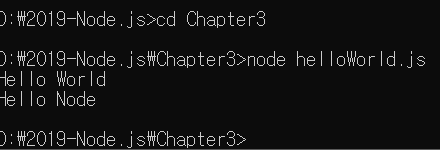

> 3.2 Js 파일 실행하기

>> REPL에 직접 코드를 입력하는 대신 자바스크립트 파일을 만들어 실행해보자.
>> 따로 폴더를 만들어 파일들을 모아두는 것이 편리
	    
>> 콘솔에서 'node 자바스크립트 파일 경로'로 실행함.
>> 확장자(.js)는 생략 가능(REPL에서 입력하는 것 아니니 주의)
>> 콘솔에서 입력해야 함.
>> 콘솔 => REPL로 들어가는 명령어 : node
>> 노드를 통해 파일을 실행하는 명령어 : node 자바스크립트 파일 경로
	    

