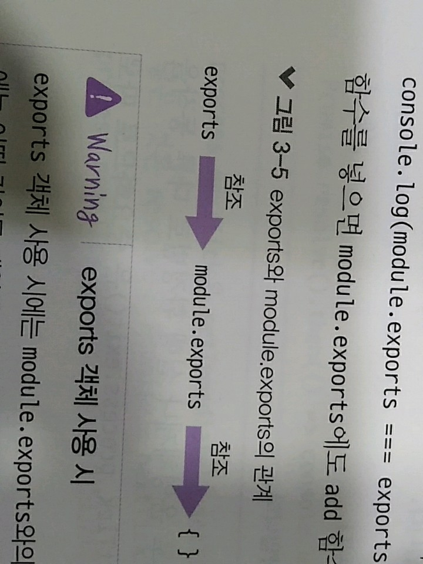

> 3.4.5 module, exports

>> 지금까지 모듈 생성시 module.exports만 사용했었지만, module 객체 말고 exports 객체로도 모듈을 만들 수 있음

>> module.export로 한 번에 대입하는 대신, 각각의 변수를 exports 객체에 하나씩 삽입함 
>> 왜 동일하게 동작하는가? 
>> module.exports와 exports가 같은 객체를 참조
>> 실제로 console.log(module.exports === exports)를 하면 true가 나옴 
>> 따라서 exports 객체에 add 함수를 넣으면 module.exports에도 add 함수가 들어감

>> ! exports 객체 사용 시
>> exports 객체 사용 시에는 module.exports와의 참조 관계가 깨지지 않도록 주의해야 함
>> module.exports에는 어떤 값이든 대입해도 되지만, 
exports에는 반드시 객체처럼 속성명과 속성값을 대입해야 함
>> exports에 다른 값을 대입하면 객체의 참조 관계가 끊겨 더 이상 모듈로 기능하지 않음.
>> exports를 사용할 때는 객체만 사용할 수 있어 func.js와 같이 module.exports에 함수를 대입한 경우에는 exports로 바꿀 수 없음
>> exports와 module.exports에는 참조 관계가 있어 한 모듈에 exports 객체와 module.exports를 동시에 사용하지 않는 게 좋음
