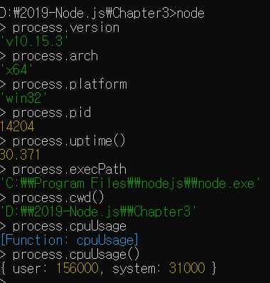
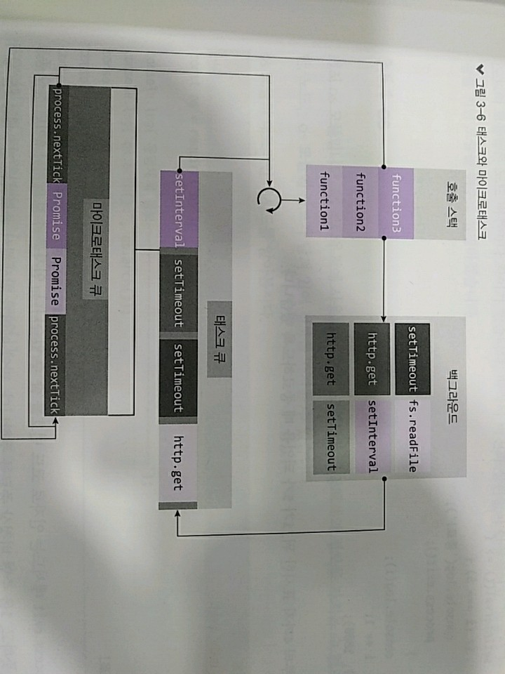
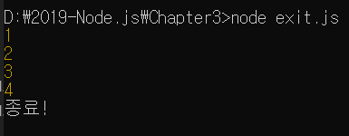

> 3.4.6 process

>> process 객체 : 현재 실행되고 있는 노드 프로세스에 대한 정보를 담고 있음
>> process 객체 안에는 다양한 속성이 있는데, REPL에 하나씩 따라서 입력해보자.
>> 결괏값은 사용자의 컴퓨터마다 차이가 있을 수 있어 



>> 이 정보들의 사용 빈도는 높지 않음.
>> 일반적으로 운영체제나 실행 환경 별로 다른 동작을 하고 싶을 때 사용함
```javascript   
    process.version // 설치된 노드의 버전
    process.arch // 프로세서 아키텍처 정보(arm, ia32 등의 값)
    process.platform // 운영체제 플랫폼(linux, darwin, freebsd) 등의 값
    process.pid // 현재 프로세스의 아이디, 프로세스를 여러 개 가질 때 구분할 수 있음
    process.uptime() // 프로세스가 시작된 후 흐른 시간, 단위는 초
    process.execPath // 노드의 경로
    process.cwd() // 현재 프로세스가 실행되는 위치
    process.cpuUsage() // 현재 cpu 사용량
```

> 3.4.6.1 process.env

>> REPL에 process.env를 입력하면 많은 정보 출력
>> process.env : 서비스의 중요한 키를 저장하는 공간
>> 서버나 데이터베이스의 비밀번호와 각종 API 키를 코드에 직접 입력하는 것은 위험
>> 서비스가 해킹되 코드 유출 시 비밀번호가 코드에 남아 있어 추가 피해 발생 가능

```javascript
    const secretId = process.env.SECRET_ID;
    const secretCode = process.env.SECRET_CODE;
```
>> 이처럼 중요한 비밀번호는 process.env의 속성으로 대체
>> 이제 process.env에 직접 SECRET_ID와 SECRET_CODE를 넣어주면 됨.
>> 넣는 방법은 운영체제마다 차이가 존재
>> but 한 번에 모든 운영체제에 동일하게 넣을 수 잇는 방법이 존재! => 나중에 배우자

> 3.4.6.2 process.nextTick(콜백)

>> 이벤트 루프가 다른 콜백함수들 보다 nextTick의 콜백함수를 우선으로 처리하게 만듬

```javascript
    // nextTick.js
    setImmediate(()=>{
        console.log('immediate');
    });
    process.nextTick(()=>{
        console.log('nextTick');
    });
    setTimeout(()=>{
        console.log('timeout');
    },0);
    Promise.resolve().then(()=>{
        console.log('promise');
    });
```

>> process.nextTick : setImmediate나 setTimeout보다 먼저 실행됨. 
>> 코드 맨 맽에 Promise를 넣은 것은 resolve된 Promise도 nextTick처럼 다른 콜백들보다 우선시 됨.
>> 그래서 process.nextTick과 Promise : microtask라고 따로 구분지어 부름



>> ! 마이크로태스크의 재귀 호출
>>
>> process.nextTick으로 받은 콜백 함수나 resolve된 Promise는 다른 이벤트 루프에서 대기하는 콜백 함수보다도 먼저 실행됨.
>> 그래서 비동기 처리 할 때 setImmediate보다 process.nextTick을 더 선호하는 개발자도 있음
>> 하지만, 이런 Microtask를 재귀 호출하게 되면 이벤트 루프는 다른 콜백 함수보다 Microtask를 우선하여 처리하므로 콜백 함수들이 실행되지 않을 수도 있음

> 3.4.6.3 process.exit(콜백)

>> 실행 중인 노드 프로세스를 종료
>> 서버에 이 함수를 사용하면 서버가 멈춤 => 서버에는 거의 사용하지 않음 
>> But, 서버 외의 독립적인 프로그램에선 수동으로 노드를 멈추게 하기 위해 사용함.

```javascript
    let i = 1;
    setInterval(()=>{
        if(i === 5){
            console.log('종료!');
            process.exit();
        }

        console.log(i);
        i += 1;
    }, 1000);
```
>> process.exit 메서드는 인자로 코드 번호를 줄 수 있음
>> 인자를 주지 않거나 0이면 정상 종료를 뜻하고, 1을 주면 비정상 종료를 뜻함
>> 만약 에러가 발생해 종료하는 경우 1을 넣어주면 됨.



>> 타이머, 콘솔, 프로세스, 모듈은 기본적인 기능 But 앞으로도 계속 사용됨.
>> 또한, 노드는 여러 가지 강력한 기능을 기본 모듈로 제공 

