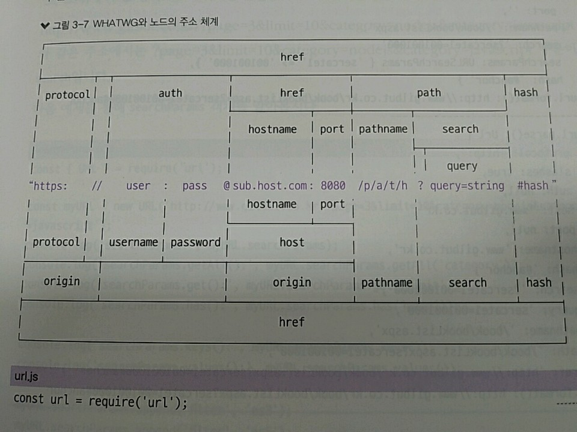
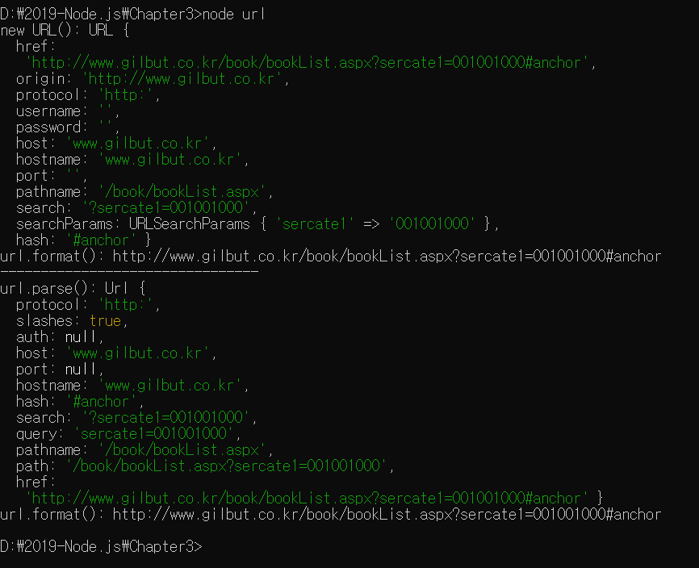
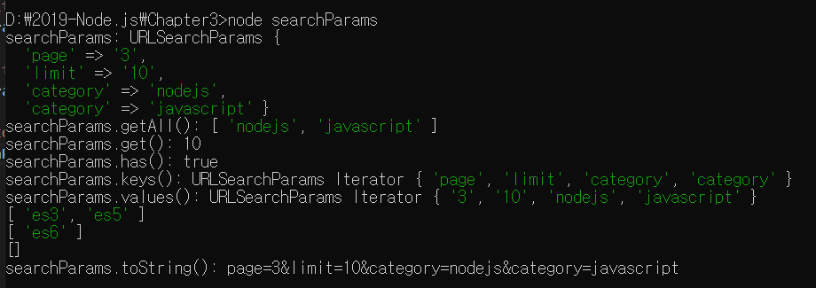

> 3.5.3 url

>> 인터넷 주소를 쉽게 조작하도록 도와주는 모듈
>> 노드 버전 7에서 추가된 WHATWG(웹 표준을 정하는 단체의 이름) 방식
>> 노드에서 사용하던 방식의 url이 있음

>> 가운데 주소를 기준으로 위쪽은 기존 노드의 url 구분 방법, 아래쪽은 WHATWG의 url 구분 방법

>> 기존 노드 방식에선 두 메서드 주로 사용

* url.parse(주소) : 주소를 분해함, WHATWG 방식과 비교하면 username과 password 대신 auth 속성이 있고, searchParams 대신 query가 있음
* url.format(객체) : WHATWG 방식의 url과 기존 노드의 url 모두 사용할 수 있습니다. 분해되었던 url 객체를 다시 원래 상태로 조립.

>> WHATWG와 노드의 url은 취향에 따라 사용하면 되지만, 노드의 url 형식을 꼭 사용해야 하는 경우가 존재

* 주소가 host 부분 없이 pathname 부분만 오는 경우(/book/bookList.aspx), WHATWG 방식은 이 주소를 처리할 수 없음

>> WHATWG 방식 : search 부분을 searchParams라는 특수한 객체로 반환하므로 유용
>> search 부분은 보통 주소를 통해 데이터를 전달할 때 사용됨.
>> search : 물음표(?)로 시작하고, 그 뒤에 키=값 형식으로 데이터를 전달함 => 여러 키가 있을 경우에는 &로 구분

>> ex) http://www.gilbut.co.kr/?page=3&limit=10&category=nodejs&category=javascript와 같은 주소에서는 
>> ?page=3&limit=10&category=nodejs&category=javascript 부분이 search

>> URL 생성자를 통해 myURL이라는 주소 객체를 만듬 => myURL 안에는 searchParams 객체가 있음
>> 이 객체는 search 부분을 조작하는 다양한 메서드를 지원

* getAll(키) : 키에 해당하는 모든 값들을 가져옴. category 키엔 두 가지 값, nodejs와 javascript의 값이 들어있음
* get(키) : 키에 해당하는 첫 번째 값만 가져옴 
* has(키) : 해당 키가 있는지 없는지를 검사함
* keys() : searchParams의 모든 키를 반복기(iterator) 객체로 가져옴
* values() : searchParams의 모든 값을 반복기 객체로 가져옴
* append(키, 값) : 해당 키를 추가함, 같은 키의 값이 있다면 유지하고 하나 더 추가
* set(키, 값) : append와 비슷하지만 같은 키의 값들을 모두 지우고 새로 추가
* delete(키) : 해당 키를 제거함
* toString() : 조작한 searchParams 객체를 다시 문자열로 만듬. 이 문자열을 search에 대입하면 주소 객체에 반영됨.

>> query 같은 문자열보다 searchParams가 유용한 이유는 query의 경우 다음 절에 나오는 querystring 모듈을 한 번 더 사용해야 함.
