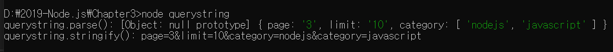
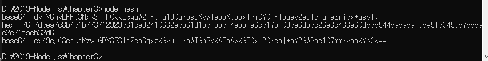
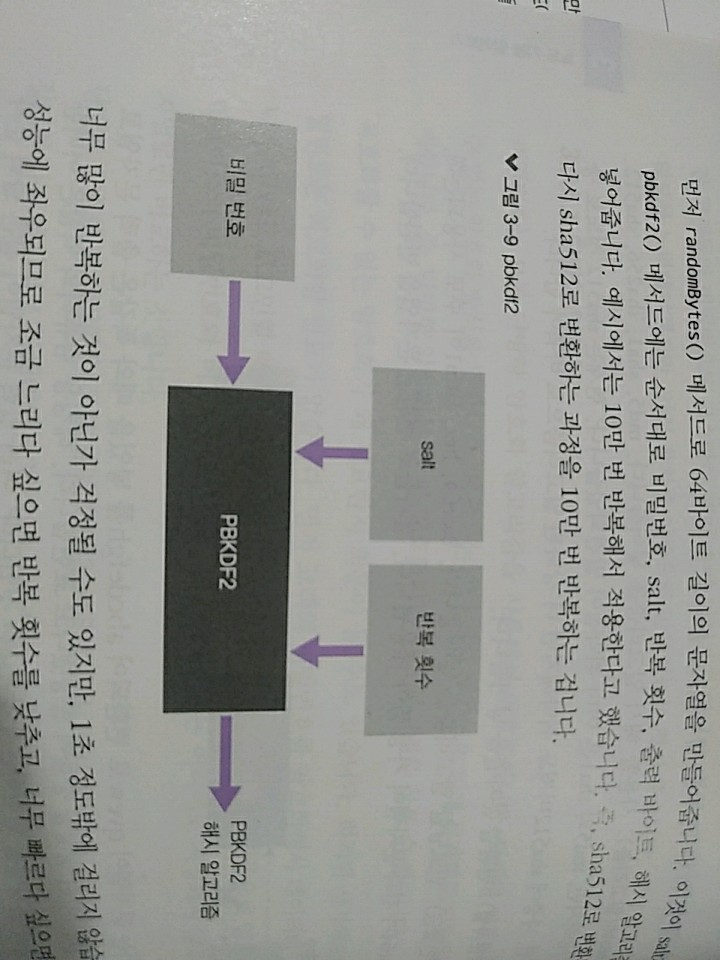
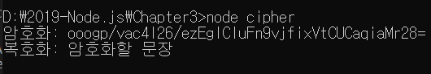

> 3.5.4 querystring

>> WHATWG 방식의 url 대신 기존 노드의 url을 사용할 떄 search 부분을 사용하기 쉽게 객체로 만드는 모듈



>> 처음으로 모듈 두 개를 함께 사용함. 실제 프로젝트에서도 이렇게 모듈 여러 개를 파일 하나에 불러올 수 있음

* querystring.parse(쿼리) : url의 query 부분을 자바스크립트 객체로 분해해줌
* querystring.stringify(객체) : 분해된 query 객체를 문자열로 다시 조립해줌
>> 간단하게 객체로 분해되고 문자열로 조립되므로 편리함.

> 3.5.5 crypto

>> 다양한 방식의 암호화를 도와주는 모듈, 몇 가지 메서드는 익혀두면 실제 서비스에도 적용할 수 있어 정말 유용
>> 고객의 비밀번호는 반드시 암호화해야함. 비밀번호를 암호화하지 않으면 비밀번호를 저장해둔 데이터베이스가 해킹당하는 순간
>> 고객들의 비밀번호도 고스란히 해커 손에 넘어가고 만다.
>> 물론 데이터 베이스가 해킹당하지 않도록 노력해야하지만, 안전 장치를 이중으로 만들어 놓는 것이 좋음

> 3.5.5.1 단방향 암호화

>> 비밀번호는 보통 단방향 암호화 알고리즘을 사용해서 암호화(복호화-암호화된 문자열을 원래 문자열로 되돌려 놓는 것)
>> 복호화할 수 없는 암호화 방식을 의미, 한 번 암호화되면 원래 문자열을 찾을 수 없음
>> 
>> 그럼 복호화할 수 없는 암호화가 왜 필요한가? => 생각해보자, 고객의 비밀번호는 복호화할 필요가 없어
1. 먼저 고객의 비밀번호를 암호화해서 데이터베이스에 저장
2. 로그인할 때마다 입력받은 비밀번호를 같은 암호화 알고리즘으로 암호화한 후,
3. 데이터베이스의 비밀번호와 비교하면 됨.
4. => 원래 비밀번호는 어디에도 저장되지 않고 암호화된 문자열로만 비교하는 것

>> 단방향 암호화 알고리즘 : 주로 해시 기법을 사용
>> 해시 기법?
>> 어떠한 문자열을 고정된 길이의 다른 문자열로 바꾸어버리는 방식
>> ex) abcdefgh라는 문자열 => qvew로 바꾸어버리고, ijklm라는 문자열 => zvsf로 바꿔버림
>> 입력 문자열의 길이는 다르지만, 출력 문자열의 길이는 네 자리로 고정되어 있음

 

>> 비밀번호라는 문자열을 해시를 사용해 바꾸어보았음

* createHash(알고리즘) : 사용할 해시 알고리즘을 넣어줌 md5, sha1, sha256, sha512 등이 가능하지만, md5와 sha1은 이미 취약점이 발견
    현재는 sha512 정도로 충분하지만, 나중에 sha512로도 취약해지면 더 강화된 알고리즘으로 바꾸어야 함.
* update(문자열) : 변환할 문자열을 넣어줌
* digest(인코딩) : 인코딩할 알고리즘을 넣어줌, base64, hex,latin1이 주로 사용됨. 그 중 base64가 결과 문자열이 가장 짧아 애용 
    => 결과물로 변환된 문자열을 반환함.


>> 가끔 nopqrst라는 문자열이 qvew로 변환되어 abcdefgh를 넣었을 때와 똑같은 출력 문자열로 바뀐다? => 충돌이 발생했다.
>> 해킹용 컴퓨터의 역할 : 어떤 문자열이 같은 출력 문자열을 반환하는지 찾아내는 것
>> 여러 입력문자열이 같은 출력 문자열로 변환될 수 있어 비밀번호를 abcdefgh로 설정했어도 nopqrst로 뚫리는 사태가 발생함

>> 해킹용 컴퓨터의 성능이 발달함 => 기존 해시 알고리즘들이 위협받고 있음 But, 해시 알고리즘도 더 강력하게 진화하고 있음
>> 언젠가 sha512도 취약점이 발견되면 => sha3으로 이전하자.

>> 현재는 주로 pbkdf2나 bcrypt, scrypt라는 알고리즘으로 비밀번호를 암호화하고 있음.
>> 이 중에 노드에서 지원하는 pbkdf2에 대해 알아보자 
>> pbkdf2 : 기존 문자열에 salt라고 불리는 문자열을 붙인 후 해시 알고리즘을 반복해서 적용하는 것

```javascript
    const crypto = require('crypto');

    crypto.randomBytes(64, (err,buf) => {
        const salt = buf.toString('base64');
        console.log('salt:' ,salt);
        crypto.pbkdf2('비밀번호', salt, 100000,64,'sha512', (err, key) =>{
            console.log('password:',key.toString('base64'));
        });
    });
```




>> 먼저 randomBytes() 메서드로 64바이트 길이의 문자열을 만들어줌. => 이것이 salt가 됨.
>> pbkdf2() 메서드에는 순서대로 비밀번호, salt, 반복 횟수, 출력 바이트, 해시 알고리즘을 인자로 넣어줌
>> ex) 예시에선 10만 번 반복해서 적용한다고 함. (즉, sha512로 변환된 결괏값을 다시 sha512로 변환하는 과정을 10만 번 반복하는 것)
>> 예시에선 1초 정도만 걸리고 컴퓨터의 성능에 좌우되므로 조금 느리다 싶으면 반복 횟수를 낮추고, 너무 빠르다 싶으면 1초 정도가 될 때까지 반복 횟수 UP


>> pbkdf2는 간단하지만, bcrypt나 scrypt보다 취약하므로 나중에 더 나은 보안이 필요하면 scrypt방식을 사용하면 됨.

> 3.5.5.2 양방향 암호화

>> 암호화된 문자열을 복호화할 수 있음, 여기서는 키(열쇠)라는 것이 사용됨. 암호를 복호화하려면 암호화할 때 사용한 키와 같은 키를 사용해야 함

```javascript
    const crypto = require('crypto');

    const cipher = crypto.createCipher('aes-256-cbc', '열쇠');
    let result = cipher.update('암호화할 문장', 'utf8','base64');
    result += cipher.final('base64');
    console.log('암호화:',result);

    const decipher = crypto.createDecipher('aes-256-cbc', '열쇠');
    let result2 = decipher.update(result, 'base64', 'utf8');
    result2 += decipher.final('utf8');
    console.log('복호화:', result2);
    // 원래 문장으로 제대로 복호화 되었음
```
 

* crypto.createCipher(알고리즘, 키) : 암호화 알고리즘과 키를 넣어줌. 암호화 알고리즘은 aes-256-cbc를 사용함. 
    * 다른 알고리즘을 사용해도 되며, 사용 가능한 알고리즘 목록은 crypto.getCiphers()를 하면 볼 수 있음
* cipher.update(문자열, 인코딩, 출력 인코딩) : 암호화할 대상과 대상의 인코딩, 출력 결과물의 인코딩을 넣어줌
    * 보통 문자열은 utf8 인코딩을, 암호는 base64를 많이 사용함
* cipher.final(출력 인코딩) : 출력 결과물의 인코딩을 넣어주면 암호화가 완려됨.
* crypto.createDecipher(알고리즘, 키) : 복호화할 때 사용함. 암호화할 때 사용했던 알고리즘과 키를 그대로 넣어주어야 함
* decipher.update(문자열, 인코딩, 출력 인코딩) : 암호화된 문장, 그 문장의 인코딩, 복호화할 인코딩을 넣어줌
    * createCipher의 update()에서 utf8, base64 순으로 넣었다면 createDecipher의 update()에선 base64, utf8 순으로 넣어주면 됨.
* decipher.final(출력 인코딩) : 복호화 결과물의 인코딩을 넣어줌.

>> 이 이외에도 crypto 모듈은 양방향 비대칭형 암호화, HMAC 등의 다양한 암호화를 제공하고 있음 
>> 암호화가 필요하면 모듈이 어떤 메서드들을 지원하는지 확인해 보면 좋음 
>> 노드 공식 문서에서 확인 가능

