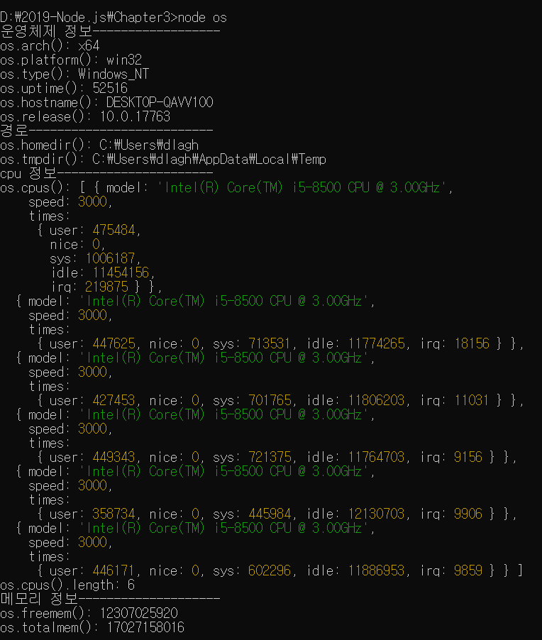

> 3.5 노드 내장 모듈 사용하기 

>> 노드 : 웹 브라우저에서 사용되는 자바스크립트보다 더 많은 기능을 제공 
>> 운영체제 정보에도 접근 가능, 클라이언트가 요청한 주소에 대한 정보도 가져올 수 있음.
>> => 바로 노드에서 제공하는 모듈을 사용하면 됨.

+ 노드의 모듈들은 노드 버전마다 차이가 존재!

>> 3.5.1 os

>> 웹 브라우저에 사용되는 자바스크립트 : 운영체제의 정보를 가져올 수 없음
>> 노드는 OS 모듈에 정보가 담겨 있어 정보를 가져올 수 있음

>> process 객체와 겹치는 부분도 있음
>> os : 사용자 컴퓨터의 운영체제 정보를 가져옴

    + os.arch() : process.arch와 동일
    + os.platform() : process.platform과 동일
    + os.type() : 운영체제의 종류를 보여줌
    + os.uptime() : 운영체제 부팅 이후 흐른 시간(초)을 보여줌, process.uptime()은 노드의 실행 시간
    + os.hostname() : 컴퓨터의 이름을 보여줌
    + os.release() : 운영체제의 버전을 보여줌
    + os.homedir() : 홈 디렉터리 경로를 보여줌
    + os.tmpdir() : 임시 파일 저장 경로를 보여줌
    + os.cpus() : 컴퓨터의 코어 정보를 보여줌
    + os.freemem() : 사용 가능한 메모리(RAM)을 보여줌
    + os.totalmem() : 전체 메모리 용량을 보여줌

* ! 코어 개수 확인하기

    * os.cpus().length를 하면 코어의 개수가 숫자로 나옴.
    * 하지만 노드는 싱글 스레드라 코어가 몇 개이든 대부분의 경우 코어를 하나밖에 사용하지 않음
    * But, Cluster 모듈을 사용하는 경우 코어 개수에 맞춰서 프로세스를 늘릴 수 있음
    * => 이 때 cpus() 메서드를 사용할 것

>> os.constants라는 객체도 존재 
>> => 각종 에러와 신호에 대한 정보가 담김
>> 에러 발생 시, EADDRINUSE나 ECONNRESET 같은 에러 코드를 함께 보여줌 => 이러한 코드들이 들어있음
>> 너무 많아서 발생할 때마다 검색 ㄱㄱ

>> os 모듈 : 주로 컴퓨터 내부 자원에 빈번하게 접근하는 경우 사용됨.
>> 즉, 일반적인 웹 서비스를 제작할 때는 사용빈도가 높지 않음
>> But, 운영체제별로 다른 서비스를 제공하고 싶을 때 os 모듈이 유용할 것
