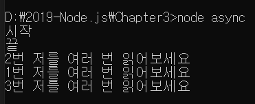
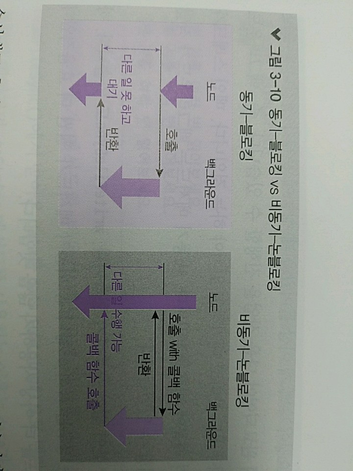
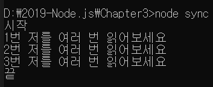
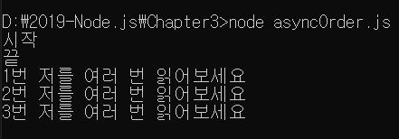

> 3.6.1 동기 메서드와 비동기 메서드

>> setTimeoout 같은 타이머와 process.nextTick 외에도, 노드는 대부분의 메서드를 비동기 방식으로 처리
>> But, 몇몇 메서드는 동기 방식으로도 사용할 수 있음 => 특히, fs 모듈

>> 파일 하나를 여러번 읽어보는 예제

```javascript
    const fs = require('fs');

    console.log('시작');
    fs.readFile('./readme2.txt',(err,data)=>{
        if(err){
            throw err;
        }
        console.log('1번', data.toString());
    });
    fs.readFile('./readme2.txt',(err, data)=>{
        if(err){
            throw err;
        }
        console.log('2번', data.toString());
    });
    fs.readFile('./readme2.txt', (err, data)=>{
        if(err){
            throw err;
        }
        console.log('3번', data.toString());
    });
    console.log('끝');
```


>> 시작과 끝을 제외하고는 결과가 달라질 수 있음 => 반복 실행할 때마다 결과가 달라짐

* 비동기 메서드들은 백그라운드에 해당 파일을 읽으라고만 요청하고 다음 작업으로 넘어감
    * 따라서 파일 읽기 요청만 세 번 보내고 console.log('끝')을 찍음
    * 나중에 읽기가 완료되면 백그라운드가 다시 메인 스레드에 알림을 줌
    * 메인 스레드는 그제서야 등록된 콜백 함수를 실행함.

>> 이 방식은 상당히 좋음 why? 수백 개의 I/O 요청이 들어와도 메인 스레드는 백그라운드에 요청 처리를 위임
>> 그 후로도 얼마든지 요청을 더 받을 수 있음.
>> 나중에 백그라운드가 각각의 요청 처리가 완료되었다고 알리면 그 때 콜백 함수를 처리하면 됨.



* ! 동기와 비동기, 블로킹과 논블로킹?
    * 노드에선 동기, 비동기, 블로킹, 논블로킹이라는 네 용어가 혼용 => 용어가 다른 만큼 의미도 차이가 존재
    * 동기, 비동기 : 함수가 바로 return 되는지의 여부
    * 블로킹과 논블로킹 : 백그라운드 작업 완료 여부
    *
    * 노드에선 동기-블로킹 방식과 비동기-논블로킹 방식이 대부분
    * 동기-블로킹 방식
        * 백그라운드 작업 완료 여부를 계속 확인하며, 호출한 함수가 바로 return되지 않고 백그라운드 작업이 끝나야 return 됨
    * 비동기-논블로킹 방식 
        * 호출한 함수가 바로 return되어 다음 작업으로 넘어가고, 백그라운드 작업 완료 여부는 신경 쓰지 않고 나중에 백그라운드가 알림을 줄 때 처리함.

```javascript
    const fs = require('fs');

    console.log('시작');
    let data = fs.readFileSync('./readme2.txt');
    console.log('1번', data.toString());
    data = fs.readFileSync('./readme2.txt');
    console.log('2번', data.toString());
    data = fs.readFileSync('./readme2.txt');
    console.log('3번', data.toString());
    console.log('끝');
```

>> 코드의 모양이 많이 바뀌었습니다. readFile() 대신 readFileSync()라는 메서드를 사용함.
>> 그런데, 콜백 함수를 넣는 대신 직접 return 값을 받아옴. 



>> 코드는 훨씬 더 이해하기 쉽지만 치명적인 단점 존재 
>> readFileSync 메서드를 사용 => 요청이 수백 개 이상 들어왔을 때 성능에 문제가 생김
>> Sync 메서드를 사용할 때는 이전 작업이 완료되어야 다음 작업을 진행할 수 있음
>> 즉, 백그라운드가 작업하는 동안 메인 스레드는 아무것도 못하고 대기하고 있어야 하는 것 
>>
>> 메인 스레드가 일을 하지 않고 노는 시간이 생기기 때문에 비효율적 => 비동기 메서드는 백그라운드가 작업을 하는 와중에도 다음 작업 처리 가능
>> 
>> 동기 메서드들 : 이름 뒤에 Sync가 붙어 있어 구분하기 쉽다. => writeFileSync도 있음
>> 하지만 동기 메서드를 사용해야 하는 경우는 극히 드뭄, 비동기 메서드가 훨씬 더 효율적임 => 동기 메서드를 왠만하면 사용하지 않을 것

```javascript
    const fs = require('fs');

    console.log('시작');
    fs.readFile('./readme2.txt', (err, data)=>{
        if(err)
        {
            throw err;
        }
        console.log('1번', data.toString());
        fs.readFile('./readme2.txt', (err, data)=>{
            if(err)
            {
                throw err;
            }
            console.log('2번',data.toString());
            fs.readFile('./readme2.txt',(err, data)=>{
                if(err){
                    throw err;
                }
                console.log('3번', data.toString());
            });
        });
    });
    console.log('끝');
```



>> 이전 readFile() 콜백에 다음 readFile()을 넣어주면 됨. 
>> 소위 말하는 콜백 지옥이 펼쳐지지만 적오도 순서가 어긋나는 일은 없음
>> 콜백 지옥은 Promise나 async/await로 어느 정도 해결할 수 있음
>>
>> 그럼 왜? readFile()과 readFileSync()에서 받아온 data를 data.toString()으로 변환하는 이유을 알아보자
>> => toString 메서드를 사용하는 이유는 data가 버퍼이기 때문 
