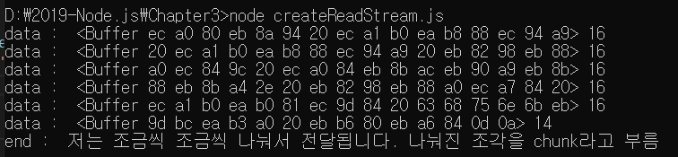
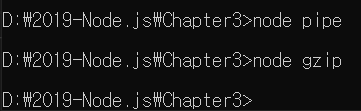

> 3.6.2 버퍼와 스트림 이해하기 

>> 파일을 읽거나 쓰는 방식 : 버퍼를 이용하는 방식, 스트림을 이용하는 방식 존재
>> 버퍼링 : 영상을 재생할 수 있을 때까지 데이터를 모으는 동작 
>> 스트리밍 : 방송인의 컴퓨터에서 시청자의 컴퓨터로 영상 데이터를 조금씩 전송하는 동작
>> 스트리밍하는 과정에서 버퍼링을 할 수도 있음 => 전송이 너무 느리면 화면을 내보내기까지 최소한의 데이터를 모아야 하고 
>> 영상 데이터가 재생 속도보다 빨리 전송되어도 미리 전송받은 데이터를 저장할 공간이 필요하기 때문.

>> 노드의 버퍼와 스트림도 비슷한 개념
>> readFile 메서드를 사용할 때 읽었던 파일이 버퍼 형식으로 출력되었음
>> 노드 : 파일을 읽을 때 메모리에 파일 크기만큼 공간을 마련해둠 => 파일 데이터를 메모리에 저장한 뒤 사용자가 조작할 수 있도록 해줌
>> 메모리에 저장된 데이터 => 버퍼

```javascript
    const buffer = Buffer.from('저를 버퍼로 바꿔보세요');
    console.log('from():', buffer);
    console.log('length:', buffer.length);
    console.log('toString():',buffer.toString());

    const array = [Buffer.from('띄엄 '), Buffer.from('띄엄 '), Buffer.from('띄엄 ')];
    const buffer2 = Buffer.concat(array);
    console.log('concat():', buffer2.toString());

    const buffer3 = Buffer.alloc(5);
    console.log('alloc:',buffer3);
```

* Buffer 객체는 여러가지 메서드를 제공
    * from(문자열) : 문자열을 버퍼로 바꿀 수 있음. length 속성은 버퍼의 크기를 알려줌 => 바이트 단위
    * toString(버퍼) : 버퍼를 다시 문자열로 바꿀 수 있음, 이때 base64나 hex를 인자로 넣으면 해당 인코딩
    * concat(배열) : 배열 안에 든 버퍼들을 하나로 합친다. 
    * alloc(바이트) : 빈 버퍼를 생성함. 바이트를 인자로 지정해주면 해당 크기의 버퍼가 생성됨.

>> readFile() 방식의 버퍼가 편리하기는 하지만 문제점도 존재!
>> if 용량이 100MB인 파일이 있으면 읽을 때 메모리에 100MB의 버퍼를 만들어야 함. 이 작업을 동시에 열 개만 해도 1GB에 달하는 메모리가 사용됨.
>> 특히 서버 같이 몇 명이 이용할지 모르는 환경에서는 메모리 문제가 발생 가능 

>> 또한, 모든 내용을 버퍼에 다 쓴 후에야 다음 동작으로 넘어감 => 파일 읽기, 압축, 파일 쓰기 등의 조작을 연달아 할 때
>> 매번 전체 용량을 버퍼로 처리해야 다음 단계로 넘어갈 수 있음

>> => 버퍼의 크기를 작게 만들어서 여러 버에 나눠서 보내는 방식이 등장 
>> ex) 버퍼 1MB를 만든 후 100MB 파일을 백 번에 걸쳐 보내는 것
>> => 메모리 1MB로 100MB 파일을 전송할 수 있음 (이를 편리하게 만든 것 = 스트림)

```javascript
const fs = require('fs');

const readStream = fs.createReadStream('./readme3.txt', { highWaterMark: 16 });
const data = [];

readStream.on('data', (chunk) => {
    data.push(chunk);
    console.log('data : ', chunk, chunk.length);
});

readStream.on('end', () => {
    console.log('end : ', Buffer.concat(data).toString());
});

readStream.on('error', (err) => {
    console.log('error :', err);
});
```


1. createReadStream()으로 읽기 스트림을 만들어줌
2. 첫 번째 인자로 읽을 파일 경로를 넣음, 두 번째 인자는 옵션 객체인데, highWaterMark라는 옵션이 버퍼의 크기(바이트 단위)를 정할 수 있는 옵션
    - 기본 값은 64KB이지만 여러 번 나눠서 보내는 모습을 보여주기 위해 16KB로 낮춤
3. readStream : 이벤트 리스너를 붙여서 사용, 보통 data, end, error 이벤트를 사용함. ex) readStream.on('data') 같이 이벤트 리스너를 붙임
4. 파일을 읽는 도중 에러가 발생하면 error 이벤트가 호출되고, 파일 읽기가 시작되면 data 이벤트가 발생함
    - 16B씩 읽도록 설정했으므로 파일의 크기가 16B보다 크다면 여러 번 발생할 수도 있음
5. 파일을 다 읽으면 end 이벤트가 발생함

>> 예제 : 미리 data 배열을 만들어 놓고 들어오는 chunk들을 하나씩 push한 뒤 마지막에 Buffer.concat()으로 합쳐 다시 문자열을 만듬
>> 파일의 크기가 99B라 무려 7번에 걸쳐 데이터를 전송했었어, But 기본값으론 64KB씩 전송해 대부분의 txt파일들은 한 번에 전송함.

```javascript
    const fs = require('fs');

    const writeStream = fs.createWriteStream('./wrtiteme2.txt');
    writeStream.on('finish', ()=>{
        console.log('파일 쓰기 완료');
    });

    writeStream.write('이 글을 씁니다.\n');
    writeStream.write('한 번 더 씁니다.');
    writeStream.end();
```


1. createWriteStream()으로 쓰기 스트림을 만들어 줌 ( 첫 번째 인자 : 출력 파일명, 두 번째 인자 : 옵션(여기선 안 씀))
2. finish 이벤트 리스너도 붙여줌, 파일 쓰기가 종료되면 콜백 함수가 호출됨.
3. writeStream에서 제공하는 write() 메서드로 넣을 데이터를 씁니다. 여러번 호출 가능
    - 데이터를 다 썼다면 end() 메서드로 종료를 알려줌 => 이 때 finish 이벤트가 발생 
4. createReadStream으로 파일을 읽고 그 스트림을 전달받아 createWriteStream으로 파일을 쓸 수도 있음
    - 파일 복사와 비슷, 스트림끼리 연결하는 것을 '파이핑한다'고 표현


```javascript
const fs = require('fs');

const readStream = fs.createReadStream('readme4.txt');
const writeStream = fs.createWriteStream('writeme4.txt');
readStream.pipe(writeStream);
```

>> readme4.txt와 똑같은 내용의 writeme3.txt가 생성되었을 것 
>> 미리 읽기 스트림과 쓰기 스트림을 만들어둔 후 두 개의 스트림 사이를 pipe 메서드로 연결해주면 저절로 데이터가 writeStream으로 넘어감.
>> on(data)나 writeStream.write()를 하지 않아도 알아서 전달되므로 편리 

>> pipe : 스트림 사이에 연결할 수 있음

```javascript
    const zlib = require('zlib');
    const fs = require('fs');

    const readStream = fs.createReadStream('./readme4.txt');
    const zlibStream = zlib.createGzip();
    const writeStream = fs.createWriteStream('./readme4.txt.gz');
    readStream.pipe(zlibStream).pipe(writeStream);
```

>> 노드에선 파일을 압축하는 zlib이라는 모듈 제공
>> zlib의 createGzip()이라는 메서드가 스트림을 지원하므로 readStream과 writeStream 중간에서 파이핑을 할 수 있음
>> 버퍼 데이터가 전달되다가 gzip 압축을 거친 후 파일로 쓰여짐



>> readme4.txt.gz 파일이 생성됨 => 전체 파일을 모두 버퍼에 저장하는 readFile() 메서드와 부분으로 나눠 읽는 createReadStream 메서드에 대해 알아봄

