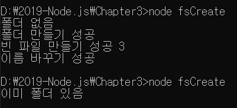
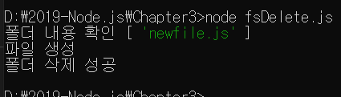
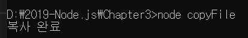

> 3.6.3 기타 fs 메서드 

>> fs : 파일 시스템을 조작하는 다양한 메서드를 제공 => 파일 생성, 삭제, 폴더 생성, 삭제 가능 

```javascript
    const fs = require('fs');

    fs.access('./folder',fs.constants.F_OK | fs.constants.R_OK | fs.constants.W_OK, (err)=>{

        if(err){
            if(err.code === 'ENOENT'){
                console.log('폴더 없음');
            
            fs.mkdir('./folder',(err) =>{
                if(err){
                    throw err;
                }
                console.log('폴더 만들기 성공');
                fs.open('./folder/file.js','w',(err,fd)=>{
                    if(err){
                        throw err;
                    }
                    console.log('빈 파일 만들기 성공', fd);
                    fs.rename('./folder/file.js','./folder/newfile.js',(err)=>{
                        if(err){
                            throw err;
                        }
                        console.log('이름 바꾸기 성공');
                    });
                });
            });
            }
            else{
                throw err;
            }
        }
        else{
            console.log('이미 폴더 있음');
        }
    });
```



* 모두 비동기 메서드 => 한 메서드의 콜백에서 다른 메서드를 호출

    * fs.access(경로, 옵션, 콜백) : 폴더나 파일에 접근할 수 있는지를 체크, 두 번째 인자로 상수들을 넣었음 
        * F_OK : 파일 존재 여부, R_OK : 읽기 권한 여부, W_OK : 쓰기 권한 여부 체크
        * 파일/폴더나 권한이 없다면 에러가 발생, 파일/폴더가 없을때의 에러 코드 : ENOENT
    * fs.mkdir(경로, 콜백) : 폴더를 만드는 메서드, 이미 폴더가 있다면 에러가 발생하므로 먼저 access() 메서드를 호출해서 확인하는 것이 중요
    * fs.open(경로, 옵션, 콜백) : 파일의 아이디(fd 변수)를 가져오는 메서드임. 파일이 없다면 파일을 생성한 뒤 그 아이디를 가져옴
        * 가져온 아이디를 사용해 fs.read()나 fs.write()로 읽거나 쓸 수 있음
        * 쓰려면 w, 읽으면 r, 기존 파일에 추가하려면 a. (예제에선 w로 설정했으므로 파일이 없을 때 새로 만들 수 있었어, r이었다면 에러가 발생하였음)
    * fs.rename(기존 경로, 새 경로, 콜백) : 파일의 이름을 바꾸는 메서드, 기존 파일 위치와 새로운 파일 위치를 적어주면 됨.
        * 반드시 같은 폴더를 지정할 필요는 없으므로 잘라내기 같은 기능을 할 수도 있음.

```javascript
    const fs = require('fs');

    fs.readdir('./folder', (err, dir)=>{
        if(err){
            throw err;
        }
        console.log('폴더 내용 확인', dir);
        fs.unlink('./folder/newFile.js', (err)=>{
            if(err)
            {
                throw err;
            }
            console.log('파일 생성');
            fs.rmdir('./folder',(err)=>{
                if(err)
                {
                    throw err;
                }
                console.log('폴더 삭제 성공');
            });
        });
    });
```



* fs.readdir(경로, 콜백) : 폴더 안의 내용물을 확인할 수 있음, 배열 안에 내부 파일과 폴더명이 나옴
* fs.unlink(경로, 콜백) : 파일을 지울 수 있음. 파일이 없다면 에러가 발생하므로 먼저 파일이 있는지를 꼭 확인해야 함
* fs.rmdir(경로, 콜백) : 폴더를 지울 수 있음. 폴더 안에 파일이 있다면 에러가 발생하므로 먼저 내부 파일을 지우고 호출해야 함

>> 노드 8.5 버전에서 파일 복사 방법도 새로 추가됨.

```javascript
    const fs = require('fs');
    
    fs.copyFile('readme4.txt', 'writeme4.txt', (error)=>{
        if(error){
            return console.error(error);
        }
        console.log('복사 완료');
    });
```



>> 동일한 내용의 writeme4.txt가 생성됨 
>> 첫 번째 인자 : 복사할 파일, 두 번째 인자 : 복사될 경로, 세 번째 인자 : 복사 후 실행될 콜백 함수를 넣음

* ! fs 프로미스 
    * 노드 10 버전에 fs 모듈을 프로미스 형식으로 사용하는 방법이 추가되었음
    * fs 모듈로부터 promises 객체를 불러와 사용합니다.
    ```javascript
        const fsPromises = require('fs').promises;
    ```
    * 하지만 아직 실험적인 기능 


