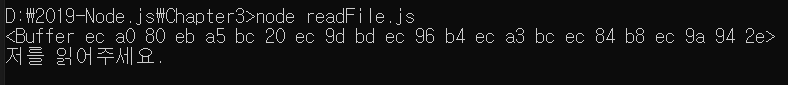
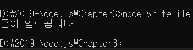

> 3.6 파일 시스템 접근하기

>> fs 모듈 : 파일 시스템에 접근하는 모듈 
>> 즉, 파일을 생성하거나 삭제하고, 읽거나 쓸 수 있음, 폴더도 만들었다 지웠다 할 수 있음
>> 웹 브라우저에서 자바스크립트를 사용할 때는 파일 다운로드와 파일 시스템 접근이 금지되어 있어.

```javascript
const fs= require('fs');

fs.readFile('./readme.txt', (err, data)=>{
    if(err){
        throw err;
    }
    console.log(data);
    console.log(data.toString());
});
```

>> fs 모듈 불러온 뒤 읽을 파일의 경로를 지정합니다, 콜백 함수도 readFile 메서드의 인자로 같이 넣어준다는 점.
>> 이 콜백 함수의 매개변수로 에러 또는 데이터를 받는다.
>> 파일을 읽다가 무슨 문제가 생겼다면 에러가 발생할 것이고, 정상적으로 읽었다면?



>> console.log(data) => Buffer라는 것이 출력 
>> data에 toString()을 붙여서 로그를 찍었더니 제대로 문자열이 출력됨.
>> readFile의 결과물은 버퍼라는 형식으로 제공됨. => 버퍼는 메모리의 데이터라고 생각하자
>> 버퍼는 사람이 읽을 수 있는 형식이 아니므로 toString을 사용해 문자열로 변환하였음

```javascript
const fs = require('fs');

fs.writeFile('./write,e.txt', '글이 입력됩니다.', (err) => {

    if (err) {
        throw err;
    }
    fs.readFile('./writeme.txt', (err, data) => {

        if (err) {
            throw err;
        }
        console.log(data.toString());
    });

});
```
>> writeFile() 메서드 : 생성될 파일의 경로와 내용을 입력함. => 도중에 에러가 발생하지 않았다면 같은 폴더 내 writeme.txt가 생성되었을 것
>> readFile() 메서드로 파일을 읽어볼 수 있음.

;

>> 파일이 잘 만들어졌고, 동시에 파일 읽기도 성공했음. => 자바스크립트로도 파일 시스템에 간단하게 접근할 수 있음.