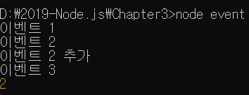

> 3.7 이벤트 이해하기

>> 스트림을 배울 때 on('data', 콜백) 또는 on('end', 콜백)을 사용했었음 
>> => data라는 이벤트와 end라는 이벤트가 발생할 때 콜백 함수를 호출하도록 이벤트를 등록한 것 
>> createReadStream() : 내부적으로 알아서 data, end 이벤트를 호출하지만, 우리가 직접 이벤트를 만들 수도 있음

```javascript 
    const EventEmitter = require('events');

    const myEvent = new EventEmitter();
    myEvent.addListener('event1',()=>{
        console.log('이벤트 1');
    });
    myEvent.on('event2', ()=>{
        console.log('이벤트 2');
    });
    myEvent.on('event2',()=>{
        console.log('이벤트 2 추가');
    });

    myEvent.emit('event1');
    myEvent.emit('event2');

    myEvent.once('event3',()=>{
        console.log('이벤트 3');
    });
    myEvent.emit('event3');
    myEvent.emit('event3');

    myEvent.on('event4',()=>{
        console.log('이벤트 4');
    });

    myEvent.removeAllListeners('event4');
    myEvent.emit('event4');

    const listener = () => {
        console.log('이벤트 5');
    };

    myEvent.on('event5', listener);
    myEvent.removeListener('event5',listener);
    myEvent.emit('event5');

    console.log(myEvent.listenerCount('event2'));
```



>> event 모듈을 사용하면 됨. myEvent라는 객체를 만들자 => 객체는 이벤트 관리를 위한 메서드를 가지고 있음

* on(이벤트명, 콜백) : 이벤트 이름과 이벤트 발생 시 콜백을 연결해 줌 => 이렇게 연결하는 동작 : 이벤트 리스닝
    * event2처럼 이벤트 하나에 이벤트 여러 개를 달아줄 수 있음
* addListener(이벤트명, 콜백) : on과 기능이 같음
* emit(이벤트명) : 이벤트를 호출하는 메서드, 이벤트 이름을 인자로 넣어주면 미리 등록해뒀던 이벤트 콜백이 실행됨.
* once(이벤트명, 콜백) : 한 번만 실행되는 이벤트, myEvent.emit('event3')을 두 번 연속 호출했지만 콜백이 한 번만 실행됨.
* removeAllListeners(이벤트명) : 이벤트에 연결된 모든 이벤트 리스너를 제거. 
    * event4가 호출되기 전에 리스너를 제거했으므로 event4의 콜백은 호출되지 않음.
* removeListener(이벤트명, 리스너) : 이벤트에 연결된 리스너를 하나씩 제거,역시 event5의 콜백도 호출되지 않음
* off(이벤트명, 콜백) : 노드 10 버전에서 추가된 메서드, removeListener와 기능이같음
* listenerCount(이벤트명) : 현재 리스너가 몇 개 연결되어 있는지 확인

>> 스트림에서 보았던 on('data')와 on('end')도 어느 정도 감이 오나?
>> 겉으로 이 이벤트를 호출하는 코드는 없지만, 내부적으로 chunk를 전달할 때마다 data 이벤트를 emit하고 있음
>> => 완료되었을 경우엔 end 이벤트를 emit 한 것 

