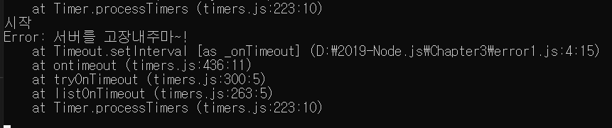
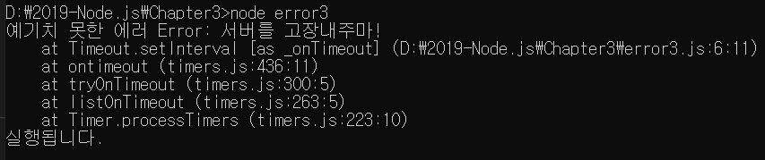

> 3.8 예외 처리하기

>> 노드 : 예외처리가 정말 중요 => 예외 : 처리하지 못한 에러
>> 예외들 : 실행 중인 노드 프로세스를 멈추게 만듬

>> 멀티 스레드 프로그램 - 스레드 하나가 멈추면 그 일을 다른 스레드가 대신하지만, 
>> But, 노드 : 스레드가 하나뿐 => 그 하나를 소중히 보호해야 함.
>> 하나뿐인 스레드가 에러로 인해 멈춘다? => 전체 서버가 멈춘다는 뜻과 같음
>> 아무리 신중을 기해 만들었다고 해도 항상 예기치 못한 에러는 발생하는 법
>> => 그래서 에러를 처리하는 방법을 익혀두어야 하며, 에러 로그는 기록되도 작업은 계속 진행될 수 있도록

```javascript
setInterval(() => {
    console.log('시작');
    try {
        throw new Error('서버를 고장내주마~!');
    } catch (err) {
        console.log(err);
    }
}, 1000);
```
>> 에러가 발생할 것 같은 부분을 try catch문으로 감싸주면 됨.
>> setInterval을 사용한 것은 프로세스가 멈추는지 여부를 체크하기 위해서 
>> 프로세스가 에러로 인해 멈추면 setInterval도 멈출 것 
>> setInterval 내부에 throw new Error()로 에러를 강제로 발생시킴.



>> 에러는 발생하지만 try-catch로 잡을 수 있고 setInterval도 직접 멈추기 전까지 계속 실행됨 
>> => 에러가 발생할 것 같은 부분을 미리 try-catch로 감싸면 됨.

>> 그러면 노드 자체에선?

```javascript
    const fs = require('fs');
    
    setInterval(()=>{
        fs.unlink('./abcdefg.js',(err)=>{
            if(err){
                console.error(err);
            }
        });
    }, 1000);
```
>> fs.unlink()로 없는 파일을 지우고 있음, 에러가 발생하지만 다행히 노드 내장 모듈의 에러는 실행 중인 프로세스를 멈추지 않음
>> 에러 로그를 기록해두고 나중에 원인을 찾아 수정하면 된다.

>> 이전 예제 => throw를 했지만, 이건 노드 프로세스가 멈춰버림
>> 따라서 throw를 하는 경우에 반드시 try-catch문으로 throw한 에러를 잡아주어야 한다.


>> 예측이 불가능한 에러는?

```javascript
    process.on('uncaughtException', (err)=>{
        console.error('예기치 못한 에러', err);
    });
    
    setInterval(()=>{
         throw new Error('서버를 고장내주마!');
    }, 1000);

    setTimeout(()=>{
        console.log('실행됩니다.');
    }, 2000);
```

>> process 객체에 uncaughtException 이벤트 리스너를 달아주었음. 처리하지 못한 에러가 발생했을 때 
>> 이벤트 리스너가 실행되고 프로세스가 유지됨.
>> 이 부분이 없다면 위의 예제에선 setTimeout이 실행되지 않음
>> 실행 후 1초만에 setInterval에서 에러가 발생하여 프로세스가 멈추기 때문
>> But, uncaughtException 이벤트 리스너가 연결되어 있어 프로세스가 멈추지 않음



>> try-catch로 처리하지 못한 에러가 발생했지만, setInterval만 멈췄을 뿐 나머지 코드는 제대로 실행

>> 노드 공식 문서엔 uncaughtException 이벤트를 최후의 수단으로 사용하라고 말함
>> why? 노드는 uncaughtException 이벤트 발생 후 다음 동작이 제대로 동작하는지를 보증하지 않아서 
>> 즉, 복구 작업 코드를 넣어두었더라도 그것이 동작하는지 제대로 확신할 수 없음

>> 따라서, 단순히 에러 내용을 기록하는 정도로 사용하고 process.exit()로 프로세스를 종료하는 것이 좋음
>> 프로세스를 종료하면 서버가 멈추어서 걱정되겠지만, 운영 중인 서버에서 프로세스가 종료되었을 때 재시작하는 방법은? => 나중에 배움

>> 서버 운영은 에러와의 싸움, 모든 에러 상황에 대비하는 것이 최선이지만, 시간이나 비용, 인력 등의 제약으로 미처 대비하지 못한 에러가 있을 수 있어
>> => 에러 발생 시 철저한 기록(로깅)하는 습관을 들이고, 주기적으로 로그를 확인하면서 보완해 나가야 함.

