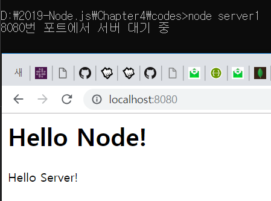
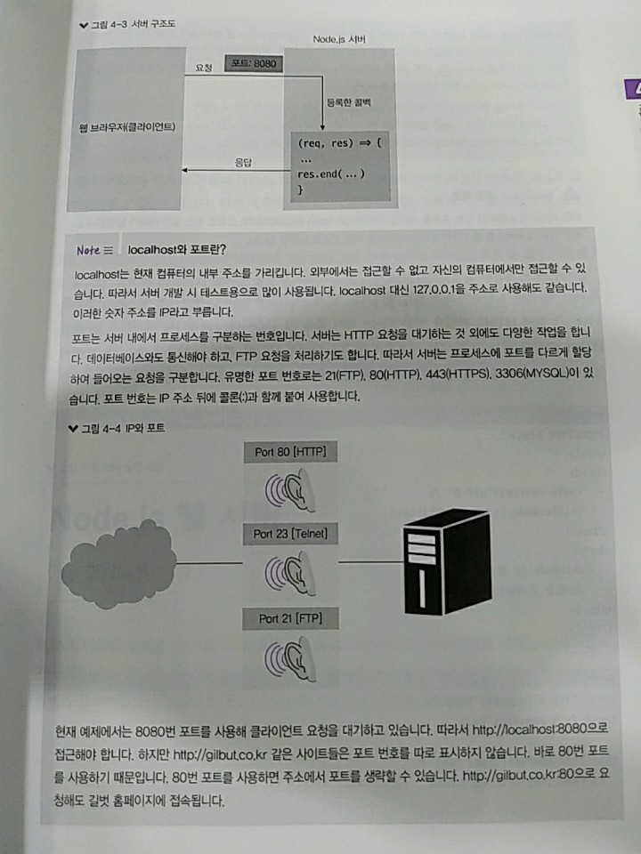
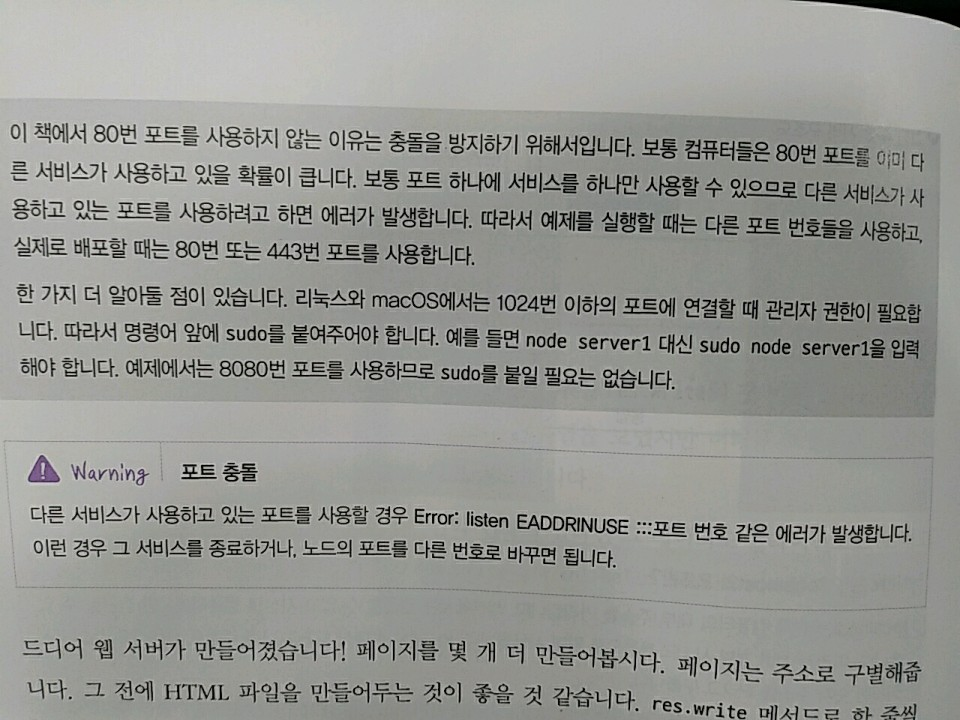

> 4.1 요청과 응답 이해하기 

>> 클라이언트 => 서버 : 요청(request) 보내고 -> 서버에선 요청의 내용을 읽고 처리한 뒤 클라이언트에게 응답(response)을 보냄

```javascript
    const http = require('http');

    http.createServer((req, res) => {
        // 여기에 어떻게 응답할지 적어줌 
        // request를 줄여 req, response을 줄여 res
        // req 객체는 요청에 관한 정보들을, res 객체는 응답에 관한 정보들을 담음
    });
```

>> http 서버가 있어야 웹 브라우저의 요청 처리 가능 => http 모듈 사용 
>> http 모듈 => createServer 메소드가 존재 => 인자로 요청에 대한 콜백 함수 넣을 수 있음 
>> 요청이 들어올 때마다 매번 콜백 함수가 실행됨. => 이 콜백 함수에 응답을 적어주면 됨.

```javascript
    const http = require('http');

    http.createServer((req,res)=>{
        res.write('<h1>Hello Node!</h1>');
        res.end('<p>Hello Server!</p>');

    }).listen(8080,()=>{
        console.log('8080번 포트에서 서버 대기 중');
    });
```

>> createServer 메서드 뒤에 listen 메서드 붙이고 클라이언트에게 공개할 포트 번호 및 포트 연결 완료 후 실행될 콜백 함수를 넣어줌 
>> => 이 파일 실행 시 서버는 8080포트에서 요청이 오기를 대기

> 다른 방법

>> listen 메서드에 콜백 함수를 넣는 대신, 서버에 listening 이벤트 리스너를 붙여도 됨.

```javascript
    const http = require('http');

    const server = http.createServer((req,res)=>{
        res.write('<h1>Hello Node!</h1>');
        res.end('<p>Hello Server!</p>');    
    });

    server.listen(8080);

    server.on('listening', ()=>{
        console.log('8080번 포트에서 서버 대기 중입니다!');
    });

    server.on('error',(error)=>{
        console.log(error);
    });
```

>> res 객체에는 res.write와 res.end 메서드가 존재

1. res.write : 클라이언트로 보낼 데이터 
    * 지금은 HTML의 문자열을 보냈지만, 버퍼를 보낼 수도 있음 + 여러 번 호출해서 데이터를 여러 개 보내도 됨.
2. res.end : 응답을 종료하는 메서드 
    * 만약 인자가 있다면? => 그 데이터도 클라이언트로 보내고 응답을 종료함. 






>> res.write 메서드로 한 줄 한 줄 HTML 코드를 적는 것은 너무 비효율적 

```html
    <!DOCTYPE html>
    <html>
        <head>
            <meta charset="utf-8"/>
            <title>Node.js 웹 서버</title>
        </head>
        <body>
            <h1>Node.js 웹 서버<h1>
            <p>만들 준비되었냐?</p>
        </body>    
    </html>
```

```javascript
    const http = require('http');
    const fs = require('fs');

    http.createServer((req,res)=>{
        fs.readFile('./server2.html', (err,data)=>{
            if(err){
                throw err;
            }
            res.end(data);
        });
    }).listen(8081,()=>{
        console.log('8081번 포트에서 서버 대기 중');
    });
```

1. 요청이 들어오면 먼저 fs 모듈로 HTML 파일을 읽음 => data 변수에 저장된 버퍼를 그대로 클라이언트에 보내주면 됨.
2. 포트 번호를 8081로 바꿈 
    * Why? server1.js를 종료했다면 8080번 포트를 계속 사용해도 되지만, 종료하지 않았을 경우 
    * server2.js가 같은 8080번 포트를 사용하면 에러가 발생 
    * => 포트만 다르게 해서 동시에 여러 노드 서버를 실행할 수도 있음


>> HTML 파일을 읽어와 클라이언트로 전송하는 데 성공 
>> But, 현재 서버는 클라이언트가 누구인지 모름 ㅠㅠ => 그냥 요청이 올 때 모두 같은 응답을 보냄 