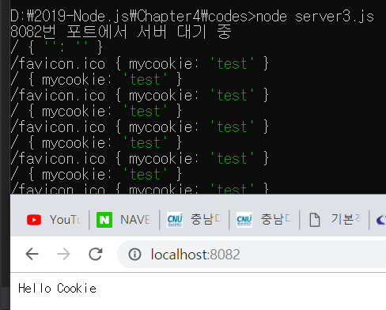
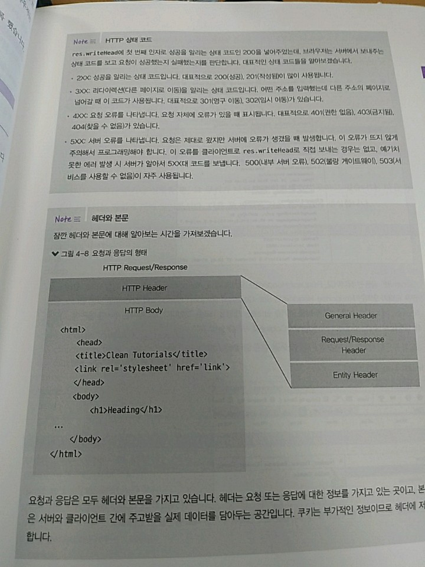
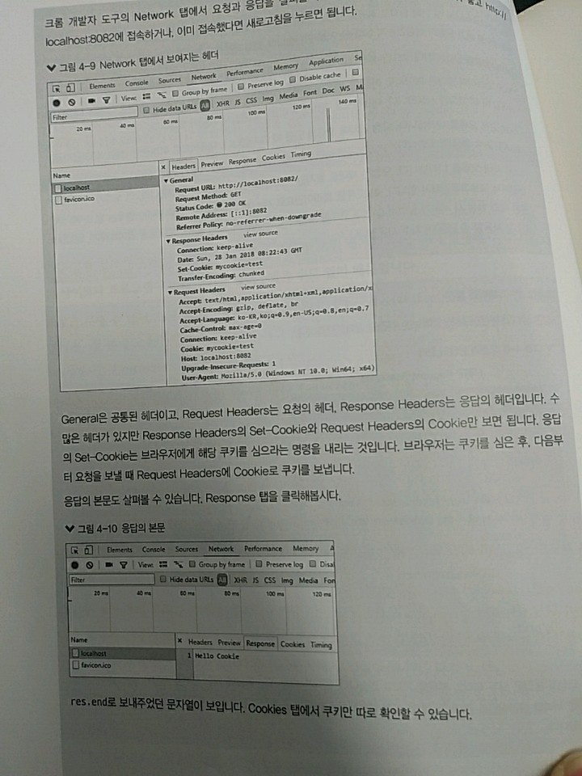
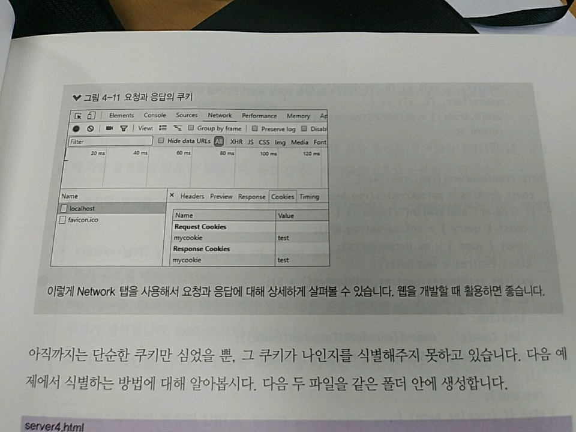
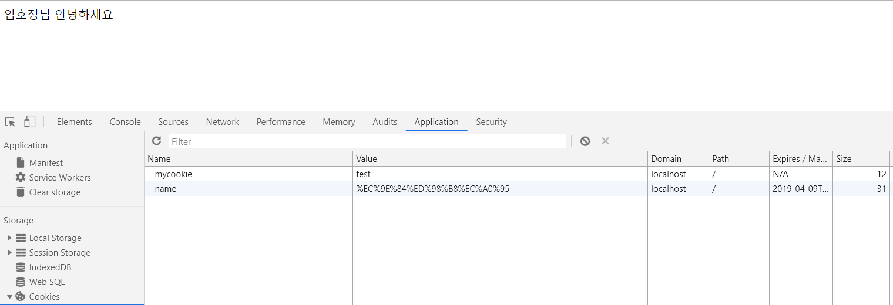
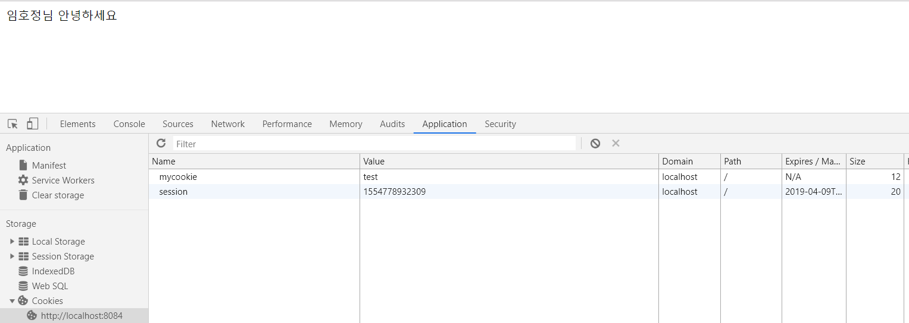

> 4.2 쿠키와 세션 이해하기

>> 클라이언트에서 보내는 요청에는 한 가지 큰 단점 => 누가 요청을 보내는지 모른다는 것
>> 요청을 보내는 IP 주소나 브라우저의 정보를 받아올 수는 있음 
>> => But, 여러 컴퓨터가 공통으로 IP 주소를 가지거나, 한 컴퓨터를 여러 사람이 사용할 수도 있음

>> => 그렇다면 로그인은? : 로그인을 구현하려면 쿠키, 세션을 알고 있어야 함.
>> 웹 사이트 방문해서 로그인 시 내부적으로 쿠키, 세션을 사용하고 있음 
>> 로그인한 후엔 새로고침(새로운 요청)해도 로그아웃 되지 않음 
>> => 클라이언트가 서버에게 우리가 누구인지를 지속적으로 알려주기 때문

>> 우리가 누구인지 기억하기 위해 => 서버 : 요청에 대한 응답을 할 때 쿠키라는 것을 같이 보내줌
>> 쿠키 : 'name=zerocho' -> 단순한 키-값의 쌍

>> 서버로부터 쿠키가 오면 웹 브라우저 : 쿠키를 저장해두었다가 요청할 때마다 쿠키를 동봉해서 보내줌
>> 서버 : 요청에 들어있는 쿠키를 읽어서 사용자가 누구인지 파악

>> 브라우저 : 쿠키가 있다면 -> 자동으로 동봉해서 보내줌 : 따로 처리할 필요가 없음 
>> 서버 -> 브라우저 : 쿠키를 보낼 때만 여러분이 코드를 작성하여 처리하면 됨.


>> 즉, 서버 - 미리 클라이언트에 요청자를 추정할 만한 정보를 쿠키를 만들어 보내고
>> => 그 다음엔 클라이언트로부터 쿠키를 받아 요청자를 파악 

>> 쿠키가 우리가 누구인지를 추적하고 있는 것 => 개인정보 유출 방지를 위해 쿠키를 주기적으로 지우라는 말이 나온 것 

* 쿠키 : 요청, 응답의 헤더(header)에 저장됨. 
    * 요청과 응답 : 각각 헤더와 본문(body)을 가짐 
    * 서버에서 직접 쿠키를 만들어 요청자의 브라우저에 넣어보자.
    ```javascript
        const http = require('http');

        const parseCookies = (cookie = '') => 
            cookie
                .split(';')
                .map(v=>v.split('='))
                .map(([k, ... vs]) => [k, vs.join('=')])
                .reduce((acc, [k,v]) => {
                    acc[k.trim()] = decodeURIComponent(v);
                    return acc;
                },{});

        http.createServer((req, res)=>{
            const cookies = parseCookies(req.headers.cookie);
            console.log(req.url, cookies);
            res.writeHead(200, { 'Set-Cookie' : 'mycookie=test'});
            res.end('Hello Cookie');
        })
            .listen(8082,()=>{
                console.log('8082번 포트에서 서버 대기 중');
            });
    ```

>> parseCookies라는 함수를 직접 제작함 
>> 쿠키 : name=zerocho;year=1994처럼 문자열 형식으로 옴 => 이를 { name : 'zerocho', year:'1994'}와 같이 객체로 바꾸는 함수
>> createServer 메서드의 콜백
1. 제일 먼저 req 객체에 담겨 있는 쿠키를 분석 
2. 쿠키는 req.headers.cookie에 들어 있음 
3. req.headers : 요청의 헤더를 의미
    * 쿠키 : 요청과 응답의 헤더를 통해 오고 감
4. 응답의 헤더에 쿠키를 기록해야 함 
    * res.writeHead 메서드를 사용하였음
    * 첫 번째 인자 : 200이라는 상태 코드를 넣어줌 => 200 : 성공이라는 의미 
    * 두 번째 인자 : 헤더의 내용 입력 
    * Set-Cookie : 브라우저한테 다음과 같은 값의 쿠키를 저장하라는 의미 
        * 실제로 응답을 받은 브라우저 : mycookie=test라는 쿠키를 저장
5. localhost:8082에 접속 - req.url과 cookies 변수에 대한 정보를 로깅하도록 함
    * req.url - 주소의 path와 search 부분을 알려줌
    * 실행 결과가 다르다면 => 브라우저의 쿠키를 모두 제거한 후 다시 실행하자.
        * 다른 사이트나 프로그램이 미리 쿠키를 넣어두었을 수도 있기 때문
    * 요청은 분명 한 번만 보냈는데 두 개가 기록되어 있어
        * /favicon.ico : 요청한 적이 없는데, 첫 번째 요청('/')에선 쿠키에 대한 정보가 없다고 나오고,    
        * 두 번째 요청('/favicon.ico')에선 { mycookie:'test'}가 기록되었음

* favicon? : 웹 사이트 탭에 보이는 이미지
    * 브라우저 : 파비콘이 뭔지 HTML에서 유추할 수 없으면? 
        * 서버에 파비콘 정보에 대한 요청을 보냄 
            * 현재 예제에서 HTML에 파비콘에 대한 정보를 넣어두지 않아 브라우저가 추가로 favicon.ico를 요청한 것
    * 요청 두 개를 통해 서버가 제대로 쿠키를 심어 주었음을 확인 가능 
        * 첫 번째 요청(/)을 보내기 전엔 브라우저가 어떠한 쿠키 정보도 가지고 있지 않음
        * 서버는 응답 요청에 mycookie=test라는 쿠키를 심으라고 브라우저에게 명령 
            * 따라서 브라우저는 쿠키를 심었고, 두 번째 요청(/favicon.ico)의 헤더에 쿠키가 들어있음을 확인 가능
> 참고!







>> 아직까지 단순한 쿠키만 심었을 뿐, 그 쿠키가 나인지를 식별해주지 못하고 있음

```html
    <!DOCTYPE html>
    <html>
    <head>
        <meta charset="utf-8"/>
        <title>쿠키&세션 이해하기</title>
    </head>
    <body>
        <form action="/login">
            <input id="name" name="name" placeholder="이름을 입력하세요"/>
            <button id="login">로그인</button>
        </form>
    <body>
    </html>
```

```javascript
    const http = require('http');
    const fs = require('fs');
    const url = require('url');
    const qs = require('querystring');

    const parseCookies = (cookie = '') =>
        cookie
            .split(";")
            .map(v=>v.split('='))
            .map(([k,...vs])=>[k,vs.join('=')])
            .reduce((acc,[k,v])=>{
                acc[k.trim()] = decodeURIComponent(v);
                return acc;
            },{});

    http.createServer((req,res)=>{
        const cookies = parseCookies(req.headers.cookie);
        if(req.url.startsWith('/login')){
                const { query }  = url.parse(req.url);
                const { name } = qs.parse(query);
                const expires = new Date(); 
                expires.setMinutes(expires.getMinutes() + 5);
                res.writeHead(302, {
                    Location : '/',
                    'Set-Cookie' : `name=${encodeURIComponent(name)};Expires=${expires.toGMTString()}; HttpOnly; path=/`,
                });
                res.end();
        }
        else if(cookies.name){
            res.writeHead(200, { 'Content-Type' : 'text/html; charset=utf-8' });
            res.end(`${cookies.name}님 안녕하세요`);
        }
        else {
            fs.readFile('./server4.html',(err,data)=>{
                if(err){
                    throw err;
                }
                res.end(data);
            });
        }
    })
        .listen(8083, ()=>{
            console.log('8083번 포트에서 서버 대기 중');
        });
```

>> 코드의 복잡 : 주소가 /login, /로 시작하는 것까지 두 개 => 주소 분기 처리됨.

```javascript
        // 위의 코드 일부분
         const cookies = parseCookies(req.headers.cookie);
        if(req.url.startsWith('/login')){
                const { query }  = url.parse(req.url);
                const { name } = qs.parse(query);
                const expires = new Date(); 
                expires.setMinutes(expires.getMinutes() + 5);
                res.writeHead(302, {
                    Location : '/',
                    'Set-Cookie' : `name=${encodeURIComponent(name)};Expires=${expires.toGMTString()}; HttpOnly; path=/`,
                });
                res.end();
```

1. 주소가 /login으로 시작할 경우 : url, querystring 모듈로 각각 주소와 주소에 딸려오는 query를 분석 
    * 쿠키의 만료 시간도 지금부터 5분 뒤로 설정 
    * => 그 후, 302 응답 코드, 리다이렉트 주소와 함께 쿠키를 헤더에 넣음 
    * 브라우저 : 이 응답 코드를 보고 페이지를 해당 주소로 리다이렉트함
    * 헤더에는 한글을 설정할 수 없음 => name 변수를 encodeURIComponent 메서드로 인코딩함

```javascript
else if(cookies.name){
            res.writeHead(200, { 'Content-Type' : 'text/html; charset=utf-8' });
            res.end(`${cookies.name}님 안녕하세요`);
        }
        else {
            fs.readFile('./server4.html',(err,data)=>{
                if(err){
                    throw err;
                }
                res.end(data);
            });
        }
```

2. 그 외의 경우(/로 접속했을 때 등), 먼저 쿠키가 있는지 없는지 확인 
    * 쿠키가 없다면 로그인할 수 있는 페이지를 보냄
    * 처음 방문한 경우 쿠키가 없음 => server4.html이 전송됨.
    * 쿠키가 있다면 로그인한 상태로 간주해 인사말을 보냄 
        * res.end 메서드에 한글이 들어가면 인코딩 문제가 발생 
        * res.writeHead에 Content-Type을 text/html;charset-utf-8로 설정해 인코딩을 명시하였음

* 쿠키 설정 시 만료 시간(Expires)과 HttpOnly, Path 같은 옵션을 부여했음
    * 쿠키 : 설정할 때 각종 옵션들을 넣을 수 있음 
    * 옵션 간에는 세미콜론(;)으로 구분하면 됨.

        + 쿠키명=쿠키값 : 기본적인 쿠키의 값 - mycookie=test 또는 name=zerocho 같이 설정
        + Expires=날짜 : 만료 기한 - 이 기한이 지나면 쿠키가 제거됨,
            + 기본값 - 클라이언트가 종료될 때까지임.
        + Max-age=초 : Expires와 비슷하지만 날짜 대신 초를 입력할 수 있음, 해당 초가 지나면 쿠키가 제거됨.
            + Expires보다 우선함
        + Domain=도메인 명 : 쿠키가 전송될 도메인을 특정할 수 있음, 기본값은 현재 도메인임
        + Path=URL : 쿠키가 전송될 URL을 특정할 수 있음, 기본값은 /이고 이 경우 모든 URL에서 쿠키를 전송할 수 있음
        + Secure : HTTPS일 경우에만 쿠키가 전송됨.
        + HttpOnly : 설정 시 자바스크립트에서 쿠키에 접근할 수 없음, 쿠키 조작을 방지하기 위해 설정하는 것이 좋음
    



>> 원하는 대로 동작하긴 하지만 => 이 방식은 상당히 위험 
>> Application 탭에서 보는 것처럼 쿠키가 노출되어 있어 => 또한, 쿠키가 조작될 위험도 존재 
>> => 따라서 이름 같은 민감한 개인정보를 쿠키에 넣어두는 것은 적절하지 못함 

>> 코드 변경을 통해 서버가 사용자 정보를 관리하도록 하자.

```javascript
  const http = require('http');
const fs = require('fs');
const url = require('url');
const qs = require('querystring');

const parseCookies = (cookie = '') =>
    cookie
    .split(';')
    .map(v => v.split('='))
    .map(([k, ...vs]) => [k, vs.join('=')])
    .reduce((acc, [k, v]) => {
        acc[k.trim()] = decodeURIComponent(v);
        return acc;
    }, {});

const session = {};

http.createServer((req, res) => {
        const cookies = parseCookies(req.headers.cookie);
        if (req.url.startsWith('/login')) {
            const { query } = url.parse(req.url);
            const { name } = qs.parse(query);
            const expires = new Date();
            expires.setMinutes(expires.getMinutes() + 5);
            const randomInt = +new Date();
            session[randomInt] = {
                name,
                expires,
            };
            res.writeHead(302, {
                Location: '/',
                'Set-Cookie': `session=${randomInt}; Expires=${expires.toGMTString()}; HttpOnly; Path=/`,
            });
            res.end();
        } else if (cookies.session && session[cookies.session].expires > new Date()) {
            res.writeHead(200, { 'Content-Type': 'text/html;charset=utf-8' });
            res.end(`${session[cookies.session].name}님 안녕하세요`);
        } else {
            fs.readFile('./server4.html', (err, data) => {
                if (err) {
                    throw err;
                }
                res.end(data);
            });
        }
    })
    .listen(8084, () => {
        console.log('8084번 포트에서 서버 대기 중입니다.');
    });
```
>> server4.js와는 달라진 부분 존재
>> 쿠키에 이름을 담아서 보내는 대신 randomInt라는 임의의 숫자를 보냄 
>> 사용자의 이름과 만료 시간은 session이라는 객체에 대신 저장함.

>> 이제 cookie.session이 있고 만료 기한을 넘기지 않았다면 session 변수에서 사용자 정보를 가져와서 사용함. => 다른 부분은 동일 



* 이 방식이 세션 => 서버에 사용자 정보를 저장하고 클라이언트와는 세션 아이디로만 소통 
    * 세션 아이디는 꼭 쿠키를 사용해서 주고 받지 않아도 됨.
    * But, 많은 웹 사이트가 쿠키를 사용함 => 쿠키를 사용하는 방법이 제일 간단해서 
    * 물론 실제 배포용 서버에선 세션을 위처럼 변수에 저장하지 않음 
        * 서버가 멈추거나 재시작되면 메모리에 저장된 변수가 초기화되기 때문
        * 또한, 서버의 메모리가 부족하면 세션을 저장하지 못하는 문제도 생김 => 보통은 데이터베이스에 넣어둠

* 서비스를 새로 만들 때마다 쿠키와 세션을 직접 구현할 수는 없음 
    + 게다가 지금 코드로는 => 쿠키를 악용한 여러 가지 위협을 방어하지도 못함 
    + 위의 방식 역시 세션 아이디 값이 공개되어 있어 누출되면 다른 사람이 사용가능 
    
* 절대로 위의 코드를 실제 서비스에 사용해선 안 되고, 개념을 설명하기 위한 코드 => 보안 상 매우 취약

* => 다른 사람들이 만든 검증된 코드를 사용하는 것이 좋음 
    + 다른 사람의 코드(모듈)을 사용하는 방법은 나중에...
    
