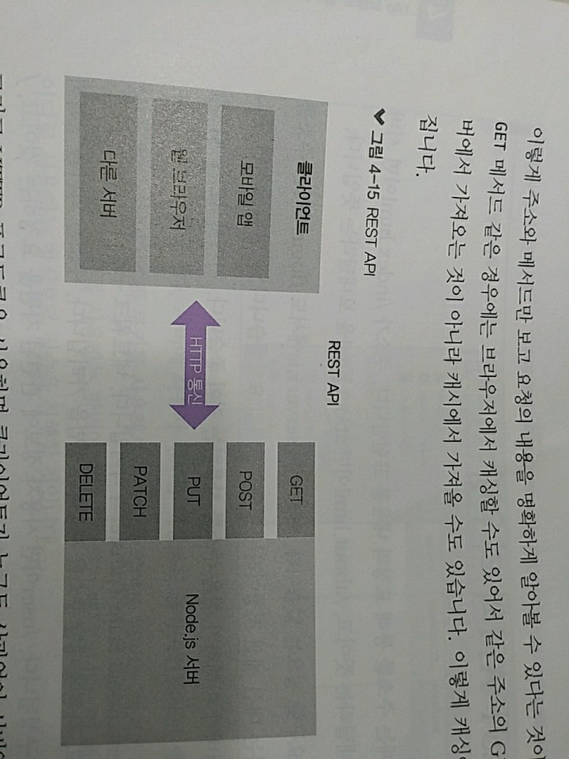
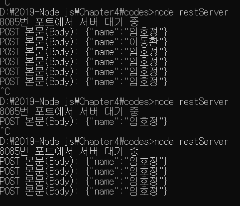

> 4.3 REST API와 라우팅 

>> 서버에 요청을 보낼 때 : 주소를 통해 요청의 내용을 표현
>> 주소가 /index.html -> 서버의 index.html을 보내달라는 뜻, /about.html -> about.html을 보내달라

>> 요청이 항상 html을 요구할 필요가 없고, 지난 실습의 server5.js 에서도 /login이라는 주소를 통해 html을 요청하는 대신 세션 저장이라는 동작 취하기를 요청함.
>> => 요청이 주소를 통해 들어와서 서버가 이해하기 쉬운 주소를 사용하는 것이 좋음 => REST API의 등장 

* REST API(REpresentational State Transfer) - 네트워크 구조의 한 형식 
    + 서버의 자원을 정의, 자원에 대한 주소를 지정하는 방법
    + 주소 : 의미를 명확히 전달하기 위해 명사로 구성됨.
        * ex) /user : 사용자 정보에 관련된 자원을 요청하는 것, /post : 게시글에 관련된 자원을 요청하는 것이라 추측 가능
    + 주소 외에도 HTTP 요청 메서드라는 것을 사용 
    + 폼 데이터를 전송할 때 GET 또는 POST 메서드를 지정해보았냐 => GET, POST가 바로 요청 메서드
        + 거기에 PUT, PATCH, DELETE까지 총 5개가 메서드로 많이 사용됨.
    1. GET : 서버 자원을 가져오고자 할 떄 사용함, 요청의 본문(body)에 데이터를 넣지 않음
        * 데이터를 서버로 보내야 한다면 쿼리스트링을 사용
    2. POST : 서버에 자원을 새로 등록하고자 할 떄 사용, 요청의 본문에 새로 등록할 데이터를 넣어 보냄
    3. PUT : 서버의 자원을 요청에 들어 있는 자원으로 치환하고자 할 때 사용
        * 요청의 본문에 치환할 데이터를 넣어 보냄
    4. PATCH : 서버 자원의 일부만 수정하고자 할 때 사용함, 요청의 본문에 일부 수정할 데이터를 넣어 보냄 
    5. DELETE : 서버의 자원을 삭제하고자 할 때 사용함.

>> 주소 하나가 요청 메서드를 여러 개 가질 수 있음
>> GET 메서드의 /user 주소로 요청을 보내면 사용자 정보를 가져오는 요청이라는 것을 알 수 있음
>> POST 메서드의 /user 주소로 요청을 보내면 새로운 사용자를 등록하려 한다는 것을 알 수 있음

>> 주소와 메서드만 보고 요청의 내용을 명확하게 알아볼 수 있다는 것이 장점 

* GET 메서드 : 브라우저에서 캐싱할 수도 있어서 같은 주소의 GET 요청을 할 때 서버에서 가져오는 것이 아니라, 캐시에서 가져올 수도 있음
    * 이렇게 캐싱이 되면 성능이 좋아짐

* HTTP 프로토콜을 사용 => 클라이언트가 누구든 상관없이 서버와 소통 가능 
    * iOS, 안드로이드, 웹이 모두 같은 주소로 요청을 보낼 수 있음 => 서버가 클라이언트와 분리되어 있다는 뜻
    * => 서버와 클라이언트를 분리 => 추후에 서버를 확장할 때 클라이언트에 구애되지 않아 좋음

* REST API를 따르는 서버를 RESTful하다고 표현 => 코드를 작성하기 전 대략적인 주소를 먼저 설계하는 것이 좋음 

>> ex) 주소 구조를 미리 머릿속에 정리해둔 후 코딩을 시작하면 더욱 체계적으로 프로그래밍 가능

HTTP 메서드| 주소 | 역할
---|---|---
GET|/|restFront.html 파일 제공
GET|/about|about.html 파일 제공
GET|/users|사용자 목록 제공
GET|기타|기타 정적 파일 제공
POST|/users| 사용자 등록
PUT|/users/사용자id| 해당 id의 사용자 수정
DELETE|/users/사용자id| 해당 id의 사용자 제거

* restFront.js 
    1. 페이지가 로딩되면 GET /users로 사용자 목록을 가져옴.(getUser 함수)
    2. 수정 버튼, 삭제 버튼에 각각 PUT /users/사용자id와 DELETE /users/사용자id로 요청을 보내도록 지정하였음
    3. form을 제출할 때는 POST /users/로 데이터와 함꼐 요청을 보냄.

* restServer.js
    * 요청이 어떤 메서드를 사용했는지 req.method로 알 수 있음 => 따라서 req.method를 기준으로 if문을 분기 처리함
        1. GET 메서드에서 /,/about 요청 주소는 페이지를 요청하는 것 => HTML 파일을 읽어서 전송
            1. AJAX 요청을 처리하는 /users에선 users 데이터를 전송 
            2. JSON 형식으로 보내기 위해 JSON.stringify를 해주었음 
            3. 그 외의 GET 요청은 CSS나 JS 파일을 요청하는 것 => 찾아서 보내주고, 없다면 404 NOT FOUND 에러를 응답합니다.
        2. POST와 PUT 메서드 : 클라이언트로부터 데이터를 받기 때문에 특별한 처리가 필요
            1. req.on('data', 콜백)과 req.on('end', 콜백) 부분 
            2. 버퍼와 스트림에서 배웠던 readStream임 => readStream으로 요청과 같이 들어오는 요청 본문을 받을 수 있음
            3. 단, 문자열이므로 JSON으로 만드는 JSON.parse 과정이 한 번 필요함.
        3. DELETE 메서드로 요청이 오면 주소에 들어 있는 키에 해당하는 사용자를 제거 
        4. 해당하는 주소가 없을 경우 404 NOT FOUND 에러를 응답 

>> method 탭이 보이지 않으면 Name 탭을 마우스 오른쪽 클릭해 method에 체크하면 됨.

[restServer3](.images/restServer3.PNG)

>> Network 탭 - 네트워크 요청을 실시간으로 볼 수 있음 
>> REST API 방식으로 주소를 만들었으므로 주소만 봐도 요청 내용을 유추가능 
>> Name : 요청 주소, Method : 요청 메서드, Status : HTTP 응답 코드, Protocol : HTTP 프로토콜, Type : 요청의 종류를 의미 
>> xhr은 AJAX 요청

>> Network 탭 => POST /users : 사용자를 등록하는 요청임을 알 수 있음
>> DELETE /users/키 : 해당 키를 가진 사용자를 제거하는 요청 
>> 등록, 수정 및 삭제가 발생할 때마다 GET /users로 갱신된 사용자 정보를 가져오고 있음 

>> 데이터 : 메모리상의 변수에 저장되어 있으므로 서버를 종료하기 전까지 유지됨.
>> 만약 데이터가 계속 유지되려면 데이터베이스를 활용해야 함

