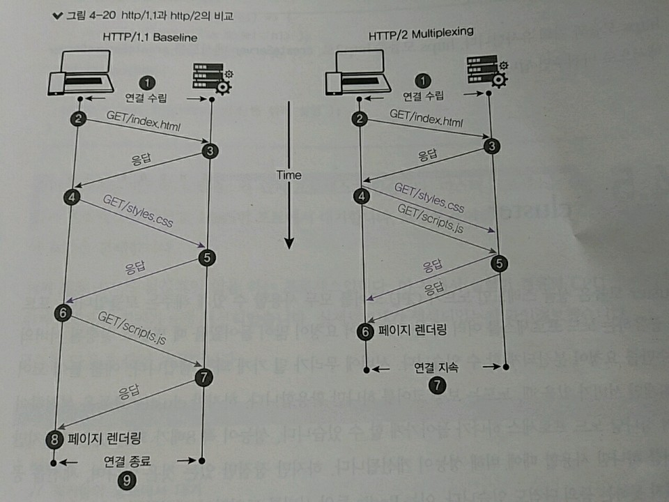

> 4.4 https와 http2

>> http 모듈 : 웹 서버에 SSL 암호화를 추가
>> GET, POST 요청 시 오고 가는 데이터를 암호화해서 중간에 다른 사람이 요청을 가로채더라도 내용을 확인할 수 없게 해줌
>> 로그인이나 결제가 필요한 창에서 https 적용이 필수가 되는 추세

>> SSL이 적용된 웹 사이트 : 브라우저 주소창에 자물쇠 표시가 나옴

>> server1.js 

```javascript
const http = require('http');

http.createServer((req,res)=>{
    res.write('<h1>Hello Node!</h1>');
    res.end('<p>Hello Server!</p>');
}).listen(8080, ()=>{
    console.log('8080번 포트에서 서버 대기 중');
});
```

>> 이 서버에 암호화를 적용하려면 https 모듈을 사용해야 함. => https는 아무나 사용할 수 있는 것이 아님
>> 암호화를 적용하는 만큼, 그것을 인증해줄 수 있는 기관도 필요 => 인증서는 인증 기관에서 구입해야 함

>> 발급받은 인증서가 있다면?

```javascript
    const https = require('https');
    const fs = require('fs');

    http.createServer({
        cert: fs.readFileSync('도메인 인증서 경로'),
        key: fs.readFileSync('도메인 비밀키 경로'),
        ca:[
            fs.readFileSync('상위 인증서 경로'),
            fs.readFileSync('상위 인증서 경로'),
        ],
    },(req,res)=>{
        res.write('<h1>Hello Node!</h1>');
        res.end('<p>Hello Server!</p>');
    })
        .listen(443,()=>{
            console.log('443 포트에서 서버 대기 중');
        });
```

* 다른 것은 거의 비슷 But, createServer 메서드 => 인자를 두 개 받음 
* 두 번째 인자는 http 모듈과 같이 서버 로직이고, 첫 번째 인자는 인증서에 관련된 옵션 객체
    * 인증서를 구입 => pem이나 crt 또는 key 확장자를 가진 파일들을 제공해줌 
    * 파일들을 fs.readFileSync 메서드로 읽어 cert,key,ca 옵션에 알맞게 넣어주자

* 노드의 http2 모듈 - SSL 암호화와 더불어 최신 HTTP 프로토콜인 http/2를 사용할 수 있게 해줌
    * http/2 : 요청, 응답 방식이 기존 http/1.1보다 개선되어 훨씬 효율적으로 요처을 보냄
    * http/2를 사용하면 웹의 속도도 많이 개선



>> 실제로는 http/1.1도 파이프라인이라는 기술을 적용해 이 정도 차이가 나지는 않음
>> But, http/2가 훨씬 효율적인 것만은 분명


```javascript
    const https = require('http2');
    const fs = require('fs');

    http.createSecureServer({
        cert: fs.readFileSync('도메인 인증서 경로'),
        key: fs.readFileSync('도메인 비밀키 경로'),
        ca:[
            fs.readFileSync('상위 인증서 경로'),
            fs.readFileSync('상위 인증서 경로'),
        ],
    },(req,res)=>{
        res.write('<h1>Hello Node!</h1>');
        res.end('<p>Hello Server!</p>');
    })
        .listen(443,()=>{
            console.log('443 포트에서 서버 대기 중');
        });
```
>> http2를 적용한 server1-2.js
>> https 모듈과 거의 유사, https => http2로, createServer 메서드를 createSecureServer 메서드로 바꾸어주면 됨.
