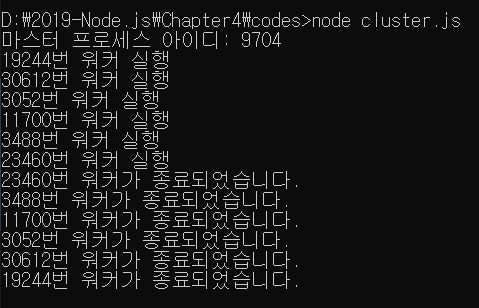
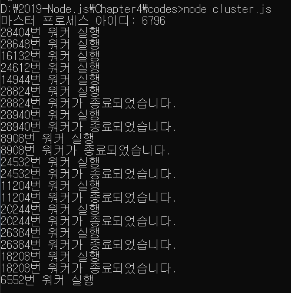

> 4.5 cluster

>> cluster 모듈 : 싱글 스레드인 노드가 CPU 코어를 모두 사용할 수 있게 해주는 모듈 
>> 포트를 공유하는 노드 프로세스를 여러 개 둘 수도 있어 요청이 많이 들어왔을 때 병렬로 실행된 서버의 개수만큼 요청이 분산되게 할 수 있음
>> => 서버에 무리가 덜 가게 되는 셈

>> ex) 코어가 8개인 서버가 있을 때, 노드는 보통 코어를 하나만 활용 
>> But, cluster 모듈을 설정하여 코어를 하나만 사용할 떄에 비해 성능이 개선됨. 

>> But, 장점만 있는 것은 아니며, 세션을 공유하지 못하는 등의 단점도 있음
>> => Redis 등의 서버를 도입해 해결 가능 

>> server1.js의 클러스터링

```javascript
    const cluster = require('cluster');
    const http = require('http');
    const numCPUs = require('os').cpus().length;

    if(cluster.isMaster){
        console.log(`마스터 프로세스 아이디: ${process.pid}`);
        // cpu 개수만큼 워커를 생산
        for(let i = 0;i < numCPUs; i+=1)
        {
            cluster.fork();
        }
        // 워커가 종료되었을 때 
        cluster.on('exit', (worker, code, signal)=>{
            console.log(`${worker.process.pid}번 워커가 종료되었습니다.`);
            cluster.fork();
        });
    }
    else{
        // 워커들이 포트에서 대기
        http.createServer((req,res)=>{
            res.write(`<h1>Hello Node!</h1>`);
            res.end('<p>Hello Cluster!</p>');
            setTimeout(()=>{
                process.exit(1);
            },1000)
        }).listen(8085);

        console.log(`${process.pid}번 워커 실행`);
    }
```

* 클러스터엔 마스터 프로세스와 워커 프로세스가 있음
    * 마스터 프로세스
        * CPU 개수만큼 워커 프로세스를 만들고
        * 8085번 포트에서 대기
        * 요청이 들어오면 만들어진 워커 프로세스에 요청을 분배
    * 워커 프로세스
        * 실질적인 일을 하는 프로세스
        * 실험한 컴퓨터 CPU 코어의 개수가 8개라서 워커가 8개 생성됨


>> 요청이 들어올 때마다 1초 후 서버가 종료되도록 했고,
이제 서버를 실행하면,
>> process.pid는 매 실행 시 마다 달라지고, 각자 자신의 코어 개수에 맞게 워커가 실행되는지 확인해보자

>> http://localhost:8085에 접속하면 1초 후 콘솔에 워커가 종료되었다는 메시지가 뜸
>> 8번 새로고침을 하면 이제 모든 워커가 종료되어 서버가 응답하지 않음

>> 즉, 8번까지는 오류가 발생해도 서버가 정상 작동할 수 있다는 뜻 
>> 종료된 워커를 다시 켜면 오류가 발생해도 계속 버틸 수 있음 

>> 워커 프로세스가 종료되었을 때 새로 하나를 생성해보면,



>> 워커가 죽을 떄마다 새로운 워커가 하나 더 생성됨. 
>> But, 이러한 방식으론 오류를 막으려는 것은 좋지 않은 생각
>> 오류 자체의 원인을 찾아 해결해야 함
>> 그래도 예기치 못한 에러로 인해 서버가 종료되는 현상을 방지할 수 있어 클러스터링을 적용해두는 것이 좋음

>> 직접 cluster 모듈로 클러스터링을 구현할 수도 있지만,
>> 실무에선 pm2 등의 모듈로 cluster 기능을 사용하곤 함. => pm2 모듈은 나중에!

* Rest API와 라우팅으로 돌아가면 
    * 4.3절의 웹 서버 주소는 크게 HTML 또는 CSS 파일을 요청하는 주소와 서버의 users 자원을 요청하는 주소로 나뉘어져 있음
    * 만약 파일이나 자원의 수가 늘어나면 그에 따라 주소의 종류도 많아져야 함.

* But, 이미 코드가 상당히 길어 보기도 어렵고 관리하기도 어려움
    * 주소의 수가 많아질수록 코드는 계속 길어짐
    * 여기에 쿠키와 세션을 추가하게 되면 더 복잡해짐
        * 이를 편리하게 만들어주는 모듈이 존재 
        * 바로 Express 모듈 

* Express 모듈 : 다른 사람들이 만들어둔 모듈 => 설치하자


