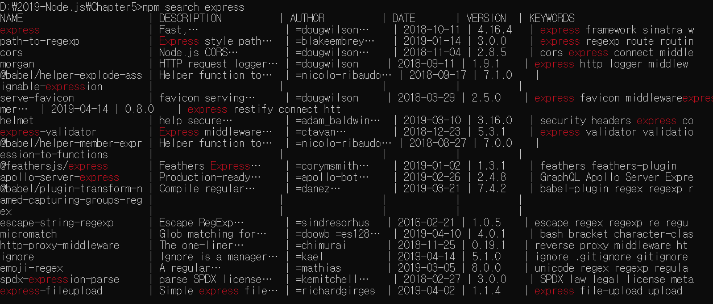
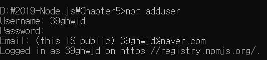
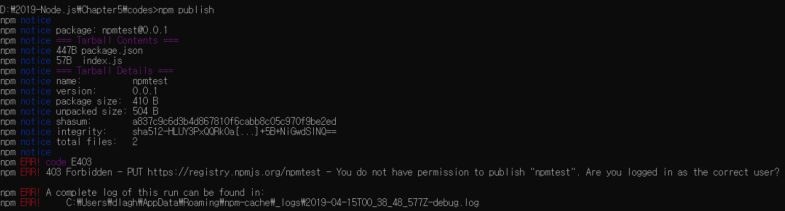
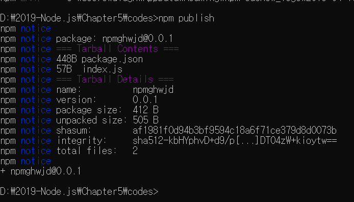
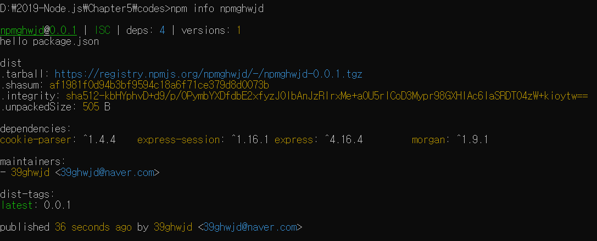
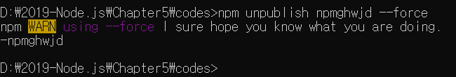
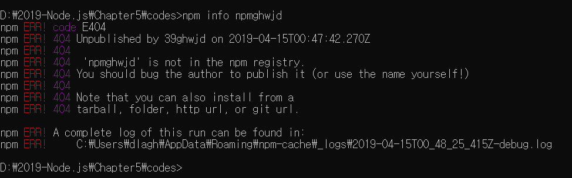
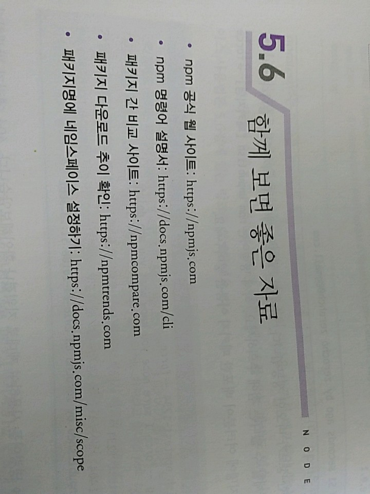

> 5.4 기타 npm 명령어 

>> npm으로 설치한 패키지를 사용하다 보면 새로운 기능이 추가되거나 버그를 고친 새로운 버전이 나올 때가 있음
>> npm outdated 명령어로 업데이트할 수 있는 패키지가 있는지 확인 ㄱㄱ


>> Current와 Wanted가 다르면 업데이트가 필요한 경우 => npm update 패키지명 
>> npm update => 업데이트 가능한 모든 패키지가 Wanted에 적힌 버전으로 업데이트 됨.

>> npm uninstall 패키지명 : 해당 패키지를 제거하는 명령어 
>> 패키지가 node_modules 폴더와 package.json에서 사라짐 ( npm rm 패키지명 으로 줄여쓸 수도 있음 )

>> npm search 검색어 : npm의 패키지 검색 가능 
>> 윈도나 macOS에선 브라우저를 통해 npm 공식 사이트(https://npmjs.com)에서 검색하는 것이 편리할 것 
>> But, GUI가 없는 리눅스에선 이 명령어를 사용해 콘솔로 검색할 수 있음 

>> npm search express 명령어로 express 를 검색 => package.json에 넣어둔 keywords가 이 때 사용됨.


>> npm info 패키지명 : 패키지의 세부 정보를 파악하고자 할 때 사용하는 명령어 
>> package.json의 내용과 의존 관계, 설치 가능한 버전 정보 등이 표시됨.

>> npm adduser : npm 로그인을 위한 명령어 - npm 공식 사이트에서 가입한 계정으로 로그인하면 됨.
>> 나중에 패키지를 배포할 때 로그인 필요
>> 패키지를 배포하지 않을 것이라면 npm에 가입할 필요 X 


>> npm whoami : 로그인한 사용자가 누구인지 알려줌, 로그인된 상태가 아니라면 에러가 발생!
>> npm logout : npm adduser로 로그인한 계쩡을 로그아웃할 때 사용함.
>> npm version 버전 : package.json의 버전을 올려줌(원하는 버전의 숫자를 넣으면 됨.)
>> or major, minor, patch라는 문자열을 넣어서 해당 부분의 숫자를 1 올릴 수도 있음
```javascript
    npm version 5.3.2, npm version minor // 이렇게
```

>> npm deprecate 패키지명 버전 메시지 : 해당 패키지를 설치할 때 경고 메시지를 띄우게 하는 명령어
>> 자신의 패키지에만 이 명령어를 적용할 수 있음 
>> deprecated 처리를 해두면 다른 사용자들이 버그가 있는 버전의 패키지를 설치할 때 => 경고 메시지가 출력됨.

>> npm publish : 자신이 만든 패키지를 배포할 때 사용함

>> npm unpublish : 배포한 패키지를 제거할 때 사용 
>> 24시간 이내에 배포한 패키지만 제거할 수 있음 => 왜? 의존성 관계 때문에!
>> 다른 사람이 사용하고 있는 패키지를 제거하는 경우를 막기 위해서 

>> 자세한 내용은 npm 공식 문서의 CLI Commands에서 확인 가능 

> 5.5 패키지 배포하기

>> 코딩에 앞에서 npm 계정을 만들어야 함, 패키지로 만들 코드 작성해 보면.
>> package.json의 main 부분의 파일명과 일치해야 함 => npm에서 이 파일이 패키지의 진입점인 것을 알 수 있음.
```javascript
    module.exports = () => {
    return 'hello package';
};
```
>> npm publish 명령어를 사용해 이 패키지를 배포 

>> 왜? npmtest라는 이름을 누군가가 이미 사용하고 있어 오류가 발생 
>> npm은 패키지의 이름이 겹치는 것을 허용하지 않음 => 패키지의 이름을 바꾸어서 배포해야 함
>> 굳이 남이 사용하는 패키지 이름 => 네임스페이스를 이용!

* 원하는 이름이 이미 사용 중이라면?
    * 해당 패키지가 활발하게 유지된다면 아쉽지만 다른 이름을 사용해야 함.
    * But, 그 패키지가 아무 의미 없이 이름만 차지하고 있다? 
    * npm owner is 패키지명 : 해당 패키지의 제작자의 이메일을 확인하고 패키지를 유지 중인지 메일을 보내 보자
    * 이 때 CC(참조)로 support@npmjs.com을 지정하면 npm 지원팀에게도 메일이 보내짐
    * 몇 주간 당사자 간 이름 분쟁이 해결되지 않는다면 => npm 팀에서 해결해 줌

>> 누군가 이름을 사용하고 있는지 확인 - npm info 패키지명 
>> 패키지 정보가 나온다? 누군가가 이미 사용하고 있는 이름 / npm ERR! code E404 Registry returned 404 for ~ 에러가 발생하면 사용해도 좋은 이름

>> package.json에서 원하는 이름으로 name을 바꾸고, 다시 npm publish 명령어를 입력 
>> => 연습용, 의미 없는 패키지 이름 써서 피해주지 말자!



>> npm info로 패키지에 대한 정보가 나오는지 확인해보자 



>> 배포 패키지 삭제 ㄱㄱ => 24시간이 지나면 삭제할 수 없다는 점 주의!
>> npm unpublish 패키지명 --force : 패키지명에 우리가 배포한 패키지 이름을 넣어줘



>> 삭제 후 npm info 명령어를 사용해 제대로 지워졌나 확인 ㄱㄱ => 404 에러가 발생한다면? 제대로 지워진 것!



* npm 배포 시 주의! => 항상 신중해야 함
    * 우리 코드가 세상에 공개되는 것, 배포 전에 개인 정보가 코드에 들어 있지 않은지 꼭 확인!
    * 특히 다른 서비스와 연동하다가 실수로 서비스의 비밀키를 넣어두는 경우가 많아!
    * 다른 사람들이 그 키를 사용해 과금 유발 가능 => 배포 전 반드시 확인!

    * 실제로 사용할 패키지가 아님에도 이름 선점하는 행위는 삼가!
    * 인터넷 도메인 주소를 판매 목적으로 선점하는 행위와 다를 게 없어 
    * 기존에 있는 패키지와 비슷한 이름으로 새 패키지를 배포하거나 다른 패키지의 코드를 살짝 수정해서 새로 배포하는 경우 => 꼭 원작자의 허락을 받기 바람!

 


