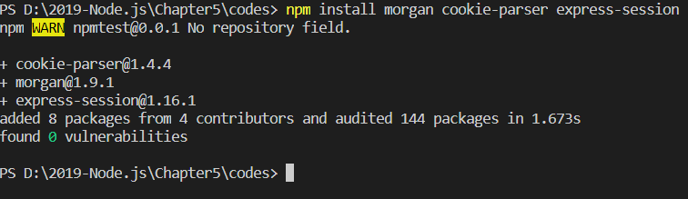
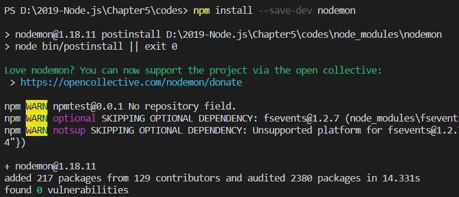
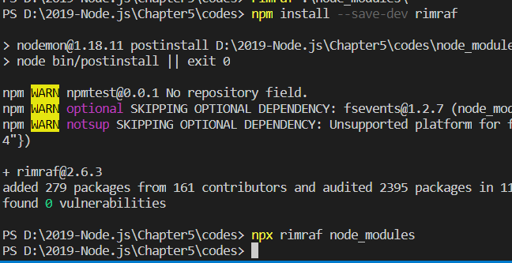

# 5. 패키지 매니저 

>> 세상에는 무수히 많은 자바스크립트 프로그래머가 있음 
>> 그들이 우리와 같은 길을 먼저 걸으며 많은 코드를 미리 작성해둠
>> => 그 코드를 다른 사람이 볼 수 있게 공개하기도 함. => 이러한 코드들이 공개되어 있는 서버인 npm 패키지 매니저 공부 ㄱ

> 5.1 npm 알아보기

>> npm : Node Package Manager
>> 노드가 자바스크립트 프로그램을 컴퓨터에서도 실행할 수 있게 해줌 
>> 대부분의 자바스크립트 프로그램 : 패키지라는 이름으로 npm에 등록됨. 
>> 특정 기능을 하는 패키지가 필요? npm에서 찾아 설치 ㄱ
>> 패키지 : npm에 업로드된 노드 모듈 

>> 모듈이 다른 모듈을 사용할 수 있는 것처럼, 패키지가 다른 패키지를 사용할 수도 있음 => 의존 관계

* yarn - npm의 대체자로 yarn이 존재 
    * 페이스북이 내놓은 패키지 
    * React, React Native 같은 페이스북 진영의 프레임워크를 사용할 때 종종 볼 수 있음.
    * npm 서버가 너무 느릴 경우 => yarn으로 패키지를 대신 설치 가능 

> 5.2 package.json으로 패키지 관리하기 

>> 서비스에 필요한 패키지를 하나씩 추가하다 보면 패키지 수가 100개를 훌쩍 넘어버리게 됨.
>> & 사용할 패키지는 고요한 버전이 존재 => 기록의 필요성 
>> 같은 패키지라도 버전별로 기능이 다를 수 있어 동일한 버전을 설치하지 않으면 문제 발생 
>> => 설치한 패키지의 버전을 관리하는 파일 => package.json

>> => 프로젝트를 시작하기 전 package.json부터 만들고 시작하는 게 좋음 
>> npm : package.json을 만드는 명령어를 제공 


* package name : 패키지의 이름, package.json의 name 속성에 저장됨

* version : 패키지의 버전, npm의 버전은 다소 엄격히 관리됨 

* entry point : 자바스크립트 실행 파일 진입점, 보통 마지막으로 module.exports하는 파일을 지정, package.json의 main 속성에 저장

* test command : 코드를 테스트할 때 입력할 명령어를 의미, package.json scripts 속 속성 안의 test 속성에 저장됨.

* git repository : 코드를 저장해 둔 Git 주소를 의미, 나중에 소스에 문제가 생겼을 때 사용자들이 이 저장소에 방문해 문제를 제기할 수도
    * 코드 수정본을 올릴 수도 있음 => package.json의 repository 속성에 저장됨.
* keywords : 키워드는 npm 공식 홈페이지에서 패키지를 쉽게 찾을 수 있게 해줌 => package.json의 keywords 속성에 저장됨.

* license : 해당 패키지의 라이선스를 넣어주면 됨.

* 라이선스 
    * 오픈 소스라고 해서 모든 패키지를 아무런 제약 없이 사용할 수 있는 것은 아님 
    * 라이선스(license)별로 제한 사항이 있으므로 설치 전에 반드시 라이선스를 확인해야 함
    * ISC, MIT, BSD 라이선스를 가진 패키지 => 사용한 패키지와 라이선스만 밝혀주면 자유롭게 사용할 수 있음
    * Apache 라이선스 패키지 => 사용은 자유롭지만 특허권에 대한 제한이 포함
    * GPL 라이선스 패키지 => 조심!, GPL 계열의 패키지를 사용한 패키지를 배포 시 자신의 패키지도 GPL로 배포하고 소스 코드도 공개해야 함
    * 라이선스 별로 특징이 다름 => 오픈 소스를 사용하기 전 반드시 라이선스를 확인하고 세부 내용을 읽어보자 
        * 나중에 상용 프로그램을 개발했을 때 법적 문제가 생길 수 있음

>> npm init 실행이 완료되면, 폴더에 생성

```json
{
  "name": "npmtest",
  "version": "0.0.1",
  "description": "hello package.json",
  "main": "index.js",
  "scripts": {
    "test": "echo \"Error: no test specified\" && exit 1"
  },
  "author": "ImHoJeong",
  "license": "ISC"
}
```
>> scripts : npm 명령어를 저장해두는 부분, 콘솔에서 npm run 스크립트 명령어를 입력하면 해당 스크립트가 실행됨.
>> ex) npm run test를 하면 echo "Error: no test specified" && exit 1 이 실행됨.
>> echo "Error: no test specified" : 콘솔에 해당 문자열을 출력 , exit 1 : 에러와 함께 종료하라는 뜻 


>> test 스크립트 외에도 scripts 속성에 명령어 여러 개를 등록해두고 사용할 수 있음 
>> 보통 start 명령어에 node 파일명을 저장해두고 npm start로 실행함. 
>> start나 test 같은 스크립트는 run을 붙이지 않아도 실행됨. 

>> 패키지를 설치해 보면 

* npm install 패키지 이름을 package.json이 있는 폴더의 콘솔에서 입력하면 됨.
    * 
    * 설치한 패키지가 package.json에 기록됨.
        * 
    * dependencies라는 속성이 새로 생겼고, express라는 이름과 함께 설치된 버전이 저장됨.

* npm WARN npmtest@0.01 No repository field
    * package.json에 repository 속성이 없어서 발생한 것 
    * 나중에 소스 코드를 GitHub이나 Gitlab 등과 같은 저장소에 저장한 후, 
    * repository 속성을 만들고 GitHub나 Gitlab 주소를 적어주면 됨.
* --save 옵션
    * 패키지를 설치할 때, npm install 명령어에 --save 옵션을 붙이는 책이나 블로그를 많이 볼 수 있음
    * dependencies에 패키지 이름을 추가하는 옵션 But, npm@5부터는 기본값으로 설정되어 있어 따로 붙이지 않아도 됨.

* 추가로 node_modules라는 폴더도 생성 
    * 그 안에 설치한 패키지들이 들어 있음
    * 분명 Express 하나만 설치했는데 패키지가 여러개 들어있어 
    * 이는 Express가 의존하는 패키지들
    * 패키지 하나가 다른 여러 패키지에 의존하고 그 패키지들은 또 다른 패키지에 의존 
    * => 의존 관계가 복잡하게 얽혀 있어 package.json이 필요한 것


* package-lock.json이라는 파일도 생성 
    * 직접 설치한 express 외에도 node_modules에 들어 있는 패키지들의 정보가 담겨짐 
    * npm으로 패키지를 설치, 수정, 삭제할 때마다 내부 의존 관계를 이 파일에 저장

>> 모듈 여러 개는 동시에 어떻게 설치하는가?
>> npm install 패키지1 패키지2 ...와 같이 패키지들을 나열하면 됨.



>> 위에서 설치한 패키지들이 dependencies 속성에 기록됨.


>> 개발용 패키지를 설치할 수도 있음 => 실제 배포 시에는 사용되지 않고, 개발 중에만 사용되는 패키지들
>> npm install --save-dev 패키지 ...으로 설치함
>> nodemon 패키지를 설치해보면(nodemon? - 소스 코드가 바뀔 때마다 자동으로 노드를 재실행해주는 패키지)



>> package.json에 새로운 속성이 생김
>> 새로 생긴 devDependencies 속성에서는 개발용 패키지들만 따로 관리


>> npm : 전역 설치라는 옵션도 존재 
>> 패키지를 현재 폴더의 node_modules에 설치하는 것이 아니라 npm이 설치되어 있는 폴더에 설치
>> => Window 기본 경로 : C:\Users\사용자이름\AppData\Roamng\npm 
>> => macOS 기본 경로 : /usr/local/lib/node_modules
>> 이 폴더의 경로는 보통 시스템 환경 변수에 등록되어 있어 전역 설치한 패키지는 콘솔의 커맨드로 사용 가능 


>> 리눅스, macOs에선 전역 설치 시 관리자 권한이 필요 => sudo를 앞에 붙여주셈
>> rimraf? 리눅스나 macOs의 rm -rf 명령어를 윈도에서도 사용할 수 있게 해주는 패키지 
>> rm -rf : 지정한 파일이나 폴더를 지우는 명령어 
>> 전역 설치했음 => rimraf 명령어를 콘솔에서 사용 가능 
>> 전역 설치한 패키지는 package.json에 기록되지 않음


>> 현재 폴더 내 => package.json, package-lock.json 밖에 없는 상태
>> 설치한 패키지들을 지워버렸지만, package.json에 설치한 패키지 내역이 들어있음 => 걱정 ㄴㄴ
>> npm install만 하면 알아서 다시 설치됨.

>> 즉, node_modules => 언제든지 npm install로 설치 가능 => 보관할 필요가 없다는 의미
>> Git 같은 버전 관리 프로그램과 같이 사용할 때도 node_modules는 커밋하지 않는다. 
>> 중요한 파일은 package.json

* npx 명령어 
    * 전역 설치를 기피하는 개발자들도 존재 
    * 전역 설치한 패키지 -> package.json에 기록되지 않아 다시 설치할 때 어려움 존재
    * => npx 명령어가 존재
    
    * => rimraf 모듈은 package.json의 devDependencies 속성에 기록한 후, 앞에 npx 명령어를 붙여 실행하면 됨.
    * => 패키지를 전역 설치한 것과 같은 효과를 얻을 수 있어

* npm에 등록되지 않은 패키지 
    * 모든 패키지가 npm에 등록되어 있는 것 X
    * 일부 패키지 -> Open Source X or 개발 중인 패키지 
        * GitHub나 nexus 등의 저장소에 보관되어 있을 수도 있음 
        * => npm install 저장소 주소 명령어를 통해 설치 가능 

* 명령어 줄여쓰기 
    * npm install 명령어 => npm i로 줄여쓸 수있음 
    * --save-dev 옵션은 -D로, --global 옵션은 -g로 줄여서 써도 됨.
        

