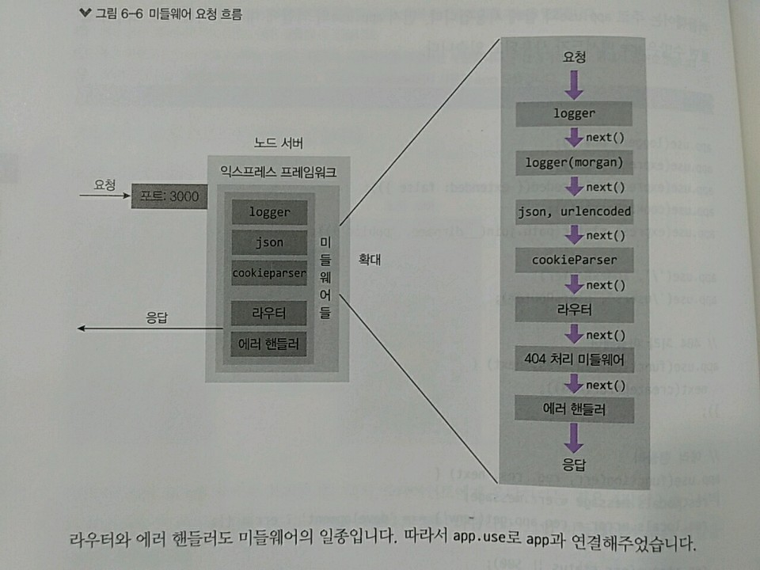
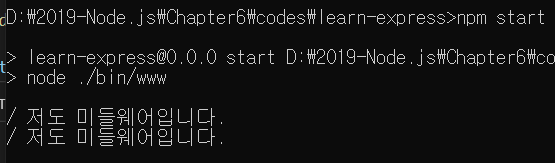
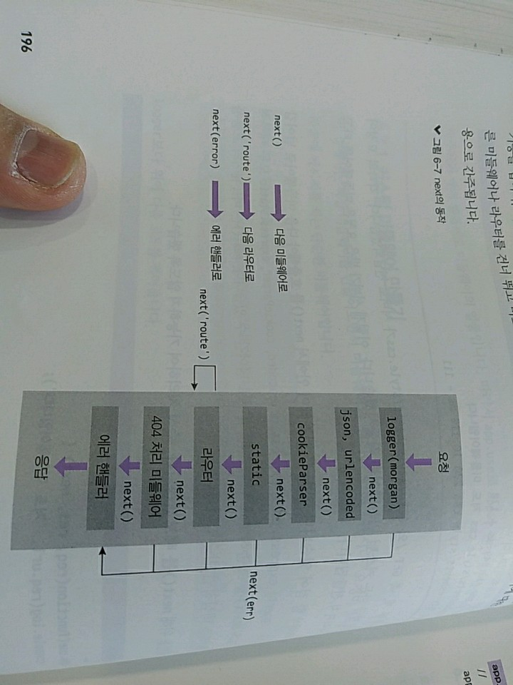

> 6.3 미들웨어 

>> 익스프레스의 핵심, 요청과 응답의 중간(middle, 미들)에 위치해 이렇게 부름
>> 라우터, 에러 핸들러 또한 미들웨어의 일종 
>> 요청과 응답을 조작하여 기능을 추가하기도 하고, 나쁜 요청을 걸러내기도 함.
```javascript
app.use(logger('dev'));
app.use(express.json());
app.use(express.urlencoded({ extended: false }));
app.use(cookieParser());
app.use(express.static(path.join(__dirname, 'public')));

app.use('/', indexRouter);
app.use('/users', usersRouter);

// catch 404 and forward to error handler
app.use(function(req, res, next) {
  next(createError(404));
});

// error handler
app.use(function(err, req, res, next) {
  // set locals, only providing error in development
  res.locals.message = err.message;
  res.locals.error = req.app.get('env') === 'development' ? err : {};

  // render the error page
  res.status(err.status || 500);
  res.render('error');
});

module.exports = app;
```
>> app.js의 app.use 메서드의 인자로 들어 있는 함수가 미들웨어 
>> 미들웨어 - use 메서드로 app에 장착 
>> logger('dev')부터 시작해 미들웨어들을 순차적으로 거친 후 라우터에서 클라이언트로 응답을 보냄

>> 라우터, 에러 핸들러도 미들웨어의 일종 => app.use로 app과 연결해줌 

> 6.3.1 커스텀 미들웨어 만들기 

>> 요청이 들어올 때 콘솔에 메시지를 출력하는 단순 미들웨어 제작

* 코드 스타일 
    * Express-generator : ES5 문법의 코드를 실행, 뒤에선 Express-generator가 생성하는 ES5 코드로 실습하다가 
    * 더 나중엔 Express-generator 없이 ES2015+문법을 사용할 것
```javascript
    app.use(function(req,res,next){
        console.log(req.url, '저도 미들웨어입니다.');
        next();
    }); 
    // logger보다 위에 다음 코드를 적어주자 
```
>> app.js 파일 저장 후 서버 실행하면 



>> 요청 두 개, GET /와 GET /stylesheets/style.css가 서버로 전달되었음 
>> 각각의 요청이 모두 방금 만든 커스텀 미들웨어를 작동시킴 
>> => 서버가 받은 요청은 미들웨어를 타고 라우터까지 전달됨.

* 주의!
    * 반드시 미들웨어 안에서 next()를 호출해야 다음 미들웨어로 너어감 
    * logger나 express.json, express.urlencoded, cookieParser, express.static 모두 내부적으론
    * next()를 호출하므로 다음 미들웨어로 넘어갈 수 잇음
    * next() : 미들웨어의 흐름을 제어하는 핵심적인 함수

>> 코드 수정 후 노드 프로세스를 종료하고 재실행하자 => 재실행 후 다시 http://localhost:3000에 접속!

>> next 빼면?


>> 결과처럼, 재실행 후 다시 접속하면 아무런 응답이 없음 => 브라우저에서도 계속 로딩 표시가 뜸
>> next를 넣지 않아 커스텀 미들웨어에서 요청의 흐름이 끊김 

* next 함수엔 추가 기능 존재(인자의 종류로 기능이 구분됨)
    1. 인자를 아무것도 넣지 않으면 => 단순하게 다음 미들웨어로 넘어감
    2. next 함수의 인자로 route를 넣으면 특수한 기능을 함 => 나중에 함께 알아보자
    3. route 외의 다른 값을 넣으면 다른 미들웨어나 라우터를 건너 뛰고 바로 에러 핸들러로 이동 
        1. 넣어준 값은 에러에 대한 내용으로 간주됨


>> 가장 흔한 에러가 404에러 => 라우터에 등록되지 않은 주소로 요청이 들어올 때 발생 => 404 NOT FOUND 상태 코드를 응답해주어야 함.
```javascript
app.use(function(req, res, next) {
  next(createError(404));
});
```
>> 라우터 다음에 나오는 이 부분 => 404 에러를 만들어내는 미들웨어 
>> 라우터에서 요청이 처리되지 않으면(일치하는 주소가 없다면) => 요청은 라우터 다음에 위치한 이 미들웨어로 오게됨.
>> http-errors(createError) 패키지가 404 에러를 만들어내고, 이 이레를 next에 담아 에러 핸들러로 보내고 있음

```javascript
app.use(function(err, req, res, next) {
  // set locals, only providing error in development
  res.locals.message = err.message;
  res.locals.error = req.app.get('env') === 'development' ? err : {};

  // render the error page
  res.status(err.status || 500);
  res.render('error');
});
```
>> 위가 에러 핸들링 미들웨어 사용한것 => 템플릿 엔진 다룰 때 더 자세히 알아보자 

>> 다른 미들웨어와 다르게 함수의 매개변수가 4개이고 req 전에 err라는 매개변수가 추가됨.
>> next 함수에 넣어준 인자가 err 매개변수로 연결됨.
>> 에러 핸들링 미들웨어 => 일반적으로 미들웨어 중 제일 아래에 위치 => 위에 있는 미들웨어에서 발생하는 에러를 받아서 처리

>> app.user의 응용
>> 하나의 use에 미들웨어를 여러 개 장착할 수 있음
```javascript
    app.use('/', function(req,res,next){
        console.log('첫 번째 미들웨어');
        next();
    }, function(req,res,next){
        console.log('두 번째 미들웨어');
        next();
    }, function(req,res,next){
        console.log('세 번째 미들웨어');
        next();
    });
```

>> 이 성질을 활용하면 Express-generator가 생성한 코드도 
```javascript
    app.use(logger('dev'), express.json(), express.urlencoded({extended:false}), cookieParser(), express.static(path.join(__dirname, 'public')));
    // 가독성이 좋지 않아 이렇게는 잘 사용 X => 유효한 코드이긴 함
```
>> next를 호출하지 않으면 다음 미들웨어로 넘어가지 않는다는 성질을 사용해 
```javascript
    app.use(function(req,res,next){
        if(+new Date() % 2 === 0)
        {
            return res.status(404).send('50% 실패');
        }
        else{
            next();
        }   
    }, function(req,res,next){
        console.log('50% 성공');
        next();
    });
```

>> 50% 확률(숫자를 2로 나눈 나머지가 항상 1이거나 0임을 이용)로 404 NOT Found를 응답하거나 다음 미들웨어로 넘어가는 미들웨어 
>> 로그인한 사용자인지 확인할 때 위 코드를 응용하게 됨.