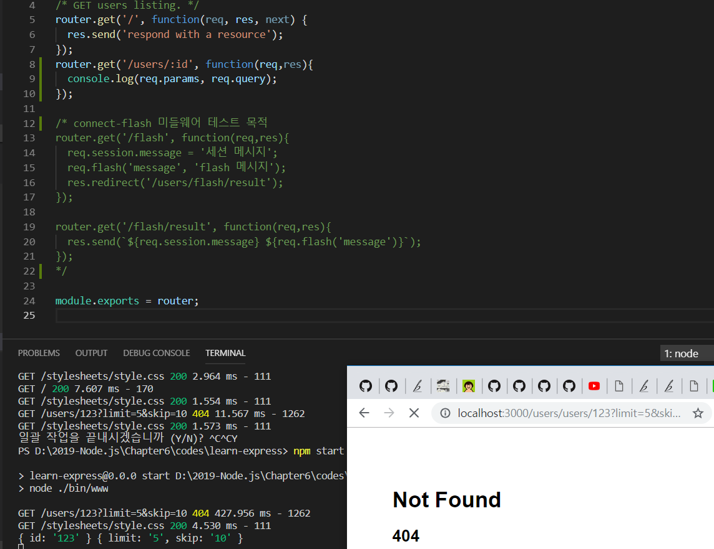

> 6.4. Router 객체로 라우팅 분리하기 

>> 4.3 참고! -> 라우터를 만들 때 요청 메서드, 주소별로 분기 처리 => 코드가 매우 복잡!
>> if문으로 분기해서 코딩해 보기에도 좋지 않고 확장하기도 어려움 
>> Express 사용하는 이유 -> 라우팅을 깔끔하게 관리할 수 있다는 점!

```javascript
var indexRouter = require('./routes/index');
var usersRouter = require('./routes/users');
...
app.use('/', indexRouter);
app.use('/users', usersRouter);
...
```
>> Express 앱과는 app.use('/',indexRouter), app.use('/users',usersRouter)로 연결되어 있음 
>> app.use를 사용 => 라우터도 일종의 미들웨어라고 볼 수 있음

* 차이점! 다른 미들웨어와는 다르게 앞에 주소가 붙음!
    * 라우팅 미들웨어 - 첫 번째 인자로 주소를 받아 특정 주소에 해당하는 요청이 왔을 때만 미들웨어가 동작하게 할 수 있음
    * 주소가 /로 시작하면 routes/index.js를, /users로 시작하면 routes/users.js를 호출하라는 의미
    * use 대신 get,post,put,patch, delete 같은 HTTP 메서드를 사용할 수도 있음 
    ```javascript
        app.use('/', function(req,res,next){
            console.log('/ 주소의 요청일 때 실행됨, HTTP 메서드는 상관없음');
            next();
        });
        app.get('/', function(){
            console.log('GET 메서드 / 주소의 요청일 때만 실행됨.');
            next();
        });
        app.post('/', function(){
            console.log('POST 메서드 /data 주소의 요청일 때만 실행됨');
            next();
        });
    ```
    * use 메소드 - 모든 HTTP 메서드에 대해 요청 주소만 일치하면 실행됨
    * get, post, put, patch, delete 같은 메서드 -> 주소뿐만 아니라 HTTP 메서드까지 일치하는 요청일 때만 실행됨.


>> 라우터 => 라우터 파일들은 routes 폴더에 들어 있음

>> router 객체 : express.Router()로 만듬 -> 마지막엔 module.exports = router;를 통해 라우터를 모듈로 만듬
>> router에도 app처럼 use,get,post,put,patch,delete 같은 메서드를 붙일 수 있음 
>> use를 제외하고는 각각 HTTP 요청 메서드와 상응

>> app.use처럼 router 하나에 미들웨어를 여러 장착 가능 
>> ex) 실제 라우터 로직이 실행되는 미들웨어 전에 로그인 여부 또는 관리자 여부를 체크하는 미들웨어를 중간에 넣어두기도 함.
```javascript
    router.get('/',middleware1, middleware2, middleware3);
```


```javascript
// /routes/index.js
var express = require('express');
var router = express.Router();

/* GET home page. */
router.get('/', function(req, res, next) {
  res.render('index', { title: 'Express' });
});

module.exports = router;
```

>> router.get('/')이면 / 주소로 GET 요청을 하는 것과 같음 
>> res.render 메서드 - 클라이언트에 응답을 보냄 
>> => Express가 응답 객체에 새로 추가한 메소드, 템플릿 엔진을 사용하는 부분 -> ?????

```javascript
// /routes/users.js
var express = require('express');
var router = express.Router();

/* GET users listing. */
router.get('/', function(req, res, next) {
  res.send('respond with a resource');
});

module.exports = router;
```

>> user.js에서도 router.get('/') 부분이 있음, app.js에서 app.use('/users', usersRouter)로 연결했기 때문에,
>> /users와 /이 합쳐져 /users/로 GET 요청을 했을 때 이 라우터의 콜백 함수가 실행됨.

>> express.Router()(라우터)를 사용할 필요없이 app.js에서 app.get('/', 미들웨어), app.get('/users', 미들웨어)를 해도 기능은 동일 
>> But, 코드 관리를 위해 라우터를 별도로 분리함!

* 라우터 - 반드시 요청에 대한 응답을 보내거나, 에러 핸들러로 요청을 넘겨야 함
    * 응답을 보내지 않으면 브라우저는 계속 응답을 기다림
    * 응답에 제한 시간이 있어 영원히 기다리지는 않지만, 기다리는 동안 다른 동작을 수행할 수 없을 수도 있음
    * res 객체에 들어 있는 메서드들로 응답을 보냄

* next 함수 - 라우터에서만 동작하는 특수 기능 존재 => next('route')
    * 라우터에 연결된 나머지 미들웨어들을 건너뛰고 싶을 때 사용함
    ```javascript
        router.get('/', function(req,res,next){
            next('route');
        }, function(req,res,next){
            console.log('실행되지 않습니다.');
            next();
        }, function(req,res,next){
            console.log('실행되지 않습니다.');
            next();
        });

        router.get('/', function(req, res){
            console.log('실행됩니다!');
            res.render('index',{ title: 'Express'});
        });
    ```
    * 같은 주소의 라우터를 두 개 만들었음, 첫 번째 라우터의 첫 번째 미들웨어에서 next('route')를 호출 
        * => 두 번쨰, 세 번째 미들웨어는 실행되지 않음 => 대신 주소와 일치하는 다음 라우터로 넘어감 
* Tip! 라우터 주소에는 특수한 패턴을 사용할 수 있음 
```javascript
        router.get('/users/:id', function(req,res){
            console.log(req.params, req.query);
        });
```
>> 주소에 :id가 있음, 문자 그대로 :id를 의미하는 것이 아닌 => 이 부분엔 다른 값을 넣을 수 있음 
>> /users/1 or /users/123 등의 요청도 이 라우터에 걸림
>> 장점 -> :id에 해당하는 1이나 123을 조회할 수 있다는 점 
>> req.params 객체 안에 들어 있음 -> :id면 req.params.id로, :type이면 req.params.type으로 조회할 수 있음

>> 주소에 쿼리스트링을 쓸 때도 있음 => 쿼리스트링의 키-값 정보는 req.query 객체 안에 들어 있음 
>> ex) /users/123?limit=5&skip=10이라는 주소의 요청이 들어왔을 때! => req.params와 req.query 객체는 


>> 요청 주소에 대한 정보가 담겨 있어 요긴하게 활용할 수 있음 
>> 주의! 이 패턴은 일반 라우터보다 뒤에 위치해야 한다는 것! => 다양한 라우터를 아우르는 와일드카드 역할을 함.
>> => 일반 라우터보다는 뒤에 위치해야 다른 라우터를 방해하지 않음

>> 에러가 발생하지 않았다? => 라우터는 요청을 보낸 클라이언트에게 응답을 보내주어야 함
>> 응답 메서드는 여러 가지 But, 이 책에선 send, sendFile, json, redirect, render를 주로 사용함

>> send : 만능 메서드 - 버퍼 데이터나 문자열을 전송 or HTML 코드를 전송하기도 함 or JSON 데이터도 전송할 수 있음 
>> sendFile - 파일을 응답으로 보내주는 메소드
>> json - JSON 데이터를 보내줌, redirect - 응답을 다른 라우터로 보내버림
>> ex) 로그인 완료 후 다시 메인 화면으로 돌아갈 떄 => res.redirect(메인 화면 주소)를 하면?
```javascript
    res.send(버퍼 또는 문자열 또는 HTML 또는 JSON)
    res.sendFile(파일 경로);
    res.json(JSON 데이터);
    res.redirect(주소);
    res.render('템플릿 파일 경로', { 변수 });
```
>> 기본적으로 200 HTTP 상태 코드를 응답(res.redirect는 302), 직접 바꿔줄 수도 있음 => status 메서드를 먼저 사용하면 됨.
```javascript
    res.status(404).send('Not Found')
```

>> render 메서드 - 템플릿 엔진을 렌더링할 때 사용함 => views 폴더 안 pug 확장자를 가지고 있는 파일들 => 템플릿 엔진 

* 주의! 응답을 여러 번 보내는 경우
    * 하나의 요청에 대한 응답은 한 번만 보내야 함. 두 번 이상 보내면...
    * Error: Can`t set headers after they are sent 
    * 이와 같은 에러? => 라우터에서 res 객체의 응답 메서드가 두 번 이상 사용되지 않았는지 점검해보아야 함!

* 라우터가 요청을 처리하지 못할 때? 
    * 요청을 처리할 수 있는 라우터가 없다면 => 다음 미들웨어로 넘어감 
    * 404 HTTP 상태 코드를 보내주어야 하므로 
        * 다음 미들웨어에서 새로운 에러를 만들고 에러의 상태코드를 404로 설정한 뒤 에러 처리 미들웨어로 넘겨 버림 

```javascript
// catch 404 and forward to error handler
app.use(function(req, res, next) {
  next(createError(404));
}); // => 404 처리 미들웨어

// error handler => 에러 핸들러
app.use(function(err, req, res, next) {
  // set locals, only providing error in development
  res.locals.message = err.message;
  res.locals.error = req.app.get('env') === 'development' ? err : {};

  // render the error page
  res.status(err.status || 500);
  res.render('error');
});
```


