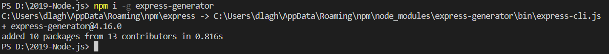
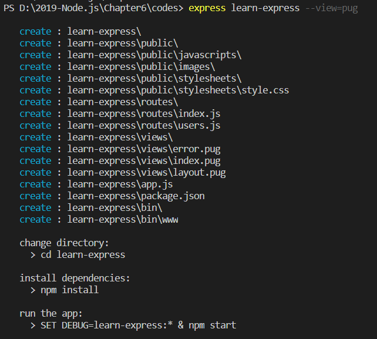
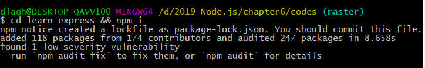
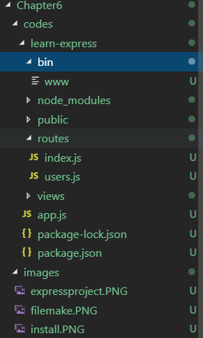
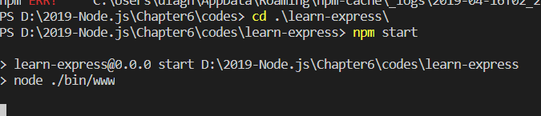
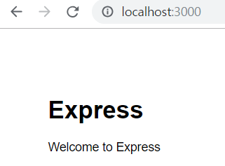
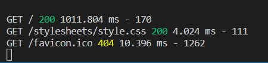
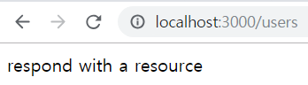

# 6. 익스프레스 웹 서버 제작

>> 지금까지 웹 서버를 만들면서 코드가 보기 좋지 않고, 확장성도 떨어진다고 느꼈을 수 있어
>> npm에는 서버 제작 시 불편함을 해서하고, 편의 기능을 추가한 웹 서버 프레임워크가 있음 => 익스프레스 써 보자

>> 익스프레스?
>> http 모듈의 요청과 응답 객체에 추가 기능들을 부여함 
>> 기존 메서드들도 계속 사용할 수 있지만, 편리한 메서드들을 추가해 기능을 보완 
>> 코드를 분리하기 쉽게 만들어 관리하기도 용이 & 더 이상 if문으로 요청 메서드와 주소를 구별하지 않아도 됨.
>> koa, hapi 같은 웹 서버 프레임워크도 존재 => But, 많은 사람이 익스프레스를 사용함.
>> Why? 많은 사람이 사용할수록 버그도 적고, 기능 추가나 유지보수도 활발히 일어남 => 지속적인 인기를 얻는 이유

> 6.1 Express-generator로 빠르게 설치 

>> 프레임워크에 필요한 package.json을 만들어주고 기본 폴더 구조까지 잡아주는 패키지가 있음 => Express-generator
>> express-generator : 콘솔 명령어 -> npm 전역 설치가 필요!

>> 설치가 완료되었다면 새 익스프레스 프로젝트틑 만들어보자 

>> 생성된 폴더 및 파일명과 함께 다음에 입력해야 할 명령어를 알려줌 

* Note! --view=pug란?
    * 템플릿 엔진? => Express-generator는 기본적으로 Jade를 템플릿 엔진으로 설치함
    * But, Jade는 Pug로 개명한지 오래됨. => express-generator에 옵션을 주었음 
    * ex) Pug 대신 EJS를 템플릿 엔진으로 사용하고 싶다면 => --view=ejs를 입력 ㄱㄱ

>> learn-express라는 폴더가 생성됨.
>> 폴더에 들어가서 npm 모듈들을 설치하자, 명령어 사이에 &&을 붙이면 됨.

* 폴더 구조

 
1. app.js 파일 - 핵심적인 서버 역할을 함 / bin 폴더의 www 파일 - 서버를 실행하는 스크립트
2. public 폴더 - 외부(브라우저 등의 클라이언트)에서 접근 가능한 파일들을 모아둔 곳
    * 이미지, 자바스크립트, css 파일들이 들어있음
3. routes 폴더 - 주소별 라우터들을 모아둔 곳 
4. views 폴더 - 템플릿 파일을 모아둔 곳

* 서버의 로직 - 모두 routes 폴더 안 파일에 작성할 것
* 화면 부분 - views 폴더 안에 작성할 것
* 데이터베이스 -> 데이터 부분 - models 폴더를 만들어 그 안에 작성하게 됨.
>> 구조가 명확하게 구분되어 있어 서버 관리하기 용이 
>> MVC(모델-뷰-컨트롤러) 패턴과도 비슷 (라우터를 컨트롤러라고 보면)

>> 익스프레스를 먼저 실행 
>> => package.json의 scripts에 start 속성 / 속성값으로 node./bin/www가 적혀 있음
>> => npm run start 명령어로 서버를 실행할 수 있음 => npm start만으로도 서버를 실행가능(start 명령어는 특별?????)

>> http://localhost:3000으로 접속하면 이런 결과 나옴

>> 콘솔에 클라이언트가 보낸 요청에 관한 정보가 기록됨.

>> http://localhost:3000/users에도 접속해보자

>> 성공적으로 익스프레스 서버를 실행!