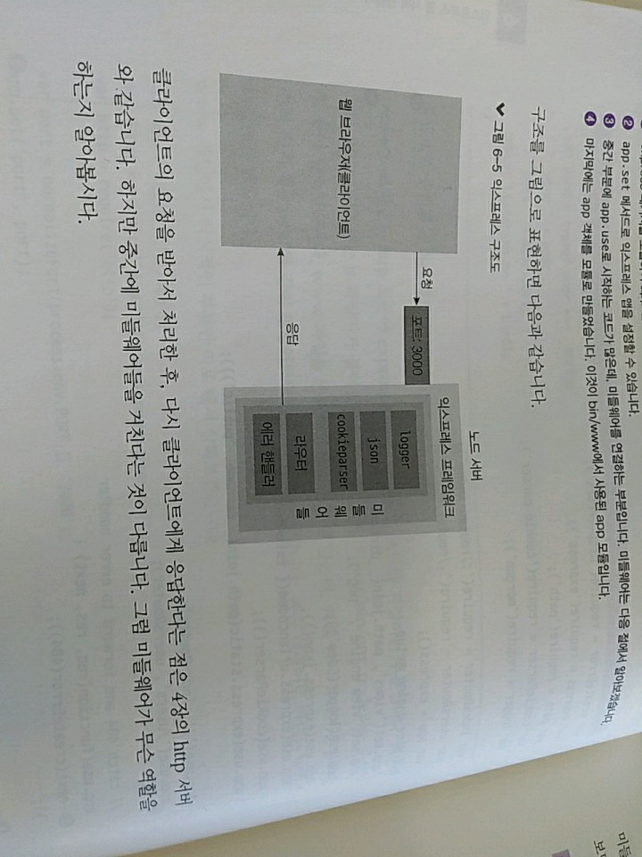

> 6.2 익스프레스 구조 이해하기

>> Express : 코드가 여러 개의 파일로 분산되어 있음 => 각 부분마다 맡은 역할이 나누어져 보기, 관리에 좋음
>> bin/www 파일을 살펴보자

* bin/www파일 - http 모듈에 express 모듈을 연결 & 포트를 지정하는 부분 
    * www파일에는 js 확장자가 붙어있지 X
    * #!/usr/bin/env node - 이 주석이 첫 줄에 달려 있음
    * www 파일을 콘솔 명령어로 만들 수 있음 => 이 때 이 주석이 사용됨.(전역 설치 후 rimraf와 같이 명령어로도 실행 가능)

```javascript

// 1
var app = require('../app');
var debug = require('debug')('learn-express:server');
var http = require('http');

// 2
var port = normalizePort(process.env.PORT || '3000');
app.set('port', port);

// 3
var server = http.createServer(app);

// 4
server.listen(port);
server.on('error', onError);
server.on('listening', onListening);
```

1. 먼저 app,debug,http 모듈들을 가져옴 => app 모듈은 나중에, debug 모듈은 콘솔에 로그를 남기는 모듈 
2. app.set('port','port')로 서버가 실행될 포트를 선언 
    1. process.env 객체에 PORT 속성이 있다면 그 값을 사용하고, 없다면 기본값으로 3000번 포트를 이용하도록 되어 잇음
    2. => app.set(키, 값)을 사용해서 데이터를 저장할 수 있음 => 나중에 데이터를 app.get(키)로 가져올 수 있음
3. http.createServer에 불러온 app 모듈을 넣어줌 => app 모듈이 createServer 메서드의 콜백 함수 역할을 함.
4. listen을 하는 부분은 http 웹 서버와 동일 => 서버를 구동했던 것과 동일하게 포트를 연결하고 서버를 실행함.
    1. 익스프레스는 그저 콜백 함수 부분을 조금 다르게 만든 것.

>> app 모듈을 살펴보자
```javascript
// 1
var app = express();

// view engine setup
// 2
app.set('views', path.join(__dirname, 'views'));
app.set('view engine', 'pug');

// 3
app.use(logger('dev'));
app.use(express.json());
app.use(express.urlencoded({ extended: false }));
app.use(cookieParser());
app.use(express.static(path.join(__dirname, 'public')));

app.use('/', indexRouter);
app.use('/users', usersRouter);

// catch 404 and forward to error handler
app.use(function(req, res, next) {
  next(createError(404));
});

// error handler
app.use(function(err, req, res, next) {
  // set locals, only providing error in development
  res.locals.message = err.message;
  res.locals.error = req.app.get('env') === 'development' ? err : {};

  // render the error page
  res.status(err.status || 500);
  res.render('error');
});

// 4
module.exports = app;
```

1. express 패키지를 호출해 app 변수 객체를 만듬 => 이제 이 변수에 각종 기능을 연결하자 
2. app.set 메서드로 익스프레스 앱을 설정할 수 있음 
3. 중간 부분에 app.user로 시작하는 코드가 많음 => 미들웨어를 연결하는 부분 
4. app 객체를 모듈로 만듬 => bin/www에서 사용된 app 모듈 



>> 클라이언트의 요청을 받아서 처리한 후, 다시 클라이언트에게 응답한다는 점 => http 서버와 같음 
>> But, 중간에 미들웨어들을 거친다는 것이 다름 => 무슨 역할을 할까?