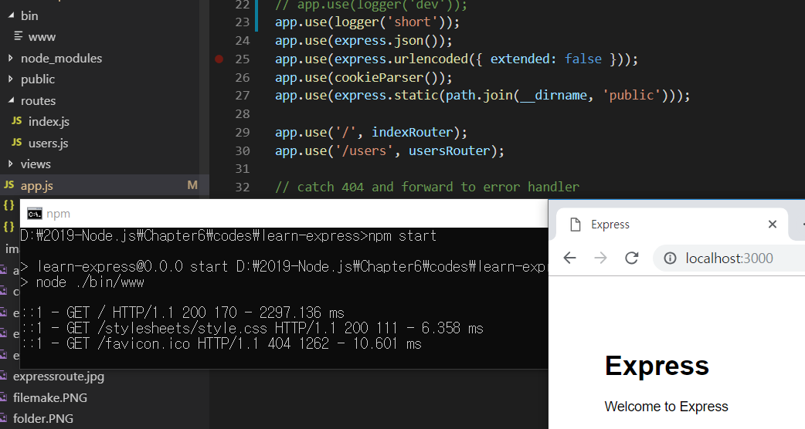
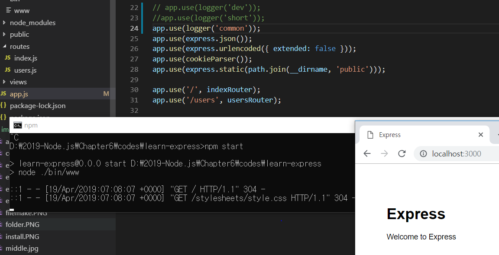
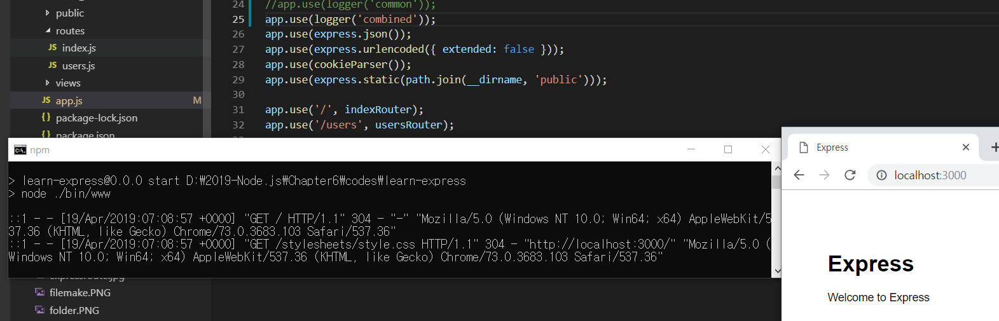

> 6.3.2 morgan

>> GET / 200 51.267 ms - 1539 => 이러한 로그들은 모두 morgan 미들웨어에서 나오는 것

```javascript
    // morgan의 사용 예

    var logger = require('morgan');
    app.use(logger('dev'));

```
>> 함수의 인자로 dev 대신 short, common, combined 등을 줄 수 있음 
>> 인자에 따라 콘솔에 나오는 로그가 다름 
>> dev 인 경우 - GET/ 200 51.267 ms - 1539의 의미 
* 순서대로 HTTP요청(GET) 주소(/) HTTP 상태 코드(200) 응답속도(51.267ms) - 응답바이트(1539)임
    * 개발 시 -> short, dev 인자를 많이 사용 
    * 배포 시 -> common, combined를 많이 사용 

* 콘솔뿐만 아니라 파일이나 데이터베이스에 로그를 남길 수도 있음 
    * 이러한 작업을 할 때 => winston 모듈을 더 많이 사용함 

* 함수의 인자로 short, common, combined 가 들어갔을 때 정보들 
    * 

    * 

    * 

> 6.3.3 body-parser

>> 요청의 본문을 해석해주는 미들웨어 => 폼 데이터나 AJAX 요청의 데이터를 처리

```javascript
    var bodyparser = require('body-parser');
    app.use(bodyParser.json());
    app.use(bodyParser.urlencoded({extended: false}));
```

>> But, app.js에선 body-parser를 볼 수 없는데 => 4.16.0 버전 부터 body-parser의 일부 기능이 익스프레스에 내장되었기 때문 
>> 그래서 설치하지 않고도 밑과 같이 사용가능 
```javascript
    app.use(express.json());
    app.use(express.urlencoded({extended:false}));
```
* body-parser가 필요한 경우도 존재 
    * body-parser : JSON과 URL-encoded 형식의 본문 외에도 Raw,Text 형식의 본문을 추가로 해석할 수 있음
    * Raw : 본문이 버퍼 데이터일 떄, Text : 본문이 텍스트 데이터일 대 해석하는 미들웨어 
    * 서비스에 적용하고 싶다면 body-parser를 설치한 후 밑 코드를 추가
    ```javascript
        app.use(bodyParser.raw());
        app.use(bodyParser.text());
    ```
    * JSON : JSON 형식의 데이터 전달 방식, URL-encoded : 주소 형식으로 데이터를 보내는 방식 
    * 일반적 
        1. 폼 전송 - URL-encoded 방식을 주로 사용 
            * urlencoded 메소드 - { extended: false } 라는 옵션이 들어 있음
            * 옵션이 false => 노드의 queryString 모듈을 사용해 쿼리스트링을 해석, 
            * true이면 qs 모듈을 사용해 쿼리스트링을 해석
                * qs 모듈? 내장 모둘이 아닌 npm 패키지, querystring 모듈의 기능을 조금 더 확장한 모듈 

* post, put 요청의 본문을 전달받으려면? => req.on('data'), req.on('end')로 스트림을 사용해야 했던 것
    * body-parser를 사용하면 그럴 필요가 없음 
        * => 내부적으로 본문을 해석해 req.body에 추가해 줌

* ex) JSON 형식으로 { name: 'zerocho' , book: 'nodejs'}를 본문으로 보낸다면 req.body에 그대로 들어감 
* ex) URL-encoded 형식으로 name=zerocho&book=nodejs를 본문으로 보낸다면 req.body에 {name: 'zerocho', book: 'nodejs'}가 들어감

* body-parser가 모든 본문을 해석해주는 것은 아니고, multipart/form-data 같은 폼을 통해 전송된 데이터는 해석하지 못함 => 다른 모듈 사용 필요


