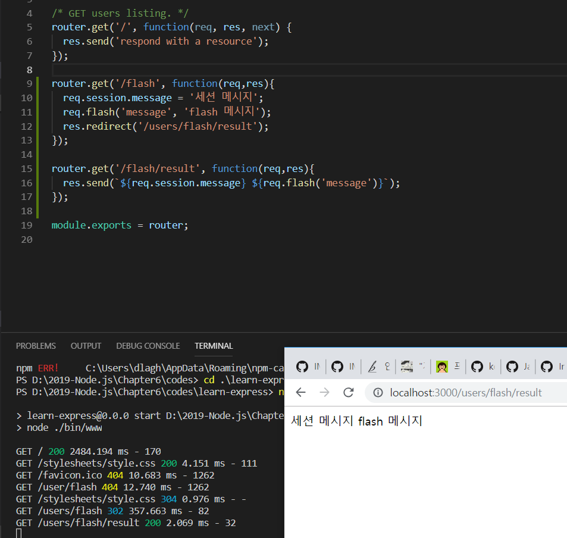
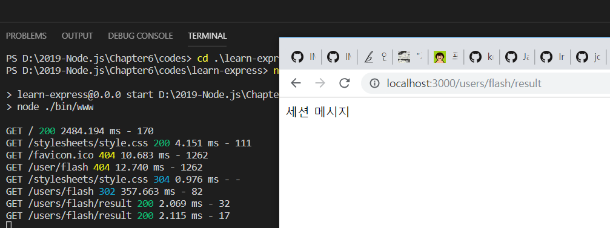

> 6.3.7 connect-flash

>> 상대적으로 중요도가 떨어지는 미들웨어, 일회성 메시지들을 웹 브라우저에 나타낼 때 좋음 => npm i connect-flash로 직접 설치 ㄱㄱ
>> connect-flash : cookie-parser와 express-session을 사용 => 이들보다는 뒤에 위치해야 함.
```javascript
var session = require('express-session'); // 2019-04-21 빠진 부분 추가
var flash = require('connect-flash');
    ...
app.use(cookieParser('secret code'));
app.use(session({
    resave:false,
    saveUninitialized: false,
    secret: 'secret code',
    cookie: {
      httpOnly: true,
      secure: false,
    }
}));
app.use(flash());
```
>> flash 미들웨어 - req 객체에 req.flash 메서드를 추가 
* req.flash(키, 값)으로 해당 키에 값을 설정 
    * req.flash(키) : 해당 키에 대한 값을 불러옴 

```javascript
    // flash, 세션을 테스트하기 위해 임시로 라우터를 만듬 -> routes/users.js
var express = require('express');
var router = express.Router();

/* GET users listing. */
router.get('/', function(req, res, next) {
  res.send('respond with a resource');
});

router.get('/flash', function(req,res){
  req.session.message = '세션 메시지';
  req.flash('message', 'flash 메시지');
  res.redirect('/users/flash/result');
});

router.get('/flash/result', function(req,res){
  res.send(`${req.session.message} ${req.flash('message')}`);
});

module.exports = router;
```
1. /users/flash 라우터로 GET 요청을 보냄
2. 서버에선 세션과 flash에 메시지를 설정하고 /users/flash/result 메시지로 리다이렉트함


>> 세션 메시지와 flash 메시지가 모두 보임


>> 세션 메시지는 보이는데 flash 메시지는 보이지 않음 => why? flash 메시지는 일회용!

>> 일회성 메시지 성질 -> 로그인 에러, 회원가입 에러 같은 일회성 경고 메시지를 flash 미들웨어로 보내면 좋음 


* 매 요청마다 연결한 모든 미들웨어가 실행됨 -> 웹에 너무 많은 미들웨어를 연결하면 응답이 느려질 수 있음 
    * => 꼭 필요한 미들웨어만 사용하자!


