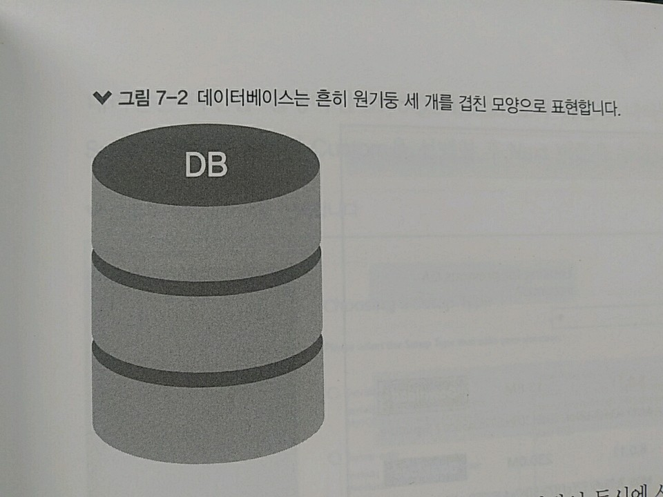
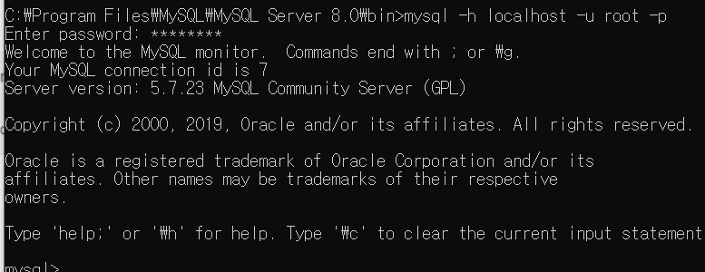
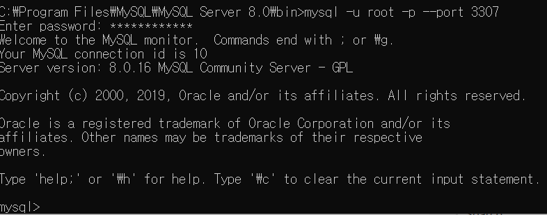
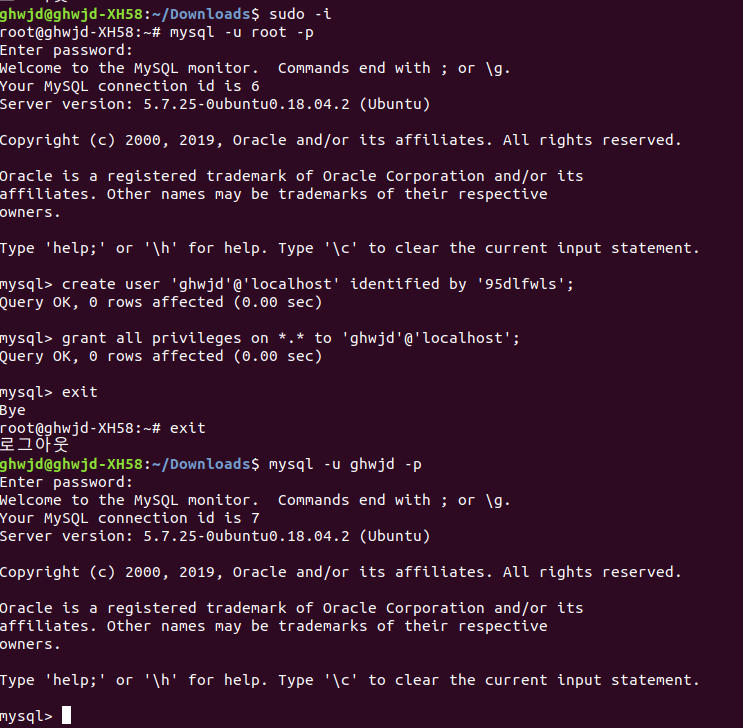

# 7. MySQL 

>> 지금까지 모든 데이터를 변수에 저장 => 변수에 저장 -> 컴퓨터 메모리에 저장 
>> 서버가 종료되면 메모리가 정리되면서 저장했던 데이터도 사라져 버림 => 방지! => 그래서 DB를 쓴다

>> 다양한 DB 중, MySQL과 MongoDB 두 가지를 사용할 예정 

> 7.1 데이터베이스란?

>> 데이터베이스 : 관련성을 가지며 중복이 없는 데이터들의 집합 
>> => 이러한 데이터베이스를 관리하는 시스템을 DBMS(데이터베이스 관리 시스템)라고 부름

>> 보통 서버의 하드 디스크, SSD 등의 저장 매체에 데이터를 저장 
>> 저장 매체가 고장 or 사용자가 직접 데이터를 지우지 않는 이상 계속 데이터가 보존됨. 
>> => 서버 종료 여부와 상관없이 데이터를 계속 사용할 수 있음



* 서버에 데이터베이스를 올리면 여러 사람이 동시에 사용할 수 있음 
    * 사람들에게 각각 다른 권한을 주어 어떤 사람은 읽기만 가능하고, 어떤 사람은 모든 작업을 가능하게 할 수 있음 

* 데이터베이스를 관리하는 DBMS 중엔 RDBMS(Relational DBMS)인 관계형 DBMS가 많이 사용됨.
    * 대표적으론 Oracle, MySQL, MSSQL 등이 존재 
    * SQL이라는 언어를 사용해 데이터를 관리 => But, RDBMS 별로 SQL문이 조금씩 다름 
    * 실습은 MySQL로 할 듯

> 7.2 MySQL 설치 => 이제부터는 리눅스에서 진행하겠습니다.

>> 우분투에선 GVI를 사용하지 않음 => 순서대로 입력하여 MySQL을 설치!
<!-- 우분투 설치 버전 -->
```console
$ sudo apt-get update 
$ sudo apt-get install -y mysql-server 
$ mysql_secure_installation
```
>> 설치만 하면 에러가 ㄷㄷㄷ

>> MySQL 못하겠다 여기선 ..... 너무 오류가 ㄷㄷ

>> 일단 진도는 맞추어야 하니까 => 윈도우에서 진행하다가 리눅스는 오류 찾으면 바로 진행하겠습니다.

 

```console
$ mysql -h localhost -u root -p
```

```console
$ mysql -u root -p --port 3307 
```
>> port 옵션을 넣어주고 Enter를 입력

* mysql -h 뒤에는 접속할 주소를, -u 뒤에는 사용자명을 입력 
    * 각각 localhost와 root를 넣어줌 
    * -p : 비밀번호를 사용하겠다라는 뜻 => 명령어 창에 설정 비번 입력 ㄱㄱㄱ
    * 콘솔로 다시 돌아가려면 exit 명령어 입력
    * => MySQL Connection으로 커넥션 생성가능 
    
* In Linux, 
```console
$ sudo apt-cache search mysql-server
<!-- 설치 가능한 버전 확인 -->
```
[mysql-community-server 삭제 안 되는 에러 해결](https://askubuntu.com/questions/640899/how-do-i-uninstall-mysql-completely)

>> 설치 과정에 이상한 부분이 생겨서 비밀번호 설정이 안 뜨고 넘어가는데, 실습을 해야하니 
>> => root 권한에서 새로운 사용자를 만들고 그것으로 mysql에 접속해서 공부해야겠다는 Think! (그냥 오류 피하는 느낌? ㅠㅠㅠ)

>> 어쨋든 



1. MySQL 서버 로그인 
```console
<!-- 사용자를 추가하기 위해 로그인 필요 -->
$ sudo -i
$ mysql -u root -p
```
2. 로컬에서 접속 가능한 사용자 추가
```console
$ create user 'ghwjd'@'localhost' idetified by '비밀번호';
```

3. DB 권한 부여하기 
```console
$ grant all privileges on *.* to 'ghwjd'@'localhost';
$ grant all privileges on DB이름.* to '사용자'@'localhost';
```

4. 사용자 계정 삭제 & 원격에서 접속 가능한 사용자
    * 원격에서 접속 가능한 사용자 만드는 것은 위에서 localhost대신 IP로 바꾸어서 해주면 가능!!!!
```console
$ drop user '사용자'@'localhost';
```
    
[사용자 추가 참조](https://cjh5414.github.io/mysql-create-user/)

>> God Google, 글 남겨주신 분들 모두 정말 큰 도움이 되었습니다.


