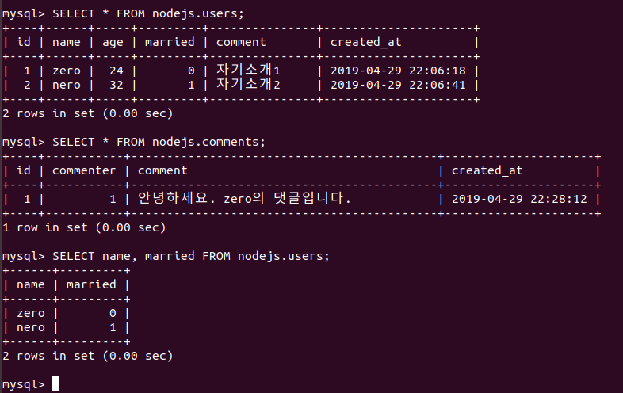
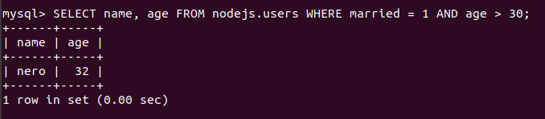
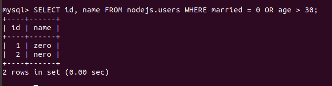
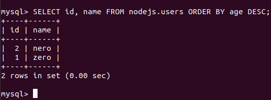
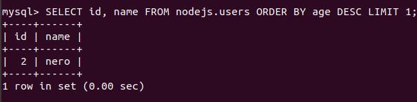
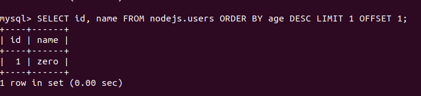
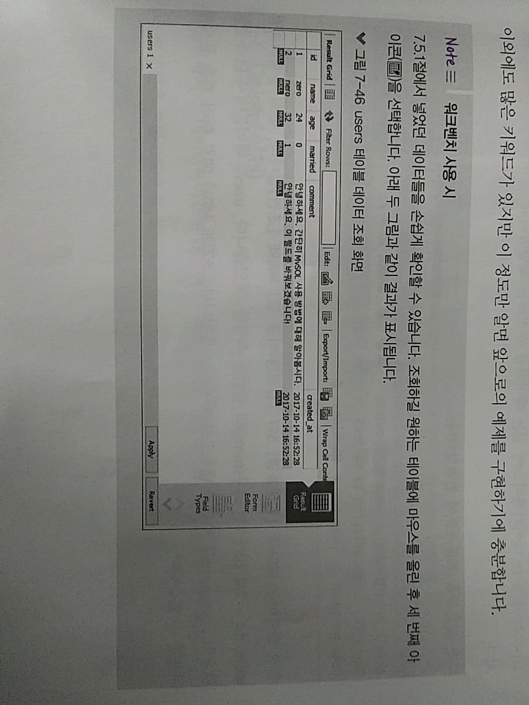
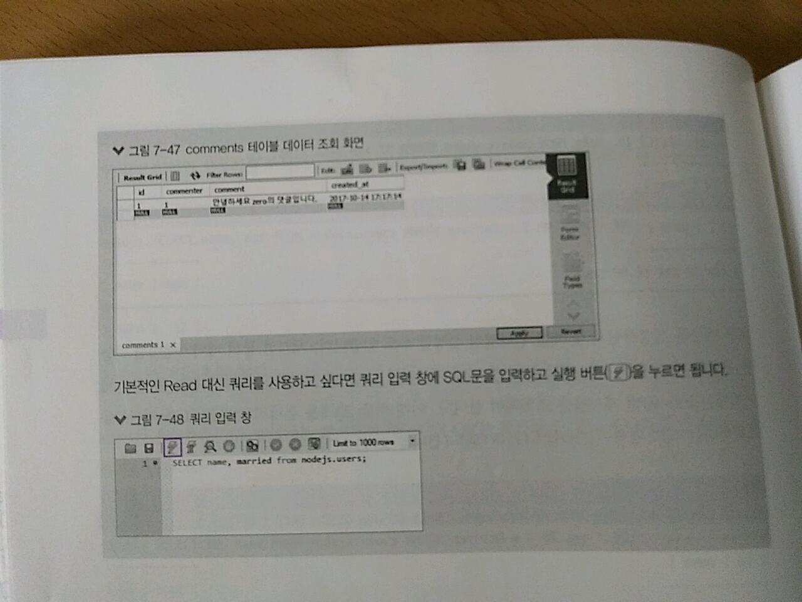

> 7.5.2 Read(조회)

>> Read : 데이터베이스에 있는 데이터를 조회하는 작업 
```sql
$ SELECT * FROM nodejs.users;
```
>> => users 테이블의 모든 데이터를 조회하는 SQL문
```sql
-- 기본 형식
$ SELECT * FROM [테이블명]
```



>> 위 SQL문을 mysql 프롬프트에 입력하면 됨. => comments 비슷한 SQL문으로 조회할 수 있음.

* 특정 컬럼만 조회할 수도 있습니다. => 조회를 원하는 컬럼을 SELECT 다음에 넣어주면 됨.

* WHERE 절을 사용하면 특정 조건을 가진 데이터만 조회할 수도 있음 
    * ex) 결혼을 했고 나이가 30세 이상인 사용자를 조회하는 SQL
    * AND 문으로 여러 조건을 묶어줄 수도 있음
```sql
$ SELECT name, age FROM nodejs.users WHERE married = 1 AND age > 30;
```


* AND - 조건들을 모두 만족하는 데이터를 찾는다?
    * OR - 조건들 중 어느 하나라도 만족하는 데이터를 찾음
```sql
$ SELECT id, name FROM nodejs.users WHERE married = 0 OR age > 30;
```


* ORDER BY 컬럼명 ASC|DESC -> 정렬도 가능 
    * ex) 나이가 많은 순서대로 정렬
    * DESC - 내림차순, ASC - 오름차순
```sql
$ SELECT id, name FROM nodejs.users ORDER BY age DESC;
```


* 조회할 로우 개수를 설정할 수도 있음 
    * LIMIT 숫자 - 이것을 사용하자!
    * ex) LIMIT 1을 SQL문 끝에 붙이면 하나만 조회 가능 
```sql
$ SELECT id, name FROM nodejs.users ORDER BY age DESC LIMIT 1;
```


* 로우 개수를 설정하면서 몇 개를 건너뛸지 설정할 수도 있음 
    * ex) 게시판 등 페이지네이션 기능을 구현할 때 유용!!!
    * ex) 첫 번째 페이지에 1~20번 게시물 조회 시, 두 번째 페이지엔 21~40번 게시물을 조회해야 함.
        * 이 때, 처음 20개를 건너뛰고 다음 20개 게시물을 조회하라는 식의 명령이 가능!
        * OFFSET 건너뛸 숫자 키워드를 사용!
    ```sql
    $ SELECT id, name FROM nodejs.users ORDER BY age DESC LIMIT 1 OFFSET 1;
    ```
    


* 워크벤치에선?



