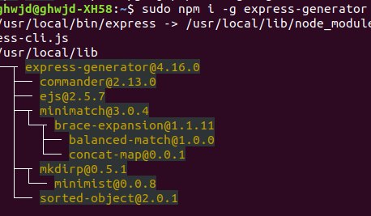
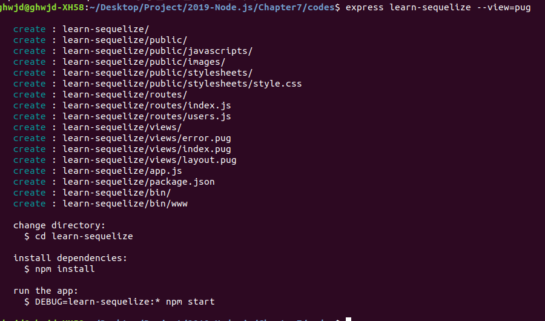
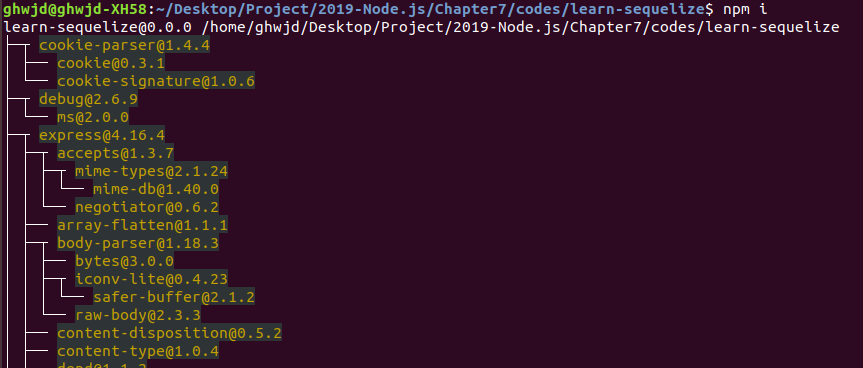
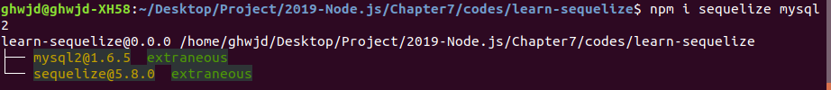
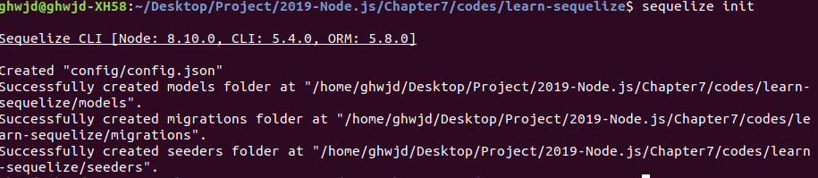

> 7.6 시퀄라이즈 사용하기 

>> 노드에서 MySQL 데이터베이스에 접속 ㄱㄱ
>> MySQL 작업을 쉽게 할 수 있도록 도와주는 라이브러리가 존재! => Sequelize

>> ORM(Object-relational Mapping)으로 분류됨.
>> ORM? 자바스크립트 객체와 데이터베이스의 릴레이션을 매핑해주는 도구!

>> 시퀄라이즈를 MySQL 뿐만이 아닌, MariaDB, PostgresSQL, SQLite, MSSQL 등 다른 데이터베이스도 함께 사용 가능
>> 문법이 어느 정도 호환되므로 다른 SQL 데이터베이스로 전환할 떄도 편리!

>> 왜 시퀄라이즈를 쓰는가? 
>> => 자바스크립트 구문을 알아서 SQL로 바꾸어주기 때문에!
>> => SQL 언어를 직접 사용하지 않아도 자바스크립트만으로 MySQL을 조작할 수 있음 
>> SQL을 몰라도 MySQL을 어느정도 다룰 수 있게 되지만, SQL을 모르는 채로 시퀄라이즈를 사용하는 것을 추천 X

1. Express-generator로 새 프로젝트 생성 & 시퀄라이즈 설치



2. 완료 후 learn-sequelize 폴더로 이동해 npm 패키지 설치


3. 시퀄라이즈에 필요한 sequelize와 mysql2 패키지를 설치 
    * 
    * 그 후 sequelize 커맨드를 사용하기 위해 sequelize-cli를 전역 설치함.
        * 
    * 설치 완료 후 sequelize init 명령어를 호출하면 됨.
        * 
        * 명령어 호출 시 나오는 Warning은 무시해도 되고 
        * config, models, migrations, seeders 폴더가 생성됨.
        * models 폴더 안 index.js를 확인해보자.
        * 왜? sequelize-cli가 자동으로 생성해주는 코드는 그대로 사용했을 때 에러가 발생 & 필요 없는 부분도 많음
```javascript
const path = require('path');
const Sequelize = require('sequelize');

const env = process.env.NODE_ENV || 'development';
const config = require(__dirname + '/../config/config.json')[env];
const db = {};

const sequelize = new Sequelize(config.database, config.username, config.password, config);

db.sequelize = sequelize;
db.Sequelize = Sequelize;

module.exports = db;
```
>> => 이렇게 수정한다.


