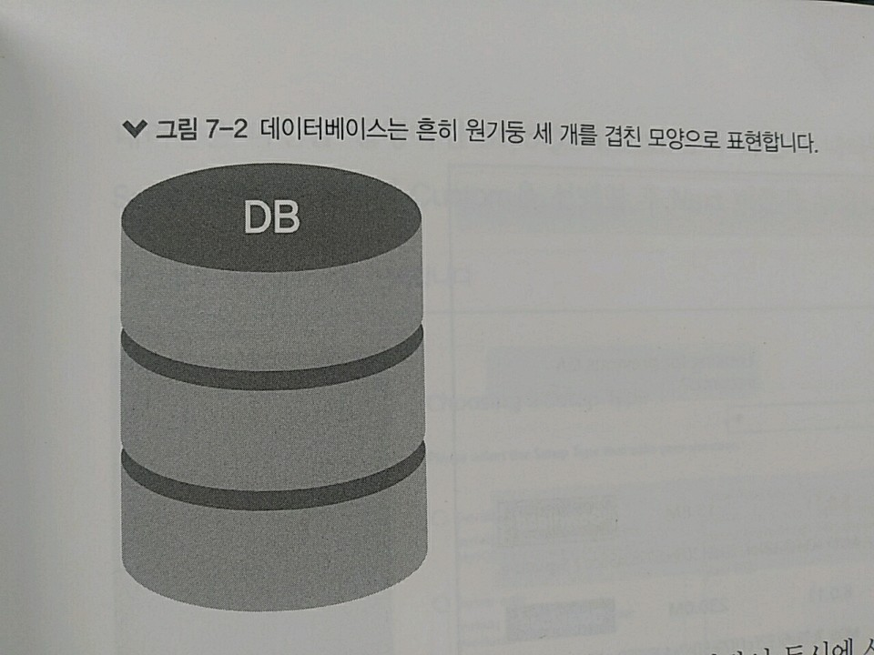

# 7. MySQL 

>> 지금까지 모든 데이터를 변수에 저장 => 변수에 저장 -> 컴퓨터 메모리에 저장 
>> 서버가 종료되면 메모리가 정리되면서 저장했던 데이터도 사라져 버림 => 방지! => 그래서 DB를 쓴다

>> 다양한 DB 중, MySQL과 MongoDB 두 가지를 사용할 예정 

> 7.1 데이터베이스란?

>> 데이터베이스 : 관련성을 가지며 중복이 없는 데이터들의 집합 
>> => 이러한 데이터베이스를 관리하는 시스템을 DBMS(데이터베이스 관리 시스템)라고 부름

>> 보통 서버의 하드 디스크, SSD 등의 저장 매체에 데이터를 저장 
>> 저장 매체가 고장 or 사용자가 직접 데이터를 지우지 않는 이상 계속 데이터가 보존됨. 
>> => 서버 종료 여부와 상관없이 데이터를 계속 사용할 수 있음



* 서버에 데이터베이스를 올리면 여러 사람이 동시에 사용할 수 있음 
    * 사람들에게 각각 다른 권한을 주어 어떤 사람은 읽기만 가능하고, 어떤 사람은 모든 작업을 가능하게 할 수 있음 

* 데이터베이스를 관리하는 DBMS 중엔 RDBMS(Relational DBMS)인 관계형 DBMS가 많이 사용됨.
    * 대표적으론 Oracle, MySQL, MSSQL 등이 존재 
    * SQL이라는 언어를 사용해 데이터를 관리 => But, RDBMS 별로 SQL문이 조금씩 다름 
    * 실습은 MySQL로 할 듯

> 7.2 MySQL 설치 => 이제부터는 리눅스에서 진행하겠습니다.

>> 우분투에선 GVI를 사용하지 않음 => 순서대로 입력하여 MySQL을 설치!
<!-- 우분투 설치 버전 -->
```console
$ sudo apt-get update 
$ sudo apt-get install -y mysql-server 
$ mysql_secure_installation
```
>> 설치만 하면 에러가 ㄷㄷㄷ

>> MySQL 못하겠다 여기선 ..... 너무 오류가 ㄷㄷ