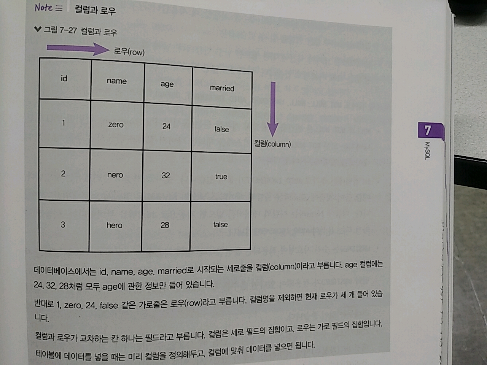
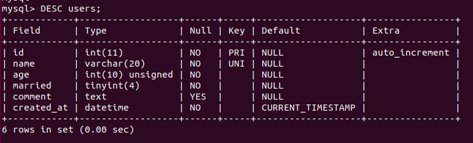
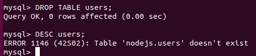
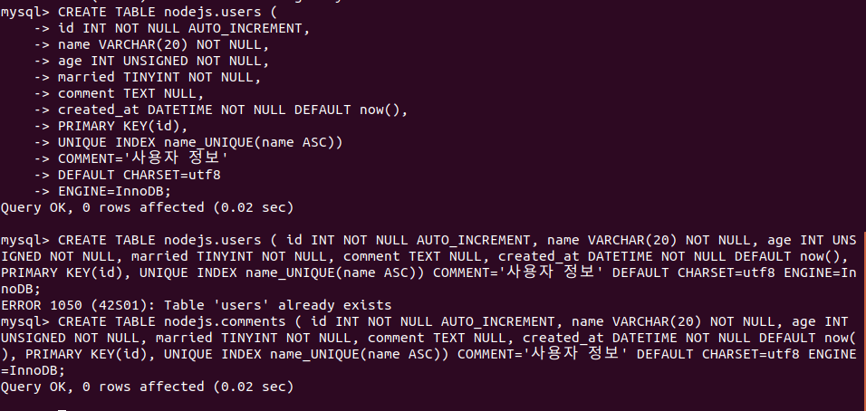
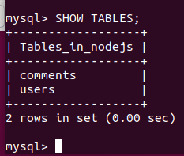
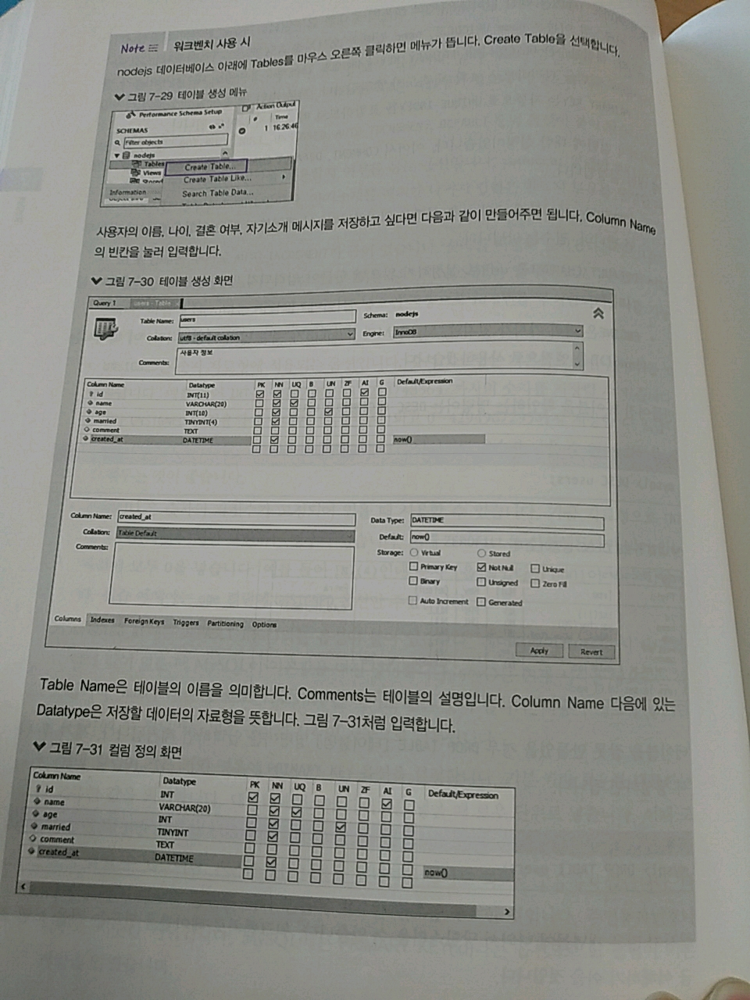
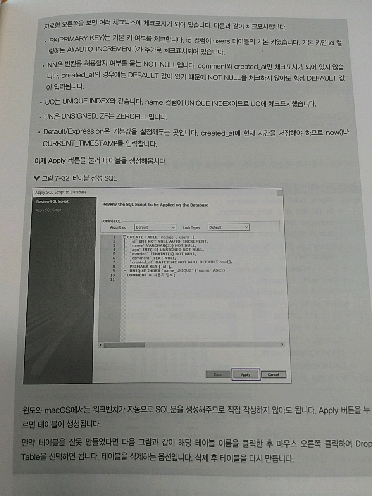
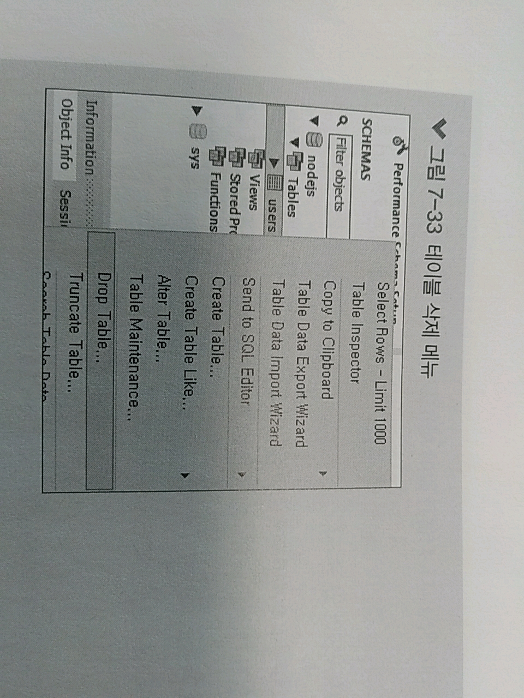
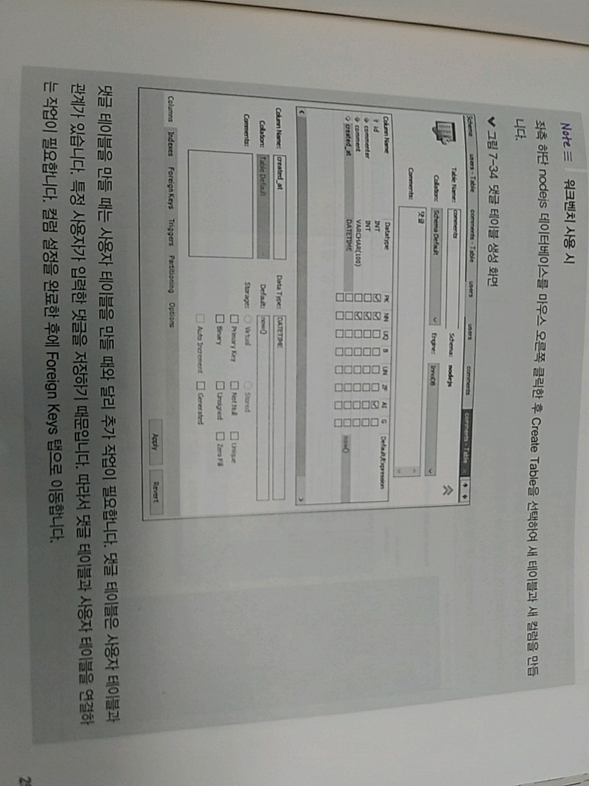

> 7.4 데이터베이스 및 테이블 생성하기 

> 7.4.1 데이터베이스 생성하기

* MySQl 명령 프롬프트 접속!
```sql   
create schema [데이터베이스 이름] 
```
>> schema라고 되어있지만, MySQL에선 DB와 Schema는 동일한 개념 

```sql
create schema nodejs;
use nodejs;
```
1. nodejs라는 이름의 데이터베이스 생성 
2. use nodejs; 
    * 앞으로 nodejs 데이터베이스를 사용하겠다는 것을 MySQL에 알림

* sql 구문 -> 입력할 때 마지막에 ;를 붙여야 실행됨.
    * 붙이지 않으면 프롬프트가 다음 줄로 넘어가 다른 입력이 들어오기를 계속 기다림 

* 예약어 - MySQL이 기본적으로 알고 있는 구문 
    * ex) create schema 
    * 대문자로 쓰는 것이 좋음 => 사용자 정의 이름과 구분하기 위해!


> 7.4.2 테이블 생성하기 

>> 데이터베이스를 생성했다면? 테이블을 만들어주자

>> 테이블? 데이터가 들어가기 위한 틀 =>  테이블에 맞는 데이터만 들어가는 게 가능


>> 오타가 나지 않도록 주의, 한 줄로 적어도 되지만,
>> => 보기 불편해서 Enter키를 누른 후 줄을 바꾸어서 입력하는 것이 좋음 
```sql
CREATE TABLE nodejs.users(
-> id INT NOT NULL AUTO_INCREMENT,
-> name VARCHAR(20) NOT NULL,
-> age INT UNSIGNED NOT NULL,
-> married TINYINT NOT NULL,
-> comment TEXT NULL,
-> created_at DATETIME NOT NULL DEFAULT now(),
-> PRIMARY KEY(id),
-> UNIQUE INDEX name_UNIQUE(name ASC))
-> COMMENT = '사용자 정보'
-> DEFAULT CHARSET=utf8
-> ENGINE=InnoDB;

```
* CREATE TABLE [데이터베이스명.테이블 명] => 테이블을 생성하는 명령어
```sql
CREATE TABLE nodejs.users 
-- nodejs 데이터베이스 내에 users 테이블을 생성하는 것 
-- 아까 use nodejs; 명령어 실행 -> 데이터베이스명은 생략해도 됨.
```

>> 그 후, 한 줄에 하나씩 콤마(,)로 구분해 컬럼들을 만듬 
>> 순서대로 id(고유 식별자), name(이름), age(나이), married(결혼 여부), comment(자기 소개),created_at(로우 생성일)
>> PRIMARY KEY부터는 다른 옵션

>> 컬럼을 정의해두면 => 데이터를 넣을 때 컬럼 규칙에 맞는 정보들만 넣을 수 있음 
>> ex) 생년월일, 몸무게 처럼 컬럼으로 만들어두지 않은 정보들은 저장할 수 없음!



* column 이름 옆 INT, VARCHAR, TINYINT, TEXT, DATETIME 등이 있음 => 컬럼의 자료형
    * INT - 정수 의미, 소수까지 저장하고 싶다면 FLOAT이나 DOUBLE 자료형을 사용하면 됨.
    * VARCHAR(자릿수), CHAR(자릿수) : CHAR - 고정 길이, VARCHAR - 가변 길이 
        * ex) CHAR(10) - 반드시 길이가 10인 문자열만 넣어야 하고,
        * ex) VARCHAR(10) - 0~10 길이의 문자열을 넣을 수 있음 
        * CHAR에 주어진 길이보다 짧은 문자열을 넣는다???? -> 부족한 자릿수만큼 스페이스가 채워짐 
    * TEXT - 긴 글을 저장할 때 사용, VARCHAR와 혼동가능 
        * 몇 백자 이내의 문자열은 보통 VARCHAR로 많이 처리 => 그보다 길면 TEXT로 처리하곤 함.
    * TINYINT - -127부터 128까지의 정수를 저장할 때 사용
        * 1 또는 0만 저장한다면 Boolean과 비슷한 역할을 할 수 있음 
    * DATETIME - 날짜와 time에 대한 정보를 담고 있음 
        * 날짜 정보만 담는 DATE와 time 정보만 담는 Time 자료형도 존재 
    * 이외에도 많은 자료형 존재!

* NOT,NULL, UNSIGNED, AUTO_INCREMENT, DEFAULT 등의 옵션 
    * NULL, NOT NULL - 빈칸을 허용할지 여부를 묻는 옵션 
        * comment 컬럼만 NULL, 나머지는 모두 NOT NULL 
        * => 자기 소개를 제외한 나머지 컬럼은 반드시 로우를 생성할 때 데이터를 입력해주어야 함.
    * id 컬럼 - 추가로 AUTO_INCREMENT
        * 숫자를 저절로 올리겠다는 의미 
        * ex) 처음에 Zero라는 사람의 데이터를 넣으면???? -> MySQL은 알아서 id로 1번을 부여함
        * ex) 다음에 Nero라는 사람의 데이터를 넣으면 자동으로 id 2번을 부여함 
        * => 가능하게 하는 옵션이 AUTO_INCREMENT
    * UNSIGNED - 숫자 자료형에 적용되는 옵션 -> 숫자 자료형 : 기본적으로 음수 범위를 지원
        * ex) INT --2147483648 ~ 2147483647까지의 숫자를 저장할 수 있음 
        * 만약 UNSIGNED 적용시 -> 음수는 무시되고 0~4294967295까지 저장할 수 있음
        * FLOAT, DOUBLE에는 UN 적용이 불가 
        * 나이처럼 음수가 나올 수 없는 컬럼은 체크해두는 것이 좋음 
    * ZEROFILL - 숫자의 자릿수가 고정되어 있을 떄 사용할 수 있음 
        * ex) 자료형으로 INT 대신 INT(자릿수)처럼 표현하는 경우 존재
            * 이 때 ZEROFILL을 설정해둔다면 비어 있는 자리에 모두 0을 넣음 
            * ex) INT(4)인데 숫자 1을 넣었다면 0001이 되는 식 
    * created_at => DEFAULT now()라는 옵션이 붙음 
        * 데이터베이스 저장 시 해당 컬럼에 value가 없을때 MySQL이 기본 value를 대신 넣어줌 
        * now() : 현재 time을 넣으라는 뜻, now() 대신 CURRENT_TIMESTAMP를 적어도 동일한 뜻이 됨.
        * ex) 사용자 정보를 넣으면 created_at 컬럼엔 넣는 잠깐의 time이 자동으로 기록됨.
    * 해당 컬럼이 기본 키인 경우 => PRIMARY KEY 옵션을 설정 
        * 기본 키? - 로우를 대표하는 고유한 value
            * 데이터베이스에 데이터를 넣을 때 로우 단위로 넣음 
            * 이 때, 로우들을 구별할 고유한 식별자가 필요!
            * 이름, 나이, 결혼 여부 칼럼은 다른 사람과 내용이 겹칠 수 있어 
            * 자기소개 - 내용을 입력하지 않아도 되어 고유하지 않음 
            * => id라는 새로운 컬럼을 하나 만들어 고유한 번호를 부여한 것
            * => 주민등록번호, 학번과 비슷한 개념 
        * MySQL에는 PRIMARY KEY(id)라는 옵션으로 id 컬럼이 기본키임을 알림
    * UNIQUE INDEX - 해당 value가 고유해야 하는지에 대한 옵션 
        * ex) name 컬럼이 해당됨.
        * 인덱스의 이름은 name_UNIQUE로, name 컬럼을 오름차순(ASC)으로 기억하겠다는 것 
        * 내림차순은 DESC 
        * PRIMARY KEY or UNIQUE INDEX의 경우 -> 데이터베이스가 별도로 컬럼을 관리
        * => 조회 시 속도가 빨라짐
        * 기본 키인 id도 사실 고유해야 하지만, PRIMARY KEY는 자동으로 UNIQUE INDEX를 포함 
            * => 따로 적을 필요가 없음    

* COMMENT, DEFAULT CHARSET, ENGINE???
    * 테이블 자체에 대한 설정
    * COMMENT : 테이블에 대한 보충 설명을 의미, 이 테이블이 무슨 역할을 하는가?
        * 필수는 아님
    * DEFAULT CHARSET을 utf8로 설정하지 않으면 한글이 입력되지 않아 => 반드시 필수!
    * ENGINE - 여러가지 존재 => MyISAM or InnoDB가 제일 많이 사용됨
        * 우린 InnoDB를 사용함

* DESC 테이블명 - 만들어진 테이블을 확인하는 명령어 
```console
$ DESC users;
```


>> 테이블을 잘못 만들었을 경우 DROP TABLE 테이블명 명령어를 입력하면 제거됨. => 제거 후 다시 만들어도 OK
```console
$ DROP TABLE users; 
```



* 주의! 워크 벤치는 책 캡처 파일로 설명을 대신할 것 입니다. 
    * 직접 윈도우에서 이미 했던 과정들이라...

>> ex) 사용자의 댓글을 저장하는 테이블 생성 
```sql
$ CREATE TABLE nodejs.comments (
    -> id INT NOT NULL AUTO_INCREMENT,
    -> commenter INT NOT NULL,
    -> comment VARCHAR(100) NOT NULL,
    -> created_at DATETIME NOT NULL DEFAULT now(),
    -> PRIMARY KEY(id),
    -> INDEX commenter_idx (commenter ASC),
    -> CONSTRAINT commenter 
    -> FOREIGN KEY (commenter)
    -> REFERENCES nodejs.users (id)
    -> ON DELETE CASCADE
    -> ON UPDATE CASCADE)
    -> COMMENT = '댓글'
    -> DEFAULT CHARSET=utf8
    -> ENGINE=InnoDB;
```



>> comment table에선 id, commenter(댓글을 쓴 사용자 ID), comment(댓글 내용), created_at(로우 생성일) 컬럼이 있음 

>> commenter 컬럼엔 댓글을 작성한 사용자의 id를 저장할 것 
>> 외래 키(foreign key) : 다른 테이블의 기본 키를 저장하는 컬럼 
    ```sql
    CONSTRAINT 제약조건명 FOREIGN KEY 컬럼명 REFERENCES 참고하는 컬럼명 
    ```
>> => 외래 키를 지정할 수 있음 
>> commenter 컬럼과 users 테이블의 id 컬럼을 연결하였습니다. 
>> 다른 테이블의 기본 키이므로 commenter 컬럼에 인덱스도 걸어 본 것.

>> ON UPDATE와 ON DELETE => 모두 CASCADE로 설정했음 
>> 사용자 정보가 수정되거나 삭제되면 그것과 연결된 댓글 정보 처럼 수정하거나 삭제한다는 뜻 
>> => 데이터가 불일치하는 현상을 막기 위해서 
```sql
SHOW TABLES;
```


* 워크벤치로는???

 

 


