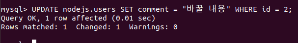
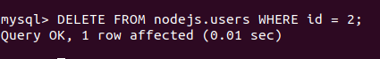

> 7.5.3 Update(수정)

>> 데이터베이스에 있는 데이터를 수정하는 작업
```sql
$ UPDATE nodejs.users SET comment = '바꿀 내용' WHERE id = 2;
-- Where id = 2로 id가 2인 로우의 컬럼을 수정할 수 잇음 
-- users 테이블에서 id가 2인 로우의 comment를 주어진 내용으로 바꾸라는 뜻! 
```

* 수정 명령어 
    * 조건도 AND나 OR로 여러 개를 동시에 사용할 수 있음
```sql
UPDATE 테이블명 SET 컬럼명=바꿀value where 조건 
```

> 7.5.4 DELETE(삭제)

>> 데이터베이스에 있는 데이터를 삭제하는 작업 -> 직접 로우 제거
```sql
$ DELETE FROM nodejs.users WHERE id = 2;
-- 조건이 WHERE id = 2 -> users 테이블에서 id가 2인 로우를 제거하라는 뜻
```
* 삭제 명령어 
    * 삭제 조건 역시 AND, OR로 여러 개를 동시에 사용 가능 
```sql
DELETE FROM 테이블명 WHERE 조건 
```


>> => 기본적인 과정 익힘 
>> -> MySQL을 노드와 연동해 서버에서 데이터베이스를 조작할 수 있게 하자!

>> 노드와 MySQL을 연동해줄 뿐만 아니라 SQL문을 작성하는 것을 도와주는 라이브러리가 존재 
>> => JAVASCRIPT로 코드를 작성하면 SQL문을 만들어줌.

* 워크벤치 에선?


