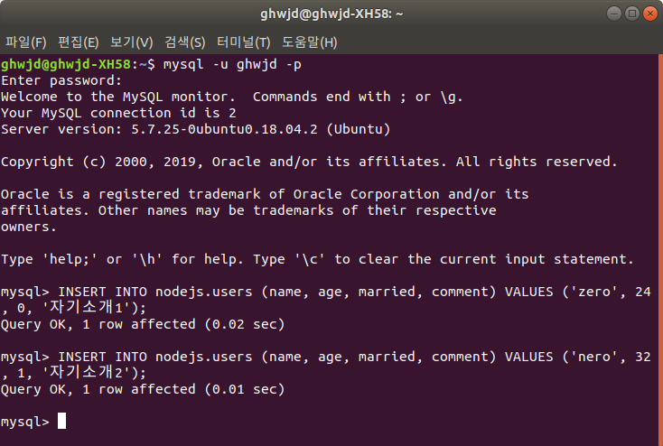
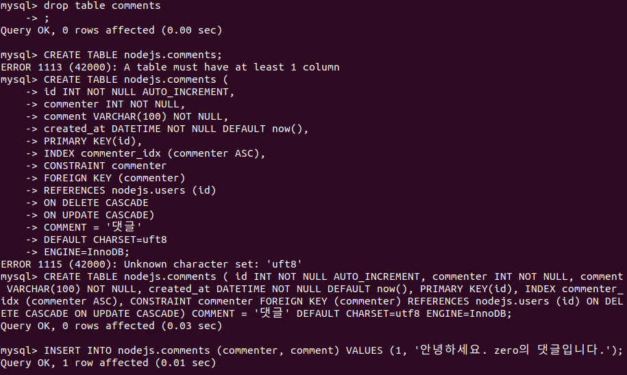
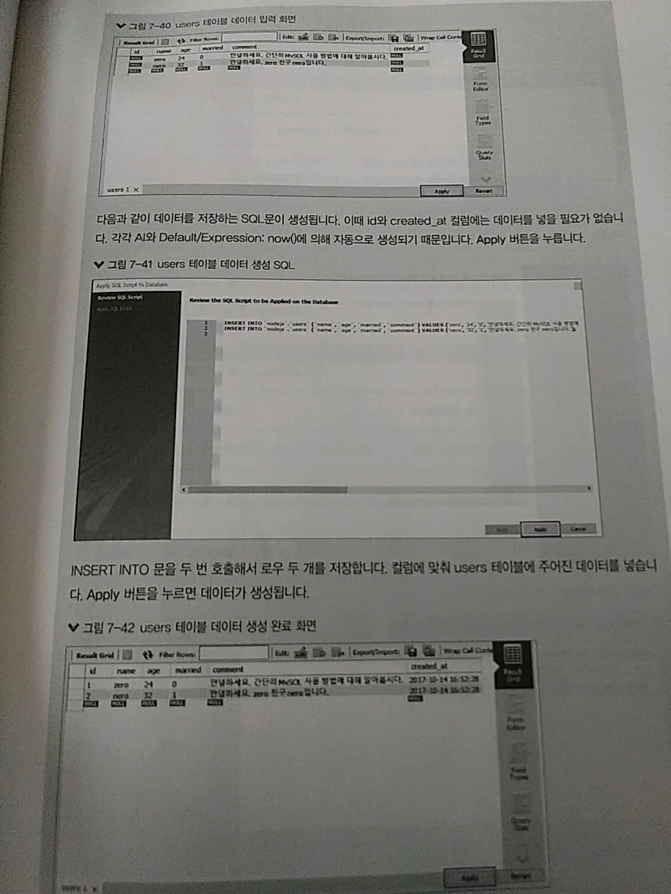
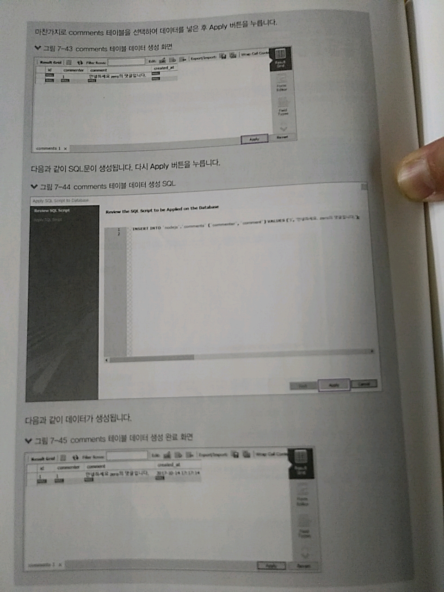

> 7.5 CRUD 작업하기

>> CRUD : Create, Read, Update, Delete의 두문자어 => 데이터베이스에서 많이 하는 작업 네가지


> 7.5.1 Create(생성)

>> 데이터를 생성해서 데이터베이스에 넣는 작업 
```sql
$ INSERT INTO nodejs.users (name, age, married, comment) VALUES ('zero', 24,0, '자기소개1');
$ INSERT INTO nodejs.users (name, age, married, comment) VALUES
('nero', 32, 1, '자기소개2' )
```


>> use nodejs; 명령어를 사용했다면? => 테이블 명으로 nodejs.users 대신 users만 해도 됨.

* 데이터를 넣는 명령어
```sql
INSERT INTO 테이블명 ([컬럼1], [컬럼2], ...) VALUES ([value1], [value2], ...)
```
>> name에 zero, age에 24, married에 0, comment에 자기소개1이 들어가는 것
>> id : AUTO_INCREMENT에 의해, created_at은 DEFAULT value에 의해 자동으로 삽입

>> comments 테이블에도 데이터를 넣어보자
```sql
$ INSERT INTO nodejs.comments (commenter, comment) VALUES (1, '안녕하세요. zero의 댓글입니다.');
```
>> 이전 실습 조금의 문제로 조금 변경하였습니다.



* 워크벤치에선?






