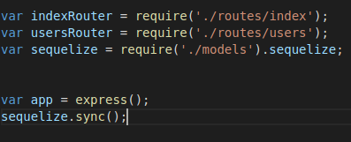

> 7.6.1 MySQL 연결하기

>> 시퀄라이즈를 통해 익스프레스 앱과 MySQL을 연결해야 함.
>> app.js에서 추가해주자.

>> require('./models') : require('./models/index.js')
>> 폴더 내의 index.js 파일은 require 시 이름을 생략할 수 있음 
>> => sync 메서드를 사용하면 서버 실행 시 알아서 MySQL과 연동됨.

> 7.6.2 모델 정의하기 

>> MySQL에서 정의한 테이블을 시퀄라이즈에서도 정의해야 함.
>> MySQL의 테이블은 시퀄라이즈의 모델과 대응됨.
>> 시퀄라이즈는 모델과 MySQL의 테이블을 연결해주는 역할을 함.
>> User와 Comment 모델을 만들어 users 테이블과 comments 테이블에 연결해보면...
>> 시퀄라이즈 - 기본적으로 모델 이름을 단수형, 테이블 이름을 복수형으로 사용
```javascript
module.exports = (sequelize, DataTypes) =>{
    return sequelize.define('user', {
        name: {
            type: DataTypes.STRING(20),
            allowNull: false,
            unique: true,
        },
        age: {
            type: DataTypes.INTEGER.UNSIGEND,
            allowNull: false,
        },
        married:{
            type: DataTypes.BOOLEAN,
            allowNull: false,
        },
        comment:{
            type: DataTypes.TEXT,
            allowNull: true,
        },
        created_at:{
            type: DataTypes.DATE,
            allowNull: false,
            defaultValue: sequelize.literal('now()'),
        },
    },
    {
        timestamps: false,
    });
};
```
>> Sequelize - 알아서 id를 기본 키로 연결함 => id 컬럼은 적어줄 필요가 없음 
>> sequelize, define 메서드로 테이블명, 컬럼의 스펙을 입력
>> MySQL 테이블과 컬럼 내용이 일치해야 정확하게 대응됨.

* 시퀄라이즈의 자료형 != MySQL의 자료형
    * VARCHAR는 STRING으로, INT는 INTEGER로,
    * TINYINT는 BOOLEAN으로, DATETIME은 DATE로 적음 
    * INTEGER.UNSIGNED는
        * UNSIGNED 옵션이 적용된 INT를 의미 
        * ZEROFILL 옵션도 사용하고 싶다면,
        * INTEGER.UNSIGNED.ZEROFILL을 적음 
    * allowNull은 NOT NULL 옵션과 동일 
    * unique는 UNIQUE 옵션임. 
    * defaultValue - 기본 value(DEFAULT)
    * now()를 사용해야 하므로 sequelize.literal 메서드 안
        * 여기에 넣어 입력함.
        * 이 메서드는 인자로 넣은 문자를 그대로 사용하는 역할을 함.
    * define 메서드의 세 번째인자는 테이블 옵션 
        * timestamps 속성의 value가 false로 되어 있음
        * timestamps 속성이 true이면 시퀄라이즈는 createdAt과 updatedAt 컬럼을 추가함.
        * 로우가 생성될 때와 수정될 때의 time이 자동으로 입력됨.
            * But, 예제에선 직접 created_at 컬럼을 만들었기 때문에 timestamps 속성이 필요하지 않음!
            * => 속성 value를 false로 하여 자동으로 날짜 컬럼을 추가하는 기능을 해제!