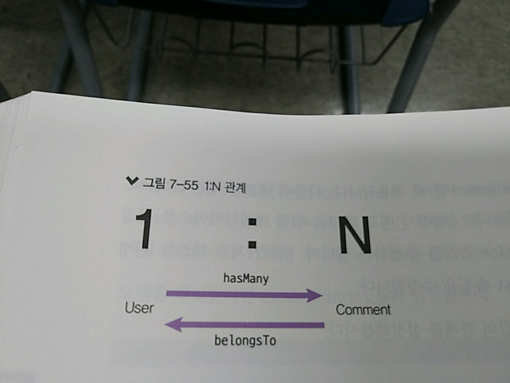
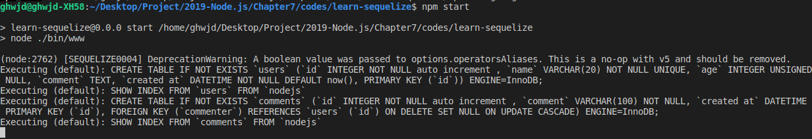
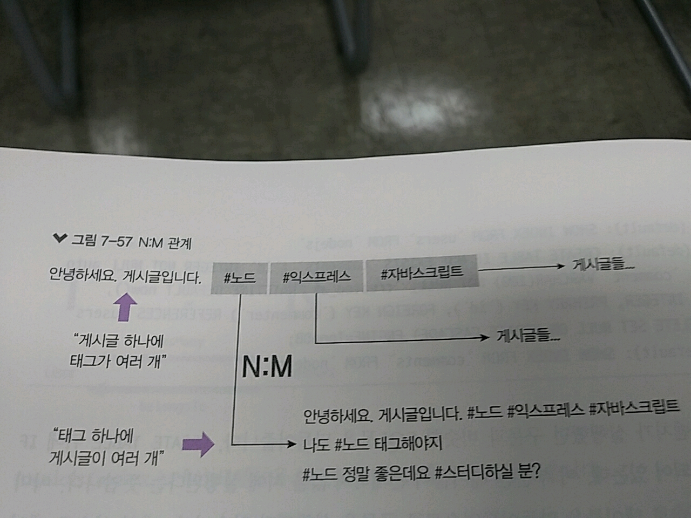
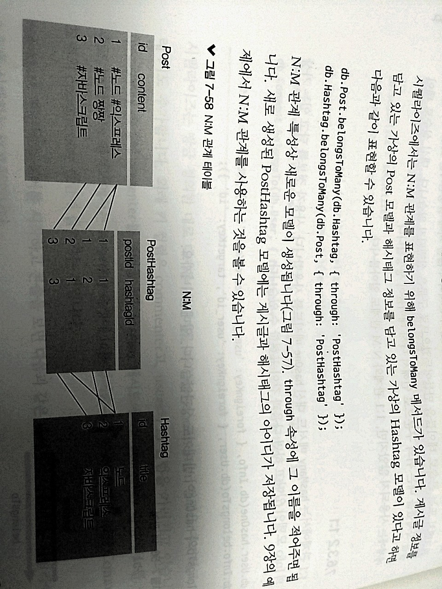

> 7.6.3 관계 정의하기 

>> users 테이블과 comments 테이블 사이의 관계를 정의해보자. 
>> 사용자 한 명은 댓글을 여러 개 작성할 수 있음 But, 댓글 하나에 사용자(작성자)가 여러 명일 수는 없음 
>> => 일대다(1:N) 관계라고 함
>> ex) 1:N 관계에선 사용자가 1이고, 댓글이 N 

>> 일대일, 다대다 관계도 존재
>> 일대일 - 사용자와 사용자에 대한 정보 테이블 
>> 사용자 한 명 => 자신의 정보를 담고 있는 테이블과만 관계가 있고 정보 테이블도 한 사람만을 가리킴 => 이러한 관계 : 1대1 관계

>> 다대다 - 게시글 테이블과 해시태그(#) 테이블 관계
>> 한 게시글에는 해시태그가 여러 개 달릴 수 있고, 한 해시태그도 여러 게시글에 달릴 수 있음 => 다대다 관계 

>> MySQL - JOIN이라는 기능 => 여러 테이블 사이 관계를 파악해 결과를 도출! => 시퀄라이즈 : JOIN 기능도 알아서 구현! 
>> 대신! 시퀼라이즈에게 테이블 사이 어떤 관계가 있는지 알려주어야 함!

> 7.6.3.1 1:N

>> 시퀄라이즈 - 1:N 관계를 hasMany 메서드로 표시! 
>> users 테이블의 로우 하나를 불러올 때 연결된 comments 테이블의 로우들도 함께 불러올 수 있음 

>> belongsTo 메서드도 존재! 
>> comments 테이블의 로우를 불러올 때 연결된 users 테이블의 로우를 가져옴



>> models/index.js에서 모델들을 연결해준 곳 밑에 추가로 넣어줌

```javascript
db.User =require('./user')(sequelize, Sequelize);
db.Comment = require('./comment')(sequelize, Sequelize);

db.User.hasMany(db.Comment, { foreignKey: 'commenter', sourceKey: 'id'});
db.Comment.belongsTo(db.User, { foreignKey: 'commenter', targetKey: 'id'});

module.exports = db;
```
>> 시퀄라이즈 - 테이블 사이 관계를 파악해서 commenter 컬럼을 추가하고, 외래 키도 추가함!
>> 외래 키 컬럼 - commenter / users의 id 컬럼을 가리키고 있음 
>> foreignKey 속성에 commenter를 넣어줌
>> hasMany 메소드 - targetKey 속성에 id를 넣어줌 => User 모델의 id가 Comment 모델의 commenter 컬럼에 들어가게 됨!


>> 근데 boolean value는 지원안하는듯 이제??

>> 이전에서 워크벤치가 실행했던 구문과 비슷한 SQL문을 만들어줌 => CREATE TABLE 뒤에 IF NOT EXISTS라고 되어 있는데, 이 부분은 테이블이 존재하지 않을 시 실행된다는 의미!

>> 이미 워크벤치 or 콘솔로 테이블을 만들어두었으므로 구문은 실행되지 않음! => 대신 실수로 테이블을 삭제했을 땐 이 구문으로 인해 다시 테이블이 생성됨.

> 7.6.3.2 1:1

>> 1:1 => hasOne 메서드를 사용함. 사용자 정보를 담고 있는 가상의 모델이 있다고 하면?
```javascript
    db.User.hasOne(db.Info, { foreignKey : 'user_id', sourceKey : 'id'});
    db.Info.belongsTo(db.User, { foreignKey : 'user_id', targetKey: 'id'});
    // belongsTO와 hasOne이 반대여도 상관없음! => 일대일이라서!
```

> 7.6.3.3 N:M 



>> 시퀄라이즈 - N:M 관계 => belongsToMany 메소드가 존재 
```javascript
 //게시글 정보를 담고 있는 가상의 Post 모델과 해시태그 정보를 담고 있는 가상의 Hashtag 모델이 있다고 하면???
 db.Post.belongsToMany(db.Hashtag, { through : 'PostHashtag' });
 db.Hashtag.belongsToMany(db.Post, { through : 'PostHashtag' });
```

>> N:M 관계 특성상 새로운 모델이 생성, through 속성에 그 이름을 적어주면 됨!
>> 새로 생성된 PostHashtag 모델엔 게시글과 해시태그의 아이디가 저장됨!



>> N:M => 데이터를 조회할 때 여러 단계를 거쳐야 함. 
>> ex) 노드 해시 태그를 사용한 게시물을 조회하는 경우를 think!
1. 노드 해시태그 - Hashtag 모델에서 조회함. 

2. 가져온 태그의 아이디(1)를 바탕으로 PostHashtag 모델에서 hashtagId가 1인 postId들을 찾아 Post 모델에서 정보를 가져옴

>> 시퀄라이즈 - 편하게 할 수 있도록 몇 가지 메서드를 지원 
```javascript 
async(req,res,next) =>{
    const tag = await Hashtag.find({ where: { title: '노드' }});
    const posts = await tag.getPosts();
}

// 1) 해시태그를 찾으면 그 해시태그에서 바로 getPost 메서드를 사용할 수 있음, get + 모델 이름의 복수형 
```

* add + 모델 이름의 복수형 메서드도 존재 => 두 테이블 사이 N:M 관계를 추가해줌 
```javascript
    // title이 노드인 해시태그와 게시글 아이디가 3인 게시글을 연결하는 코드
    async (req,res,next) => {
        const tag = await Hashtag.find({ where: { title: '노드' }});
        await tag.setPosts(3);
    };
```

>> PostHashtag 모델에 postId가 3이고 hashtagId가 1인 로우가 생성됨.