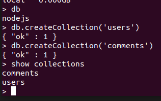
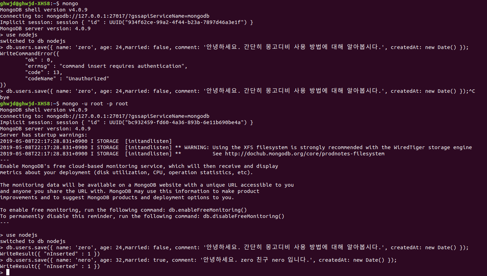
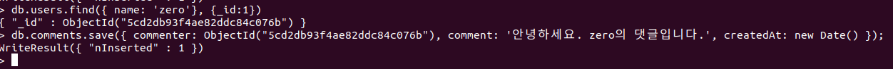
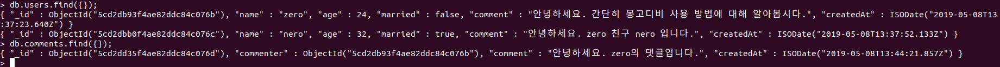
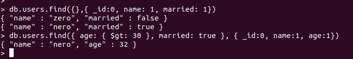
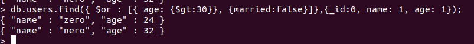
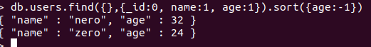
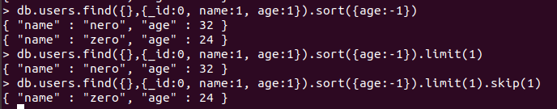
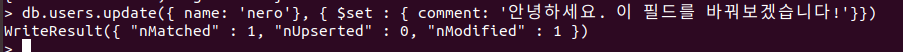

> 8.4 데이터베이스 및 컬렉션 생성하기

>> nodejs라는 이름의 데이터베이스와 MySQL의 테이블과 상응하는 컬렉션들을 만들어보자! => 몽고디비 프롬프트에 접속한 후 진행하면 됨.

* 데이터베이스를 만드는 명령어 - use 데이터베이스명 
```console
> use nodejs
```
* 데이터베이스 목록 확인 명령어 - show dbs
```console
> show dbs
```


>> 왜 방금 생성한 nodejs가 없지? => 데이터를 최소 한 개 이상 넣어야 목록에 표시됨 

* 현재 사용중인 데이터베이스를 확인하는 명령어 - db
    * 비록 데이터베이스 목록에는 없지만 현재 nodejs 데이터베이스를 사용하고 있음을 확인할 수 있음 
    * 컬렉션은 따로 생성할 필요가 없음 -> 다큐먼트를 넣으면 컬렉션도 자동으로 생성됨 => 직접 컬렉션을 생성하는 명령어가 있긴 함
```console
> db
> db.createCollection('users')
> db.createCollection('comments')
```
* 생성한 컬렉션 목록을 확인 - show collections
```console
> show collections
```


>> 컴퍼스 활용해서 하는 것은 쉽기 때문에 생략하였습니다.

> 8.5 CRUD 작업하기(in 몽고디비)

>> 8.5.1 Create(생성)

>> 컬렉션에 컬럼을 정의하지 않아도 됨 => 컬렉션에는 아무 데이터나 넣을 수 있음 => 이러한 자유로움(몽고디비의 장점) But, 무엇이 들어올지 모른다는 단점도 존재
>> 몽고디비의 자료형 - MySQL과는 조금 다름 => 기본적으로 몽고디비는 자바스크립트 문법을 사용함 => 자바스크립트의 자료형을 따름 + 추가로 몇가지 자료형이 더 있음 

* Date, 정규표현식 처럼 자바스크립트 객체를 자료형으로 사용 가능 & Binary Data, ObjectId, Int, Long, Decimal, Timestamp, JavaScript 등의 추가적인 자료형이 있음 
    * Undefined, Symbol은 몽고디비에서 자료형으로 사용하지 않음!
    * 추가적인 자료형 중 ObjectId, Binary Data, Timestamp 외에는 잘 사용되지 않음 
    * ObjectId? =>  MySQL에서 기본키로 쓰이는 value와 비슷한 역할을 한다고 알면 됨. => 고유한 value를 가지므로 다큐먼트를 조회할 때 사용할 수 있음 

>> 이전 실습에서 몽고디비의 관리자만 편집가능하게 바꾸어 로그인도 관리자로 해주어야 함.

* db.컬렉션명.save(다큐먼트) - 다큐먼트 생성 => 자바스크립트 객체처럼 생성하면 됨.
    * new Date() - 현재 time을 입력하라는 뜻 => 명령이 성공적으로 수행되었다면 WriteResult({ "nInserted":1})이라는 응답 => 다큐먼트 한 개가 생성되었다는 뜻(실패하면 에러 내용이 응답으로 뜸)

>> comments 컬렉션에도 데이터를 넣어보자 => zero의 댓글을 넣을 것 -> zero의 아이디를 알아야 함.
>> db.users.find를 통해 zero의 ID를 알고 => 사용자마다 이 문자의 value가 다름 
>> db.comments.save(다큐먼트)를 통해 저장


> 8.5.2 Read(조회)

>> 생성한 다큐먼트들을 조회해보자!
* find({}) - 컬렉션 내 모든 다큐먼트를 조회하라는 뜻 
```console
> mongo
> db.users.find({})
> db.comments.find({})
```


* 특정 필드만 가져오고 싶다면 find 메서드의 두 번째 인자로 조회할 필드를 넣으면 됨. 
    * 1 또는 true로 표시한 필드만 가져옴 
    * _id는 기본적으로 가져오게 되어 있음 => 0 또는 false를 입력해 가져오지 않도록 해야함.
    * => 조회 시 조건을 주려면 첫 번째 인자 객체에 기입하면 됨 
```console
> mongo
> db.users.find({},{ _id: 0, name: 1, married: 1});
> db.users.find({ age: { $gt : 30 }, married: true}, { _id:0, name:1, age:1})
```


* $gt라는 속성? - 시퀄라이즈 쿼리와 비슷 => 몽고디비 - 자바스크립트 객체를 사용해서 명령어 쿼리를 생성해야 함 => $gt 처럼 특수한 연산자가 사용됨.
    * $gt(초과), $gte(이상), $lt(미만), $lte(이하), $ne(same하지 않음), $or(또는), $in(배열 요소 중 하나) 등이 존재
    * 몽고디비 - OR 연산 - $or를 사용함 
        * age가 30 초과이거나 married가 false인 다큐먼트 조회
        * $or에 주어진 배열 안의 조건들을 하나라도 만족하는 다큐먼트를 모두 찾음 
```console
> db.users.find({ $or: [{$age: {$gt:30}}, {married: false}]}, {_id:0,name:1,age:1});
```


* 정렬도 가능함 => sort 메서드를 사용하면 됨.  
    * -1 : 내림차순, 1은 오름차순 => -1을 사용해보자
```console
> db.users.find({},{ _id: 0, name: 1, age:1}).sort({ age: -1 })
```


* 조회할 다큐먼트 개수를 설정 => limit 메서드를 사용!
```console
> db.users.find({},{_id:0, name:1, age:1}).sort({age:-1}).limit(1)
```
* 다큐먼트 개수를 설정하면서 몇 개를 건너뛸지 설정 => skip 메서드를 사용
```console
> db.users.find({}, {_id:0, name:1, age:1}).sort({age:-1}).limit(1).skip(1)
```


>> 이외에도 많은 쿼리가 있음 -> 이 정도면 앞으로의 실습으론 충분

> 8.5.3 Update(수정)

```console
$ mongo
> db.users.update({ name: 'nero'},{ $set: { comment: '안녕하세요. 이 필드를 바꾸어보겠습니다!'}});
```

* 첫 번째 객체 - 수정할 다큐먼트를 지정하는 객체 / 두 번째 객체 - 수정할 내용을 입력하는 객체 
    * $set이라는 연산자가 사용됨 - 어떤 필드를 수정할지 정하는 연산자 
    * 이 연산자를 사용하지 않고 일반 객체를 넣는다? => 다큐먼트가 통째로 두 번째 인자로 주어진 객체로 수정되어 버림
    * => 일부 필드만 수정하고 싶을 때는 반드시 $set 연산자를 지정해주어야 함. -> 수정 성공 시, 첫 번째 객체에 해당하는 다큐먼트 수(nMatched), 수정된 다큐먼트 수(nModified)가 나옴

> 8.5.4 Delete(삭제)

* 삭제할 다큐먼트에 대한 정보가 담긴 객체를 첫 번째 인자로 제공하면 됨. => 성공 시 삭제된 개수가 반환됨.
```console
$ mongo
> db.users.remove({ name: 'nero'});
```

>> 다음 작업! -> 몽고디비를 노드와 연동해 서버에서 데이터베이스를 조작할 수 있게 해야 함.
>> 노드와 몽고디비를 연동 & 쿼리까지 만들어주는 라이브러리가 존재 => 몽고디비 자체로도 자바스크립트 쿼리를 사용함 But => 이 라이브러리 쓰면 더 쉽게 만들 수 있음 


