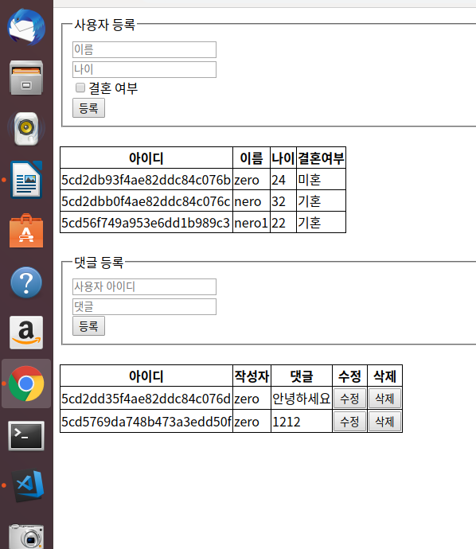
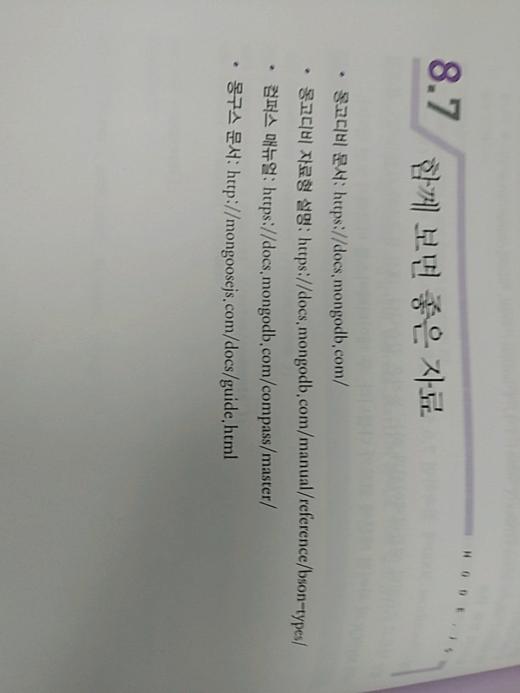

> 8.6.3 쿼리 수행하기 

>> 몽구스 사용한 쿼리 수행 

1. views 폴더 안 mongoose.pug 파일을 만듬 

2. routes/index.js -> 라우터를 작성 
```javascript
var express = require('express');
var router = express.Router();

/* GET home page. */
router.get('/', function(req, res, next) {
  User.find({})
    .then((users)=>{
      res.render('mongoose',{ users });
    })
    .catch((err)=>{
      console.error(err);
      next(err);
    });
});

module.exports = router;
```
* GET /로 접속했을 때의 라우터 => User.find({}) 메서드로 모든 사용자를 찾은 뒤, mongoose.pug를 렌더링할 때 users 변수로 넣어줌 
    * find 메서드는 User 스키마를 require한 뒤 사용할 수 있음 => 몽고디비의 db.users.find({}) 쿼리
    * 몽구스 - 기본적으로 프로미스를 지원하므로 then, catch를 사용해서 개개 조회 성공 시와 실패 시 정보를 얻을 수 있음 
        * 미리 데이터베이스에서 데이터를 조회한 후 템플릿 렌더링에 사용할 수 있음 
    * async/await 문법으로 표현하면...
```javascript
 router.get('/', async (req,res,next)=>{
     try {
         const users = await User.find();
         res.render('mongoose', { users });
     } 
     catch (error){
         console.error(error);
         next(error);
     }
 });
```

3. users.js의 수정 -> 프로미스 형식으로 추가!
```javascript
router.get('/', function(req, res, next) {
  User.find({})
    .then((users)=>{
      res.json(users);
    })
    .catch((err)=>{
      console.error(err);
      next(err);
    });
});


router.post('/', function(req, res, next){
  const user = new User({
    name: req.body.name,
    age: req.body.age,
    married: req.body.married,
  });
  user.save()
    .then((result)=>{
      console.log(result);
      res.status(201).json(result);
    })
    .catch((err)=>{
      console.error(err);
      next(err);
    });
});
```
* GET /users와 POST /users 주소로 요청이 들어올 때의 라우터 => 개개 사용자를 조회하는 요청, 사용자를 등록하는 요청을 처리 
    * GET /에서도 사용자 데이터를 조회했지만, GET /users에서는 데이터를 JSON 형식으로 반환한다는 것에 차이가 있음 
    * 사용자를 등록할 때는 먼저 모델로 user 객체를 만든 후, 객체 안에 다큐먼트에 포함될 내용들을 넣어줌 => 그 후 save 메서드로 저장
    * 정의한 스키마에 부합하지 않는 데이터를 넣었을 때 -> 몽구스가 에러를 발생시킴 

4. comments.js 작성 
    * 댓글에 관련된 CRUD 작업을 하는 라우터 -> GET /comments, POST /comments, PATCH /comments/:id, DELETE /comments/:id를 등록
```javascript
router.get('/:id', function(req,res,next){
    Comment.find({ commenter: req.params.id }).populate('commenter')
        .then((comments) =>{
            console.log(comments);
            res.json(comments);
        })
        .catch((err)=>{
            console.error(err);
            next(err);(
        });
}); 
```
* => 게시글 다큐먼트를 조회하는 라우터 -> find 메서드에 옵션이 추가됨 
    1. 먼저 댓글을 쓴 사용자의 아이디로 댓글을 조회한 뒤 populate 메서드로 관련 있는 컬렉션의 다큐먼트를 불러올 수 있음 
        * Comment 스키마 commenter 필드의 ref가 User로 되어 있음 -> 알아서 users 컬렉션에서 사용자 다큐먼트를 찾아서 합침! 
        * commenter 필드가 사용자 다큐먼트로 치환됨! 
            * commenter 필드는 ObjectId가 아니라 그 ObjectId를 가진 사용자 다큐먼트가 됨.

```javascript
router.post('/', function(req, res, next){
    const comment = new Comment({
        commenter: req.body.id,
        comment: req.body.comment,
    });
    comment.save()
        .then((result)=>{
            return Comment.populate(result, { path: 'commenter' });
        })
        .then((result)=>{
            res.status(201).json(result);
        })
        .catch((err)=>{
            console.error(err);
            next(err);
        });
});
```
* 다큐먼트를 등록하는 라우터 -> Comment 스키마로 comment 객체를 만들어 안에 다큐먼트 내용을 넣은 뒤 save 메서드로 저장함.
    * 프로미스의 결과로 반환된 result 객체를 populate 메서드로 User 스키마와 합침 
    * path 옵션으로 어떤 필드를 합칠지 설정해주면 됨! => save한 뒤에 populate를 하는 방법!

```javascript
router.patch('/:id', function(req, res, next){
    Comment.update({ _id: req.params.id} , {comment: req.body.comment})
        .then((result)=>{
            res.json(result);
        })
        .catch((err)=>{
            console.error(err);
            next(err);
        });
});
```
* 다큐먼트를 수정하는 라우터 -> 수정에는 update 메서드를 사용함, 시퀄라이즈와는 반대로 update 메서드에는 어떤 다큐먼트를 수정할지에 대한 쿼리 객체를 첫 번째 인자로 제공!
    * 두 번째 인자로는 수정할 필드와 value가 들어있는 객체를 제공! => 몽고디비와 다르게 $set 연산자를 사용하지 않아도 기입한 필드만 바꿔줌
    * 실수로 다큐먼트를 통째로 수정할 일이 없어 안전!

```javascript
router.delete('/:id', function( req, res,next){
    Comment.remove({ _id: req.params.id })
        .then((result)=>{
            res.json(result);
        })
        .catch((err)=>{
            console.error(err);
            next(err);
        });
});
```
* 다큐먼트를 삭제하는 라우터 -> remove 메서드를 사용하여 삭제함! => remove 메서드에도 update 메서드와 유사하게 어떤 다큐먼트를 삭제할지 첫 번째 객체에 조건을 넣어줌 

5. 라우터를 서버에 연결! => app.js에서
    * express.static의 순서를 위로 올림
```javascript

var indexRouter = require('./routes/index');
var usersRouter = require('./routes/users');
var commentsRouter = require('./routes/comments');
var connect = require('./schemas');

var app = express();
connect();

// view engine setup
app.set('views', path.join(__dirname, 'views'));
app.set('view engine', 'pug');

app.use(logger('dev'));
app.use(express.static(path.join(__dirname, 'public')));
app.use(express.json());
app.use(express.urlencoded({ extended: false }));
app.use(cookieParser());


app.use('/', indexRouter);
app.use('/users', usersRouter);
app.use('/comments', commentsRouter);

```

* 서버 실행 전 몽고디비 서버를 먼저 실행! => 몽고디비 서버가 켜졌다면? 콘솔을 하나 더 열어 웹 서버를 실행해보자!

```console
$ sudo service mongod start
$ npm start 
```
>> 

* 참고

