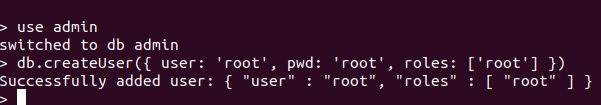
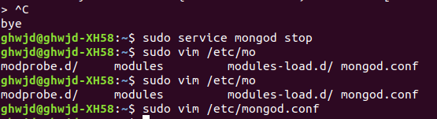
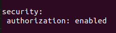
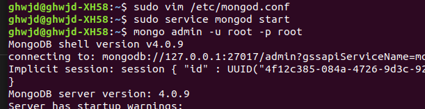

# 8 - 몽고디비 

>> MySQL만 알고 있어도 많은 곳에서 사용할 수 있지만, 다른 유형의 데이터베이스인 몽고디비(mongoDB)를 알아보자 -> 더욱 많은 프로그램에서 확인 가능!
* 특징 - 자바스크립트 문법을 사용한다! 
    * 노드도 자바스크립트를 사용 -> 데이터베이스마저 몽고디비를 사용한다면 Javascript만 사용해 웹 애플리케이션을 만들 수 있음 
    * 하나의 언어만 사용하면 됨 -> 생산성도 매우 높음 
    * 몽고디비 - 특색이 뚜렷한 NoSQL => 특징을 잘 알 필요가 있음 

> 8.1 NoSQL vs SQL

>> MySQL - SQL을 사용하는 대표적인 데이터베이스 / NoSQL(Not only SQL) - 몽고디비가 대표 주자

SQL(MySQL)|NoSQL(몽고디비)
----------|-------------
규칙에 맞는 데이터 입력 | 자유로운 데이터 입력
테이블 사이의 JOIN 지원 | 컬렉션 사이의 JOIN 미지원
트랜잭션 지원 | 트랜잭션 미지원
안정성, 일관성 | 확장성, 가용성 
용어(테이블, 로우, 컬럼) | 용어(컬렉션, 다큐먼트, 필드)

>> NoSQL - 고정된 테이블이 없음  => 컬렉션이라는 개념이 있지만 컬럼을 따로 정의하지 않음 
>> ex) MySQL - users 테이블 만들 때 -> name, age, married 등의 컬럼과 자료형, 옵션 등을 정의 
>> ex) 몽고디비 - 그냥 users 컬렉션을 만들고 끝 => users 컬렉션에는 어떠한 데이터라도 다 포함될 수 있음 
>> => 어떤 다큐먼트(MySQL의 로우에 해당하는 개념)에는 name, age, married 데이터가, 다른 다큐먼트에는 name, comment, createdAt, updatedAt 등의 데이터가 포함될 수 있음

* 몽고디비 - MySQL과 달리 JOIN 기능이 없음 
    * JOIN을 흉내낼 수 있지만, 하나의 쿼리로 여러 테이블을 합치는 작업이 항상 가능하지는 않음   
    * 트랜잭션을 지원하지 않는 것!(트랜잭션 - 여러 쿼리가 모두 정상적으로 수행되거나 아예 하나도 수행되지 않음을 보장하는 기능)
        * 아예 없지는 않지만, MySQL 처럼의 수준의 트랜잭션은 없음 -> 데이터 일관성에 문제가 생길 수 있음 
        * Note! - 대중적으로 사용되는 몽고디비 버전은 3! -> 4부터 트랜잭션을 지원하겠다고 발표함 => 데이터의 일관성을 유지하는 데 큰 도움이 될 듯
    * 사용하는 이유 - 확장성과 가용성 때문 => 데이터의 일관성을 보장해주는 기능이 약한 대신 데이터를 빠르게 넣을 수 있고, 쉽게 여러 서버에 데이터를 분산할 수 있음 
    * MySQL의 테이블, 로우, 컬럼 => 몽고디비에선 컬렉션, 다큐먼트, 필드라고 부름

* Application을 만들 때 꼭 한 가지 Database만 사용해야 하는 것 아님!
    * SQL과 NoSQL을 동시에 사용을 많이 함 => 개개 특징이 달라 알맞은 곳에 사용하면 됨.
    * ex) 항공사 예약 시스템의 경우 비행기 표에 관한 정보가 모든 항공사에 일관성있게 전달되어야 함 -> 예약 처리 부분에선 MySQL 사용
    * => 대신 핵심 기능 외의 빅데이터, 메시징, 세션 관리 등엔 확장성, 가용성을 위해 몽고디비를 사용할 수도 있음 

> 8.2 몽고디비 설치 

[몽고디비 설치 매뉴얼](https://docs.mongodb.com/manual/tutorial/install-mongodb-on-ubuntu/)

```console
<!-- 실행 -->
$ sudo service mongod start

<!-- 종료 -->
$ sudo service mongod stop

<!-- 재시작 -->
$ sudo service mongod restart

$ mongo
```
>> 콘솔에 mongo 명령어 입력하면 접속 => 프롬프트가 >로 바뀌었다면 성공 -> 현재는 누구나 몽고디비에 접속할 수 있으므로 관리자 계정을 추가!
```mongo
use admin
```

>> db.createUser 메서드로 계정을 생성할 수 있음 - user에 사용자 이름을 넣고, pwd 자리에 사용할 비번을 입력 => 이 비번은 기억하고 있어야 함
>> roles로는 현재 모든 권한이 있는 root를 부여 -> 나중에 실무에선 상황에 맞는 역할을 부여하면 됨.




>> vi를 통해 /etc/mongod.conf의 주석 처리된 security를 수정 후 :wq로 저장 
>> 다시 mongod를 실행 후, mongo admin -u 이름 -p 비밀번호 명령어로 접속하자.



>> 윈도우, macOS에서는 따로 진행하지 않았습니다. => 윈도우는 이미 설치되어 있고, 맥은 사용하질 않아서 ㅠㅠ

> 8.3 컴퍼스 설치 - 윈도우에는 이미 되어있어서 리눅스로만 진행하겠습니다.

>> 몽고디비 - 관리도구로 컴퍼스를 제공, 몽고디비 공식 사이트에서 받을 수 있음 => GUI를 통해 데이터를 눈으로 관리할 수 있어 편리함 => 필수적인 것은 아님!
