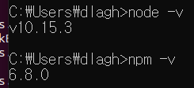
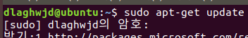
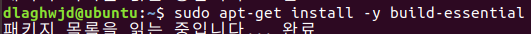
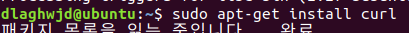
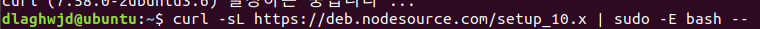
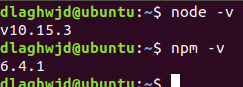
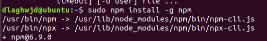

NodeJs 설치 & 사용 
=================

1. 윈도우 
    - nodejs 홈페이지 가서 LTS 받자.
    

2. 리눅스
    - 차례대로 진행
    - 1. sudo apt-get update
    
    - 2. sudo apt-get install -y build-essential
    
    - 3. sudo apt-get install curl
    
    - 4. curl -sL https://deb.nodesource.com/setup_10.x | sudo -E bash --
    
    - 5. sudo apt-get install -y nodejs
    
    - 6. 설치 완료
    
    - 7. npm 버전 업데이트
    

함께보면 좋은 자료 
=================

- 노드 공식 사이트 : https://nodejs.org/ko
- 노드 공식 사이트의 가이드 : https://nodejs.org/en/docs/guides/
- 이벤트 루프에 대한 시각적 설명 : https://latentflip.com/loupe
- 이벤트 루프에 대한 설명 : https://nodejs.org/ko/docs/guides/event-loop-timers-and-nexttick/
- vs code 공식 사이트 : https://code.visualstudio.com/